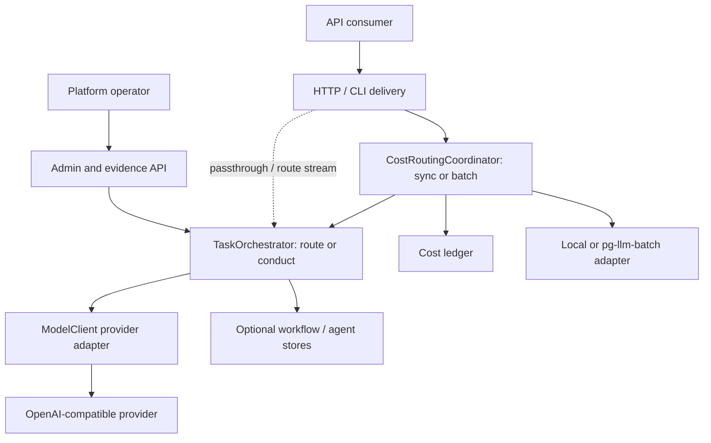

# Contextual Orchestrator architecture

**Document state:** `accepted_architecture`  
**Canonical role:** current component, trust-boundary, and deployment authority

`docs/architecture.md` remains a research-to-product note. This document is the
system architecture authority and links detailed runtime diagrams in
`docs/UML.md` and data ownership in `docs/ERD.md`.

## Architectural intent

Contextual Orchestrator is one provider-neutral orchestration domain exposed as
a Python library, CLI, and OpenAI-compatible HTTP service. It keeps policy and
evidence inside one deployable boundary while allowing optional infrastructure
adapters. Basic operation does not require the wider CWL ecosystem.

The dotted path is a protected-main exception: raw compatible passthrough and
route streaming bypass part of coordinator accounting. It is a documented gap,
not the target evidence architecture.

## Bounded contexts

| Context | Responsibility | Does not own |
|---|---|---|
| Delivery | Authentication, input bounds, HTTP/CLI translation, compatible response framing. | Model policy or provider credentials. |
| Orchestration domain | Route/conduct choice, workflow plan, access lists, agent selection, verification, synthesis, trace, budget. | Host identity, tenant directory, or provider network implementation. |
| Provider adapter | KV credential lookup, compatible request, timeout/retry, usage capture, transport validation. | Workflow policy or review authority. |
| Cost and batch hub | Token/count provenance, configured prices, attribution, sync/batch decision, backend lifecycle. | Route/conduct policy, fabricated prices, or external batch persistence. |
| State and credential adapters | Optional SQLite state/agent overlay, PEP-249 ledger, in-memory or pgcrypto credentials. | Legal basis, tenant authorization, or enterprise backup policy. |
| Operator evidence | Admin, trace, evaluation, access, audit, analytics, and readiness projections. | Certification, independent approval, or production SLO proof. |

## Module map

| Module | Role |
|---|---|
| `orchestrator.py` | `ModelAgent`, `WorkflowStep`, `OrchestrationPolicy`, `ModelClient`, `TaskOrchestrator`, state stores, cache, redaction, budgets, traces, and readiness reports. |
| `server.py` | Threaded stdlib HTTP delivery, bearer scopes, validation, rate/concurrency controls, routing, SSE framing, and error translation. |
| `admin.py` | Dependency-free operator console. |
| `api_contract.py` | Machine-readable OpenAPI subset and operation identities. |
| `credentials.py` | Credential protocol, in-memory backend, pgcrypto Postgres backend, and registry functions. |
| `kv_config.py` | In-memory configuration and optional `pg-llm-batch` configuration adapters. |
| `cost_ledger.py` | Price book, prompt-safe usage records, telemetry, non-blocking export, SQL store, and rollups. |
| `batch_routing.py` | Routing hints/policy, local and external chat/embedding batch contracts. |
| `cost_router.py` | Coordinates token counting, sync/batch channel choice, ledger, and backend submission/retrieval. |
| `token_counting.py` | Deterministic heuristic and optional Postgres `pg_tiktoken` adapter. |
| `conventions.py` | Two-or-more-word snake_case validation. |
| `__main__.py` | CLI completion, server, evaluation, and credential bootstrap. |

## Control plane and data plane

The control plane includes agent configuration, policy, credentials, prices,
budgets, provider exclusions, evaluation, and operator evidence. The data plane
includes validated request payloads, selected step context, provider requests,
answers, usage signals, and optional batch payload references.

Control-plane changes may affect later requests but cannot rewrite the evidence
attached to a completed run. Data-plane payloads must not be copied into broad
usage telemetry. Protected main has only admin and inference bearer scopes: no
dedicated trace scope exists, and an inference-scoped caller may request
`include_orchestration_trace: true`. Purpose- and tenant-specific trace authority
is an accepted boundary that still needs host RBAC or a dedicated runtime scope.

## Route and conduct

`TaskOrchestrator.complete()` is the stable split:

- `route` selects and calls one eligible worker. It is the only mode that can
  honestly relay live provider SSE tokens on protected main.
- `conduct` creates a bounded template or validated generated workflow. Each
  `WorkflowStep.access` tuple names prior step outputs deliberately included in
  that worker's context. Verification precedes synthesis when policy requires
  it. Any HTTP stream is framed after the answer exists.

The deterministic policy is the protected-main authority. Learned routing,
recursive coordination, and role-specific reasoning controls require
comparable-budget evidence before replacing it.

Protected-main agent choice is deterministic tag/domain/priority scoring. It is
not learned, price-aware, or load-balanced. `route_p95_seconds` is exposed but
does not currently participate in dispatch, and `cheapest_upstream()` is not
called by either routing layer.

## Trust boundaries

1. **Caller boundary:** bearer scope, bind policy, body/role/mode/rate/concurrency
   validation precede orchestration.
2. **Context boundary:** access lists limit cross-step visibility. Trace exposure
   defaults off, but protected-main inference authority can opt in; dedicated
   purpose/tenant trace RBAC remains `planned`.
3. **Credential boundary:** provider secrets are names in model configuration
   and values in KV; environment is bootstrap transport only.
4. **Provider boundary:** protected main requires HTTPS and globally routable
   destinations. The stronger DNS-pinned, redirect/proxy-safe, strictly bounded
   response implementation is `active_pr` in #96.
5. **Persistence boundary:** in-memory is default. Enabling a file or database
   creates an operator obligation for access, encryption, retention, backup,
   deletion, and recovery.
6. **Evidence boundary:** a local report, check status, automated review, human
   approval, and protected merge are different authorities.
7. **Host boundary:** a CWL host retains identity, tenancy, legal basis,
   business data, and deployment unless a versioned contract delegates them.

## Data ownership

- In-memory workflow, evaluation, audit, analytics, circuit, and cache state are
  process-owned and ephemeral.
- Optional SQLite stores provide standalone durability, not a normalized
  enterprise data plane.
- The cost ledger has an in-memory default and a portable PEP-249 SQL store.
- The active `PriceBook` reads ConfigStore, not the SQL
  `llm_price_entries` table. That table is created but dormant.
- Provider credentials may be in-memory for development or pgcrypto-encrypted
  in Postgres.
- `docs/database_design.sql` is a normalized production target and must not be
  confused with runtime-created SQLite schemas.
- External batch/config/secret objects accessed through `pg-llm-batch` are
  owned by that service or adapter.

## Deployment forms

### Standalone

One process serves CLI or HTTP, mock or configured providers, in-memory state,
and optional SQLite/SQL/KV adapters. Loopback binding is the safe default.

### CWL composition

An ingress or host authenticates the user and supplies a purpose-bound request.
Contextual Orchestrator selects and executes models. `pg-llm-batch` may execute
latency-tolerant work. naruon, inkspan, Clearfolio, and other systems consume
explicit interfaces and retain their own data and authorization boundaries.

## Failure domains and degraded behavior

| Domain | Isolation and degraded behavior |
|---|---|
| One provider/model | Bounded transient retry, eligible failover, circuit breaker; permanent errors fail fast. |
| Credential registry | Non-mock execution fails closed; mock/offline operation remains available. |
| Optional state store | Persistence evidence is unavailable; the service must not claim durable history. |
| Cost export | Non-blocking store may degrade while prompt-safe health exposes the loss. |
| External batch service | Interactive route remains independently usable; process-local job lookup is lost on restart even when an external job survives. |
| Admin integration | Inference and library paths remain independently usable. |
| Automated review/control plane | Protected merge waits; repository-local development and verification continue. |

## Architecture invariants

- Agent pools are data, not provider-specific branches in domain logic.
- Access is explicit; a worker never receives all previous outputs by default.
- Credentials are resolved by name at the provider boundary.
- Estimates are labeled and unknown prices remain unknown.
- Optional integrations do not break standalone behavior.
- No repository-local result claims certification or independent approval.
- New scientific arithmetic owned by this service is Rust-first with
  parity-verified CPU/GPU paths; currently such arithmetic is `out_of_scope`.
- Database identifiers use two-or-more-word snake_case unless an external
  standard fixes the field name.

## Known protected-main divergences

- Workflow-derived spend/budget and the independent cost ledger are not
  synchronized. Missing ledger price becomes zero while spend analytics labels
  it unknown; this violates the accepted unknown-price invariant.
- Raw passthrough records analytics but no workflow or ledger row. Route
  streaming bypasses the coordinator and durable `_StateStore`; a mid-stream
  failure can leave no retained run.
- Coordinator batch handles are process-local. Restart loses lookup, and chat
  result replay can duplicate usage; embedding idempotency is also process-local.
- Static OpenAPI, runtime dispatch, scopes, and endpoint prose are separate
  authorities and have drifted.
- Optional config and token-count adapters may silently fall back to memory or
  heuristic counting. Degraded authority needs explicit operator evidence.
- Commercial/readiness responses are derived documents, not persisted domain
  entities or external attestations.

## Status-qualified evolution

- PR #96: `active_pr` provider transport and response trust boundary.
- PR #90: `active_pr` NIM discovery/benchmark evidence.
- PR #94: `active_pr` free-first fallback.
- PR #99: `active_pr` adaptive reasoning controls stacked on #94.
- PR #82: `active_pr` dependency bootstrap stacked on #96 and not independently
  mergeable first.

No active pull request is architecture authority until its exact head passes
repository policy and reaches protected main. See `docs/TRACEABILITY.md` for the
dated repository snapshot and `docs/adr/README.md` for decision status.
