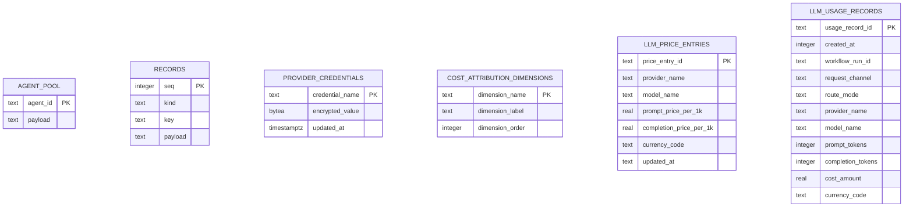
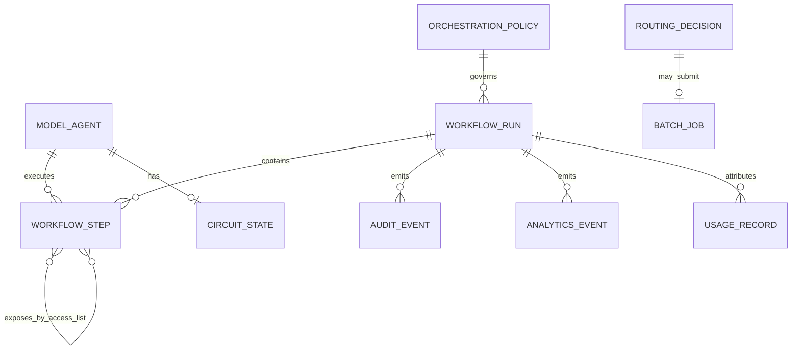
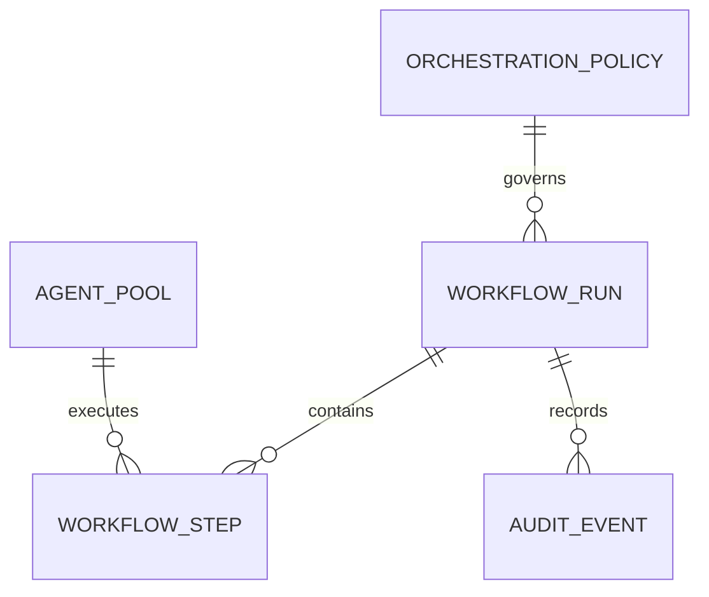

# Data model and ERD

**Document state:** `accepted_architecture`

This document separates actual protected-main storage from in-memory domain
objects, external ownership, and the normalized production target. It does not
invent persistence to make an ERD look complete.

## Storage classification

| Classification | Meaning |
|---|---|
| `persisted_runtime` | Protected-main code creates or writes this object when its adapter is enabled. |
| `in_memory` | Process state only unless projected into a generic runtime record. |
| `external_owned` | Another service or host owns the schema. |
| `accepted_target` | Reviewed target design, not the schema automatically used by protected main. |
| `active_pr` | Exists only on an open pull request. |

## Protected-main physical objects

| Object | Store and owner | Classification | Purpose |
|---|---|---|---|
| `agent_pool` | SQLite `_AgentPoolStore` | `persisted_runtime` | Agent ID to JSON configuration/tombstone overlay. |
| `records` | SQLite `_StateStore` | `persisted_runtime` | Generic keyed workflow/evaluation records and append-only audit/analytics payloads. |
| `records_kind_seq` | SQLite `_StateStore` | `persisted_runtime` | Kind/sequence retrieval index. |
| `provider_credentials` | Postgres `PostgresCredentialBackend` | `persisted_runtime` | pgcrypto-encrypted provider credential values. |
| `cost_attribution_dimensions` | PEP-249 `SqlLedgerStore` | `persisted_runtime` | Seven supported cost dimensions. |
| `llm_price_entries` | PEP-249 `SqlLedgerStore` | `persisted_runtime` | Created schema only; protected-main `PriceBook` does not read or write it. |
| `llm_usage_records` | PEP-249 `SqlLedgerStore` | `persisted_runtime` | Prompt-safe usage and cost facts. |
| `com_config`, `com_secrets` | `pg-llm-batch` adapter | `external_owned` | Optional external configuration/secret contract. |

SQLite and Postgres ledger deployments use the same logical ledger columns,
subject to their driver types. No foreign keys connect any runtime table shown
below. `llm_usage_records.workflow_run_id` is informational and may contain a
workflow ID or batch job ID. The active price book lives in ConfigStore category
`llm_price_entries`, not the same-named SQL table.

The absence of edges is intentional: protected main enforces no relational
links across these physical objects.

## In-memory domain model

| Domain object | Key fields | Persistence projection |
|---|---|---|
| `model_agent` (`ModelAgent`) | ID, model, base URL, credential name, tags, priority, exclusions, disabled flag | JSON in `agent_pool` only when agent DB is enabled. |
| `workflow_step` (`WorkflowStep`) | integer step ID, role, agent ID, subtask, access tuple, latency, output | Embedded in a workflow-run payload in `records` when state DB is enabled. |
| `orchestration_policy` | route P95 target, complexity threshold, verifier controls, planning mode, max steps | Snapshot inside run evidence; not a dedicated protected-main table. |
| `workflow_run` | generated ID, prompt projection, mode, answer, policy, trace, timing, usage | Memory map and optional `records(kind='workflow_run')`. |
| `evaluation_run` | generated ID, inputs, baseline/comparison measurements, workflow-run ID list | Memory map and optional `records(kind='evaluation_run')`; references are embedded JSON. |
| `audit_event` | event name, detail, time | Bounded deque and optional append-only `records(kind='audit')`. |
| `analytics_event` | event name, prompt-safe detail, time | Bounded deque and optional append-only `records(kind='analytics')`. |
| `routing_decision` | sync/batch channel and reason | Returned/embedded evidence; no dedicated table. |
| `batch_job` | job ID, status, input/result metadata | Coordinator/local maps are process-local; an external backend may own durable execution but restart loses local lookup. |
| `response_cache_entry` | request hash, timestamp, deep-copied response | Bounded in-memory TTL/LRU only. |
| `circuit_state` | failures, open-until time by agent | In-memory only. |
| `price_book_entry` | provider/model prompt and completion prices | In-memory/external ConfigStore category `llm_price_entries`; not projected to SQL `llm_price_entries`. |
| `completed_embedding_document` | batch document and usage-idempotency marker | Process-local only; lost on restart. |

The following conceptual names make orchestration and evidence relationships
explicit without claiming that protected main creates dedicated tables:

| Conceptual entity | Classification | Current projection or owner |
|---|---|---|
| `step_dependency` | `in_memory` | A `workflow_step.access` predecessor reference. |
| `access_grant` | `in_memory` | The validated permission to project one predecessor output into a later step. |
| `provider_credential` | `persisted_runtime` | One encrypted row in `provider_credentials`. |
| `credential_backend` | `in_memory` / `external_owned` | In-memory development adapter or injected Postgres/KV authority. |
| `cost_ledger_entry` | `persisted_runtime` | One prompt-safe `llm_usage_records` row. |
| `batch_request` | `in_memory` / `external_owned` | Local submission or request handed to `pg-llm-batch`. |
| `batch_result` | `in_memory` / `external_owned` | Qualified local/external job result. |
| `fallback_candidate` | `active_pr` | Candidate ordering in PR #94; not a protected-main stored object. |
| `check_evidence` | `external_owned` | GitHub check/run evidence, qualified by checked-out commit. |
| `release_evidence` | `accepted_target` | A provenance/SBOM/acceptance record; GitHub owns current source evidence. |

This is a conceptual ERD; these entities are not all physical tables.

Spend analytics, access reports, admin state, readiness resources, and
commercial packets are derived response documents, not durable entities.

## Normalized production target

`docs/database_design.sql` defines `agent_pool`, `orchestration_policy`,
`workflow_run`, `workflow_step`, and `audit_event`, plus retention indexes, a
safe view, and a purge function. It is `accepted_target`, not an applied
migration.

Before adoption, a migration ADR must reconcile this normalized target with the
existing JSON `records` store, the current agent overlay, the cost ledger, and
host tenant/retention authority. Expand/backfill/contract and rollback evidence
are required; copying the SQL into startup code is not an accepted migration.

## Privacy and retention implications

- `records.payload` may contain workflow prompts and outputs. It is opt-in and
  currently lacks field encryption, automatic retention pruning, tenant
  partitioning, and backup policy.
- Trace payloads embed subtasks and step outputs. Audit/analytics deques are
  bounded in memory, but their enabled SQLite stream rows grow without an
  automatic disk-retention policy.
- `provider_credentials.encrypted_value` is encrypted at rest, but DSN,
  passphrase, database authorization, rotation, and backup protection remain
  deployment responsibilities.
- `llm_usage_records` intentionally excludes raw prompts and answers.
- Chat-batch result replay can create duplicate usage rows; embedding
  idempotency is process-local and does not survive restart.
- The normalized target uses ciphertext, bounded previews, expiry, soft
  deletion, and safe views; those controls are not retroactively claimed for
  the generic SQLite store.

## Naming exceptions

All owned database identifiers use two-or-more-word snake_case except the
generic SQLite table `records`, which predates the repository naming contract.
That one-word object is documented technical debt. A future migration must use
a descriptive replacement such as `runtime_records`; it must not rename the
table without compatibility and rollback evidence.
