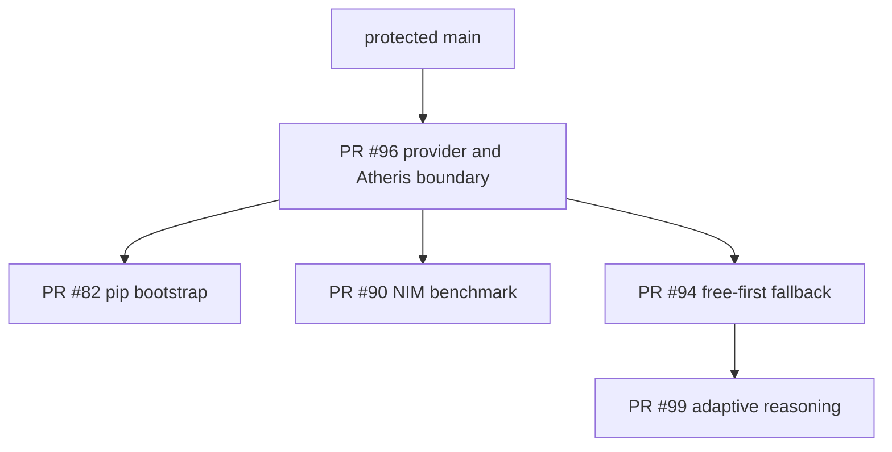

# Documentation and implementation traceability

**Document state:** `active_pr`; the audit describes protected-main evidence,
while this canonical documentation repair is not shipped until protected merge  
**Audit date:** 2026-08-09 (Asia/Seoul)  
**Protected-main revision audited:** `6841b71935e0b7cb98fb52bcb4709cc5100c8d87`

This file is the only canonical location for volatile audit SHAs and run IDs.
Other architecture documents describe durable contracts.

## Sufficiency assessment before this documentation repair

| Artifact family | Prior classification | Evidence | Repair in this branch |
|---|---|---|---|
| PRD | `PARTIAL` | `conductor/product.md`, `docs/product_planning.md`, and user stories described intent but did not provide one status-qualified product contract. | `docs/PRD.md` |
| TRD | `PARTIAL` | API, database, KV, analytics, and security requirements were scattered and mixed target architecture with runtime behavior. | `docs/TRD.md` |
| Architecture | `STALE` | `docs/architecture.md` named `Agent`/`Orchestrator`, omitted current stores/cost/batch surfaces, and described an earlier implementation. | root `ARCHITECTURE.md` |
| ADR | `MISSING` | No status-bearing ADR directory or decision index existed. | `docs/adr/` |
| UML | `MISSING` | No checked-in Mermaid/PlantUML runtime sequences, states, or deployment authority diagram existed. | `docs/UML.md` |
| ERD/data ownership | `PARTIAL` | `docs/database_design.sql` described a normalized target but not actual SQLite/PEP-249/Postgres objects or in-memory/external ownership. | `docs/ERD.md` |
| Threat model | `MISSING` | `SECURITY.md` provided disclosure and scanner policy, not assets, zones, abuse cases, controls, and residual risk. | `docs/THREAT_MODEL.md` |
| Test strategy | `PARTIAL` | Tests and fuzz docs existed, but no exact-head evidence taxonomy or release-wide test contract. | `docs/TEST_STRATEGY.md` |
| Operability/runbook | `PARTIAL` | Commercial packets mentioned gaps; no canonical degraded-mode and recovery authority existed. | `docs/OPERABILITY.md`, `docs/INCIDENT_RUNBOOK.md` |
| Research/standards | `PARTIAL` | Paper PDFs and an architecture note existed, but APA 7 and current official standards were not indexed together. | `docs/REFERENCES.md` |
| Documentation index | `MISSING` | Buyers and maintainers could not discover which artifact was authoritative. | `docs/README.md` |
| Documentation fitness test | `MISSING` | Existing tests checked selected keywords and could pass while canonical families were absent or stale. | `tests/test_documentation_contract.py` |
| Changelog | `MISSING` on audited main | Protected main had no root `CHANGELOG.md`; PR #96 introduces one on an active stack. | Not duplicated here; resolve through the accepted stack to avoid conflicting authority. |

The pre-repair set was therefore **not sufficient** for commercial or
acquisition diligence. Volume was not the issue: many buyer packets existed,
but product requirements, implementation truth, decisions, diagrams, and data
ownership were not joined into one status-disciplined graph.

## Requirement-to-implementation matrix

| Requirement | Product state | Implementation authority | Decision/docs | Test authority |
|---|---|---|---|---|
| PRD-001 / FR-001 compatible chat surface | `implemented_on_protected_main` | `server.py`, `orchestrator.py`; OpenAPI subset drift is recorded in TRD | PRD, TRD, ADR-0002 | API and passthrough tests |
| PRD-002 / FR-002 route/conduct allocation | `implemented_on_protected_main` | `TaskOrchestrator.complete` | ADR-0001, UML | paper/optimizer tests |
| PRD-003 / FR-003/004 explicit workflow/access | `implemented_on_protected_main` | `WorkflowStep`, conduct/generated planner | ADR-0003, UML | paper/generated-workflow tests |
| PRD-004 / FR-005 reliability/failover | `implemented_on_protected_main` | `ModelClient`, `TaskOrchestrator` circuit state | Architecture, threat model | provider-reliability tests |
| PRD-005 / FR-006 KV credentials | `implemented_on_protected_main` | `credentials.py`, `kv_config.py`, CLI | ADR-0004, UML, threat model | KV credential tests |
| PRD-006 / FR-007 cost attribution | `implemented_on_protected_main` with honesty gaps | two unsynchronized authorities in `orchestrator.py`, `cost_ledger.py`, `cost_router.py` | ADR-0006, ERD | cost-ledger tests plus reconciliation/unknown-price tests required |
| PRD-007 / FR-008 sync/batch | `implemented_on_protected_main` with restart/idempotency gaps | `batch_routing.py`, `cost_router.py` | ADR-0005, UML | batch tests plus restart/replay tests required |
| PRD-008 / FR-009 optional persistence | `implemented_on_protected_main` | `_StateStore`, `_AgentPoolStore`, SQL/KV adapters | ADR-0008, ERD | persistence/agent-pool/ledger tests |
| FR-011 route registry parity | `accepted_architecture` | dispatcher and static OpenAPI currently diverge | TRD, test strategy | shared-registry parity test required |
| FR-012 execution-path evidence parity | `accepted_architecture` | passthrough/streaming bypasses are documented | Architecture, UML, threat model | mode matrix required |
| PRD-006 / FR-013 cost authority | `accepted_architecture` | unknown ledger price is currently zero; SQL price table dormant | ADR-0006, ERD | reconciliation and non-free unknown tests required |
| PRD-007 / FR-014 durable batch identity | `accepted_architecture` | job/idempotency maps are process-local | ADR-0005, operability | restart and replay tests required |
| PRD-009 / SEC-002 strict provider transport | `active_pr` | PR #96 | ADR-0002, ADR-0015, threat model | Evidence remains PR-bound |
| Free-first fallback | `active_pr` | PR #94 | ADR-0007 | Evidence remains PR-bound |
| Adaptive reasoning effort | `active_pr` | PR #99 stacked on #94 | ADR-0003 | Evidence remains PR-bound |
| NIM all-modality benchmark | `active_pr` | PR #90 stacked on #96 | ADR-0006 | Evidence remains PR-bound |
| PRD-010 independent review and release | `accepted_architecture` | GitHub rules/workflows and human governance | ADR-0010, ADR-0011, ADR-0016, test strategy | Exact-head and protected-main evidence |
| Purpose-bound PII handling | `accepted_architecture` | Host plus runtime audience boundaries | ADR-0009, threat model | Privacy/telemetry/trace tests and deployment evidence |

## Dated open-PR snapshot

All PR facts below were refetched during this audit. `base tip` is the live
branch ref, not the historical base snapshot stored in PR metadata.

| PR | Contributor head | Base branch → live tip | Draft / mergeable | Observed gate summary | Unresolved threads |
|---:|---|---|---|---|---:|
| #88 | `a7f78f5674d9425be7f5f3bf355df431274d0944` | `fix/atheris-interpreter-lock` → `3703d0da9823b8258a0be94f1801aa5d61bfad9f` | yes / yes | Tests, Security, Fuzz success; historical OpenCode changes requested | 0 |
| #69 | `e0b3bcf31b42e284e8d0519751cfa0e775cfa32b` | `fix/atheris-interpreter-lock` → `3703d0da9823b8258a0be94f1801aa5d61bfad9f` | yes / yes | Tests, Security, Fuzz, Security Scan success; Semgrep failure | 0 |
| #104 | `4137aaff5ef16f6db381c7c790f9061c6b169973` | `main` → `6841b71935e0b7cb98fb52bcb4709cc5100c8d87` | yes / yes | Tests, Security, Fuzz, Security Scan success; Semgrep failure | 0 |
| #84 | `269daa41fd0c664f8b78c084781471176753371b` | `fix/atheris-interpreter-lock` → `3703d0da9823b8258a0be94f1801aa5d61bfad9f` | yes / yes | Tests, Security, Fuzz, Security Scan success; Semgrep failure | 0 |
| #63 | `dd4e62b46fbc651a6696cb04438751122e161d8c` | `fix/atheris-interpreter-lock` → `3703d0da9823b8258a0be94f1801aa5d61bfad9f` | yes / yes | Tests, Security, Fuzz, Security Scan success; Semgrep failure | 0 |
| #66 | `e7020795c6c5cbaac884dbcee3e0a37c409ab360` | `claude/contextualwisdomlab-audit-governance-fb7470` → `8bc91f370eefc2a907170303ae27315ec567bf74` | yes / no | Five named workflows success; stack is not mergeable | 0 |
| #96 | `3703d0da9823b8258a0be94f1801aa5d61bfad9f` | `main` → `6841b71935e0b7cb98fb52bcb4709cc5100c8d87` | yes / yes | Named workflows success; Security Scan/Semgrep include synthetic-tree evidence; no qualifying approval | 0 |
| #75 | `8bc91f370eefc2a907170303ae27315ec567bf74` | `fix/atheris-interpreter-lock` → `3703d0da9823b8258a0be94f1801aa5d61bfad9f` | yes / no | Five named workflows success; stale stack and review state | 0 |
| #99 | `99ba6d478ac71c22782df583025e3933f40e24aa` | `feat/free-first-model-fallback-policy` → `5104ea1805ffb6a3bc82df583025e3933f40e24aa` | yes / yes | Reasoning-control quality success only; dependent stack | 0 |
| #94 | `5104ea1805ffb6a3bc82df583025e3933f40e24aa` | `fix/atheris-interpreter-lock` → `3703d0da9823b8258a0be94f1801aa5d61bfad9f` | yes / no | No contributor-head workflow runs returned by the current connector snapshot | 0 |
| #82 | `f56337f4cc9a170ba999b82419666be5027497d1` | `fix/atheris-interpreter-lock` → `3703d0da9823b8258a0be94f1801aa5d61bfad9f` | yes / no | Tests, Security, Fuzz, Security Scan success; Semgrep failure; pre-refresh evidence | 0 |
| #90 | `26f8d8dc5634f0371fad0801056e9a3450c78bff` | `fix/atheris-interpreter-lock` → `3703d0da9823b8258a0be94f1801aa5d61bfad9f` | yes / no | Tests, Security, Fuzz success; other exact-head evidence absent | 1 |
| #71 | `2f4ec9fed753927d1ebc83638db68683736e6fad` | `fix/atheris-interpreter-lock` → `3703d0da9823b8258a0be94f1801aa5d61bfad9f` | yes / yes | Tests, Security, Fuzz, Security Scan success; Semgrep failure | 0 |
| #80 | `ee9e08acb2f3b864c02048f9f7ebe046dab44a61` | `fix/atheris-interpreter-lock` → `3703d0da9823b8258a0be94f1801aa5d61bfad9f` | yes / yes | Tests, Security, Fuzz, Security Scan success; Semgrep failure | 0 |
| #83 | `fa3a30bda3b3209025d55c5526a037f3086f0f07` | `fix/atheris-interpreter-lock` → `3703d0da9823b8258a0be94f1801aa5d61bfad9f` | yes / yes | Tests, Security, Fuzz, Security Scan success; Semgrep failure | 0 |

All 15 PRs were Draft. No PR in the snapshot was eligible for immediate
protected merge. A successful workflow name or CodeRabbit status was not
promoted into independent approval or exact-head success. Live ruleset detail
was not returned by the connector used for this audit, so the repository's
required-context decision remains GitHub's protected merge authority rather
than a reconstructed list.

## Dependency order from live refs

PR #96 supersedes closed-unmerged #76. PR #82 must remain Draft until #96 has
one accepted stable head or protected merge, then preserve only its unique pip
bootstrap intent on the accepted base and reacquire all evidence.

## Open issues at audit time

| Issue | Meaning | Related path |
|---:|---|---|
| #95 | Portable Atheris lock | PR #96 |
| #103 | Fail-closed release readiness on exact-head review/check evidence | ADR-0010 and product backlog |
| #102 | Race equivalent model-group endpoints by first valid completion | Planned reliability/product slice |
| #86 | Evidence-grade NIM discovery and cost-quality benchmark | PR #90 |

## Documentation maintenance rule

Any change to a mapped requirement must update its PRD/TRD status, ADR if the
decision changes, UML/ERD if control or data flow changes, and this matrix. The
documentation contract test verifies structure; reviewers still verify factual
truth against live code and protected evidence.
