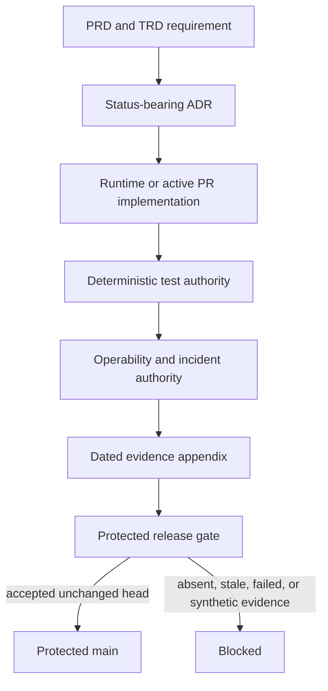

# Requirement traceability

**Document state:** `active_pr` 
**Canonical role:** durable requirement-to-implementation-to-decision-to-test mapping

This document records stable authority relationships. Volatile commit SHAs,
workflow IDs, review snapshots, and current branch state belong only in the
[dated evidence appendices](evidence/README.md). A pull request, issue, or
dated appendix is evidence and never becomes shipped authority until protected
integration and operational acceptance succeed.

## Requirement-to-implementation matrix

| Requirement | Product state | Implementation authority | Decision and operational authority | Test authority |
|---|---|---|---|---|
| PRD-001 / FR-001 compatible chat surface | `implemented_on_protected_main` | `server.py`, `orchestrator.py` | PRD, TRD, ADR-0002, operability | API and passthrough tests |
| PRD-002 / FR-002 route/conduct allocation | `implemented_on_protected_main` | `TaskOrchestrator.complete` | ADR-0001, UML | paper and optimizer tests |
| PRD-003 / FR-003/004 workflow and access control | `implemented_on_protected_main` | `WorkflowStep`, conduct planner | ADR-0003, UML | workflow and access tests |
| PRD-004 / FR-005 reliability and failover | `implemented_on_protected_main` | `ModelClient`, orchestrator circuit state | Architecture, threat model, incident runbook | provider reliability tests |
| PRD-005 / FR-006 KV credentials | `implemented_on_protected_main` | `credentials.py`, `kv_config.py`, CLI | ADR-0004, UML, threat model | KV credential tests |
| PRD-006 / FR-007 cost attribution | `implemented_on_protected_main` with honesty gaps | `orchestrator.py`, `cost_ledger.py`, `cost_router.py` | ADR-0006, ERD, operability | ledger reconciliation and unknown-price tests |
| PRD-007 / FR-008 sync and batch | `implemented_on_protected_main` with restart gaps | `batch_routing.py`, `cost_router.py` | ADR-0005, UML, operability | batch restart and replay tests |
| PRD-008 / FR-009 optional persistence | `implemented_on_protected_main` | state, agent-pool, SQL, and KV adapters | ADR-0008, ERD, release guide | persistence and migration tests |
| FR-011 route registry parity | `accepted_architecture` | dispatcher and generated contract | TRD, test strategy | shared-registry parity tests |
| FR-012 execution-path evidence parity | `accepted_architecture` | route, conduct, passthrough, streaming, and batch paths | Architecture, UML, threat model | execution-mode matrix |
| PRD-006 / FR-013 cost authority | `accepted_architecture` | price and usage authorities | ADR-0006, ERD | reconciliation and non-free unknown-price tests |
| PRD-007 / FR-014 durable batch identity | `accepted_architecture` | job and idempotency stores | ADR-0005, operability | restart and replay tests |
| PRD-009 / SEC-002 provider transport trust | `active_pr` | PR #96 | ADR-0002, ADR-0015, threat model | PR-bound evidence until protected merge |
| Free-first fallback | `active_pr` | PR #94 | ADR-0007 | PR-bound evidence until protected merge |
| Adaptive reasoning effort | `active_pr` | PR #99 stacked on PR #94 | ADR-0003 | PR-bound evidence until protected merge |
| NIM all-modality benchmark | `active_pr` | PR #90 stacked on PR #96 | ADR-0006 | PR-bound evidence until protected merge |
| Local loopback MLX provider and audited model judgment | `active_pr` | PR #109 independently targets protected main | PR #109 planning ADR, PRD, TRD | PR-bound evidence until protected merge |
| PRD-010 independent review and release | `accepted_architecture` | repository rules, workflows, and human governance | ADR-0010, ADR-0011, ADR-0016, release guide | exact-head and protected-main evidence |
| Purpose-bound PII handling | `accepted_architecture` | host and runtime audience boundaries | ADR-0009, threat model | privacy, telemetry, and trace tests |

## Authority flow

## Active stack relationships

PR #96 supersedes closed-unmerged PR #76. PR #82 remains Draft until PR #96
has an accepted stable head or protected merge, after which only PR #82's
unique bootstrap intent may be reconstructed and revalidated. PR #105 carries
this canonical documentation graph and PR #104 carries the disclosure
lifecycle on top of it. PR #109 is an independent `active_pr` MLX slice and
does not inherit PR #96 authority. No predecessor, author-only, status-only, or
synthetic-merge evidence transfers between these branches.

## Open product backlog relationships

- Issue #95 closes only after PR #96 reaches protected main.
- Issue #103 owns fail-closed commercial release authorization semantics.
- Issue #102 owns equivalent-endpoint racing after the accepted security and
  coverage boundary is integrated.
- Issue #86 owns evidence-grade NIM model discovery and cost-quality
  evaluation; PR #90 remains active evidence, not shipped behavior.

## Documentation maintenance rule

Any mapped behavior change must update the relevant PRD/TRD status, ADR,
diagram, data ownership, test authority, operability path, and this matrix in
the same reviewed change. Evidence-only changes update a dated appendix rather
than embedding volatile identifiers in canonical documents.
