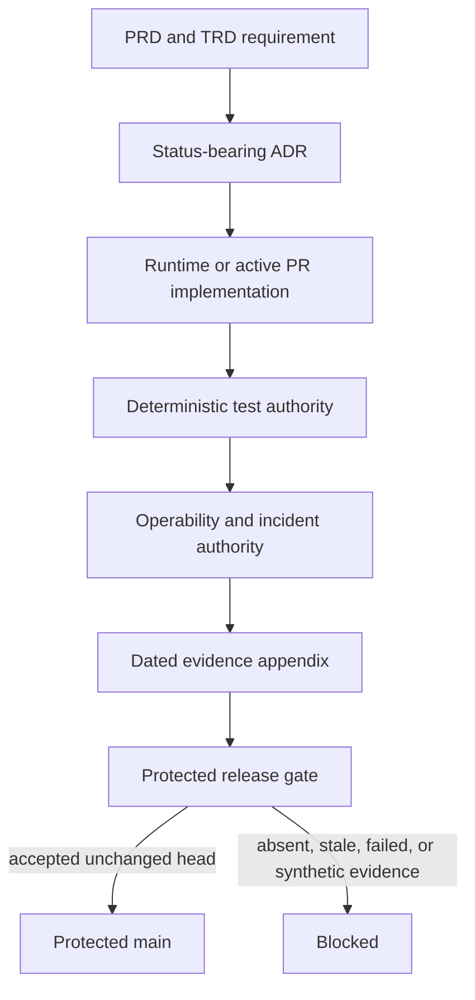

# Requirement traceability

**Document state:** `active_pr` 
**Canonical role:** durable requirement-to-implementation-to-decision-to-test mapping

This document records stable authority relationships. Volatile commit SHAs,
workflow IDs, review snapshots, and current branch state belong only in the
[dated evidence appendices](evidence/README.md). A pull request, issue, or
dated appendix is evidence and never becomes shipped authority until protected
integration and operational acceptance succeed.

## Requirement-to-implementation matrix

| Requirement | Product state | Implementation authority | Decision and operational authority | Test authority |
|---|---|---|---|---|
| PRD-001 / FR-001 compatible chat surface | `implemented_on_protected_main` | `server.py`, `orchestrator.py` | PRD, TRD, ADR-0002, operability | API and passthrough tests |
| PRD-002 / FR-002 route/conduct allocation | `implemented_on_protected_main` | `TaskOrchestrator.complete` | ADR-0001, UML | paper and optimizer tests |
| PRD-003 / FR-003/004 workflow and access control | `implemented_on_protected_main` | `WorkflowStep`, conduct planner | ADR-0003, UML | workflow and access tests |
| PRD-004 / FR-005 reliability and failover | `implemented_on_protected_main` | `ModelClient`, orchestrator circuit state | Architecture, threat model, incident runbook | provider reliability tests |
| PRD-005 / FR-006 KV credentials | `implemented_on_protected_main` | `credentials.py`, `kv_config.py`, CLI | ADR-0004, UML, threat model | KV credential tests |
| PRD-006 / FR-007 cost attribution | `implemented_on_protected_main` with honesty gaps | `orchestrator.py`, `cost_ledger.py`, `cost_router.py` | ADR-0006, ERD, operability | ledger reconciliation and unknown-price tests |
| PRD-007 / FR-008 sync and batch | `implemented_on_protected_main` with restart gaps | `batch_routing.py`, `cost_router.py` | ADR-0005, UML, operability | batch restart and replay tests |
| PRD-008 / FR-009 optional persistence | `implemented_on_protected_main` | state, agent-pool, SQL, and KV adapters | ADR-0008, ERD, release guide | persistence and migration tests |
| FR-011 route registry parity | `accepted_architecture` | dispatcher and generated contract | TRD, test strategy | shared-registry parity tests |
| FR-012 execution-path evidence parity | `accepted_architecture` | route, conduct, passthrough, streaming, and batch paths | Architecture, UML, threat model | execution-mode matrix |
| PRD-006 / FR-013 cost authority | `accepted_architecture` | price and usage authorities | ADR-0006, ERD | reconciliation and non-free unknown-price tests |
| PRD-007 / FR-014 durable batch identity | `accepted_architecture` | job and idempotency stores | ADR-0005, operability | restart and replay tests |
| PRD-009 / SEC-002 provider transport and configured-KV trust | `active_pr` | PR #96 | ADR-0002, ADR-0015, threat model | PR-bound evidence until protected merge |
| Local loopback MLX provider and audited model judgment | `active_pr` | PR #109 independently targets protected main | PR #109 planning ADR, PRD, TRD | PR-bound evidence until protected merge |
| Price-aware tie-breaking and administrator credential workflow | `active_pr` | PR #111 is a partial feature slice on protected-main ancestry | PR #111 contracts and issue #116 | remaining session, security, coverage, review, and protected-integration evidence |
| Fail-closed commercial release authorization | `active_pr` | PR #112 is an evidence-model prototype, not a trusted authority binder | ADR-0010, ADR-0011, release guide | spoofing, ruleset, review-identity, and protected-integration matrix remains incomplete |
| Equivalent-endpoint racing | `active_pr` | PR #114 is a partial immediate-race experiment | issue #102, architecture, operability, threat model | equivalence, validation, cancellation, accounting, and ablation matrix remains incomplete |
| Liveness/readiness, inbound framing, and trace authority | `active_pr` | PR #121 is an open partial security slice | issues #117, #118, and #119 remain requirement authority | duplicate framing, deadlines, independent trace authority, readiness degradation, and protected integration remain incomplete |
| Evidence-grade NVIDIA NIM benchmark | `planned` | PR #90 is `superseded` closed-unmerged evidence; PR #115 is an open `superseded` scaffold; issue #86 owns replacement | ADR-0006 | replacement benchmark evidence |
| Free-first fallback | `planned` | PR #94 is `superseded` closed-unmerged evidence | ADR-0007 | replacement implementation requires fresh protected-line evidence |
| Adaptive reasoning effort | `planned` | PR #99 is `superseded` closed-unmerged evidence | ADR-0003 | comparable-budget replacement tests |
| Synchronous embeddings and KV-only bootstrap | `planned` | PR #66 is `superseded` closed-unmerged evidence | PRD and TRD | replacement contract evidence |
| PRD-010 independent review and release | `accepted_architecture` | repository rules, workflows, and human governance | ADR-0010, ADR-0011, ADR-0016, release guide | exact-head and protected-main evidence |
| Purpose-bound PII handling | `accepted_architecture` | host and runtime audience boundaries | ADR-0009, threat model | privacy, telemetry, and trace tests |

## Authority flow

## Active stack relationships

PR #96 supersedes closed-unmerged PR #76. PR #82 is `superseded`
closed-unmerged bootstrap evidence; only its unique intent may be rebuilt after
PR #96 reaches an accepted protected result. PR #105 carries this canonical
documentation graph. PR #104 was merged into this documentation stack and is
not protected-main authority until PR #105 reaches protected main.

PR #109 remains an independent `active_pr` local-provider/judgment slice. PR
#111, PR #112, PR #114, and PR #121 are independent `active_pr` partial or
prototype slices; none inherits PR #96 authority or closes its owning issue.
PR #115 is an open scaffold classified `superseded`, not active implementation
authority. PR #113 and PR #120 are `superseded` closed-unmerged duplicate
documentation replays; their accepted unique intent is retained in this PR #105
graph. No predecessor, author-only, status-only, queued, or synthetic-merge
evidence transfers between these branches.

## Open product backlog relationships

- Issue #95 closes only after PR #96 reaches protected main and operational
  acceptance succeeds.
- Issue #103 has a partial prototype in active PR #112. The trusted GitHub and
  protected-main authority binder remains incomplete, so the issue stays open.
- Issue #102 has a partial immediate-race experiment in active PR #114. Explicit
  endpoint equivalence, completed-response validation, cancellation/drain,
  accounting, deterministic tie-breaking, and comparable-budget acceptance
  remain incomplete.
- Issue #86 owns evidence-grade NIM model discovery and cost-quality evaluation.
  PR #90 is `superseded` closed-unmerged evidence. PR #115 is an open scaffold
  classified `superseded`, not active implementation authority, because it does
  not satisfy the accepted security, benchmark, and evidence contract.
- Issues #117, #118, and #119 remain open requirement authorities. Active PR
  #121 supplies partial implementation evidence only and does not close them.
- Issue #116 remains open. Active PR #111 proves opaque session separation,
  expiry, and logout, but Secure-cookie, CSRF/origin, bounded-session,
  restart/durability, disclosure-sink, security-base, and approval acceptance
  remain incomplete.

## Documentation maintenance rule

Any mapped behavior change must update the relevant PRD/TRD status, ADR,
diagram, data ownership, test authority, operability path, and this matrix in
the same reviewed change. Evidence-only changes update a dated appendix rather
than embedding volatile identifiers in canonical documents.
