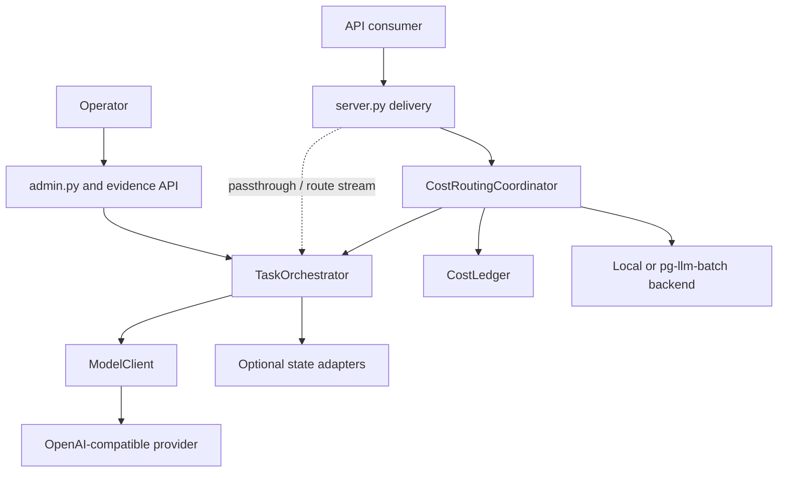
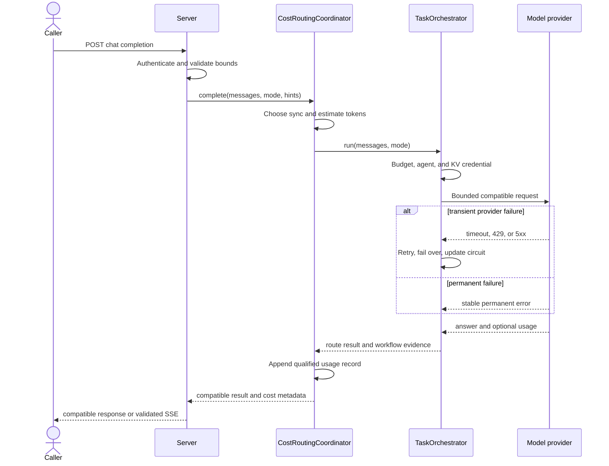
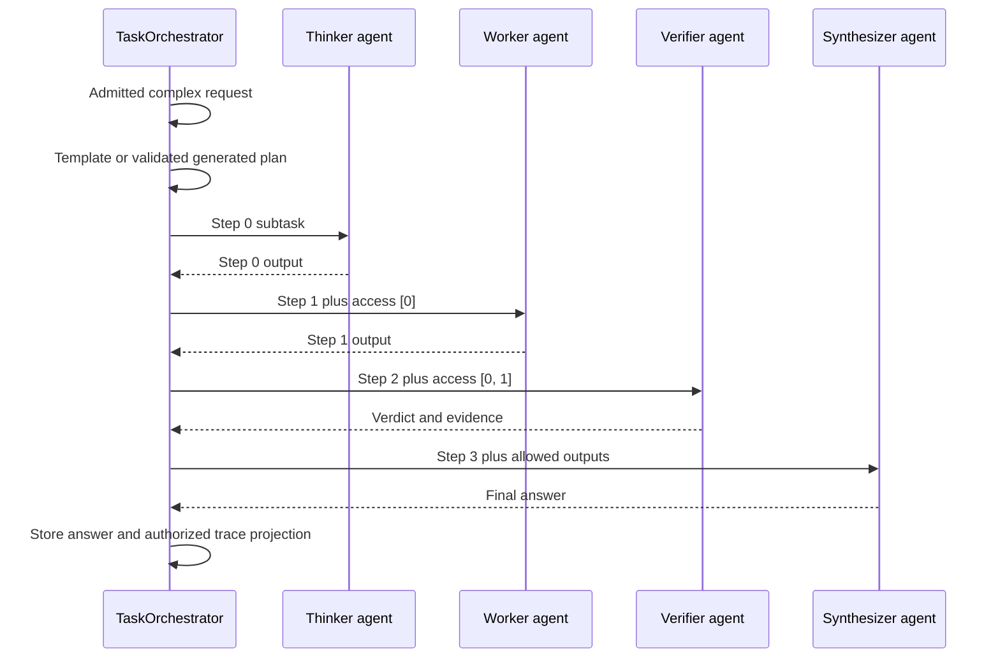
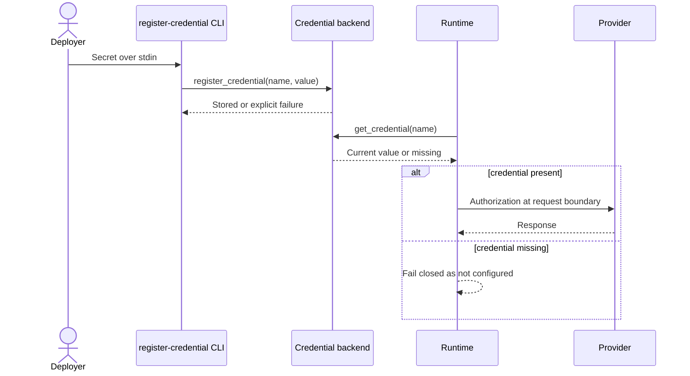
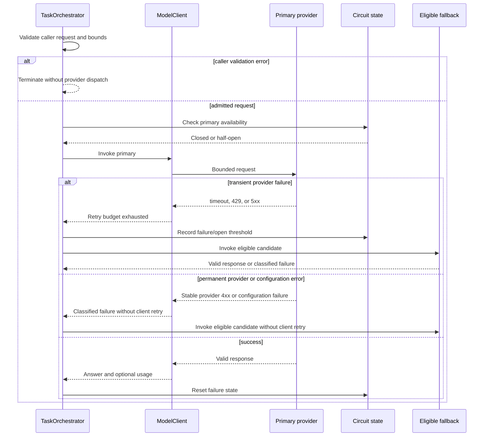
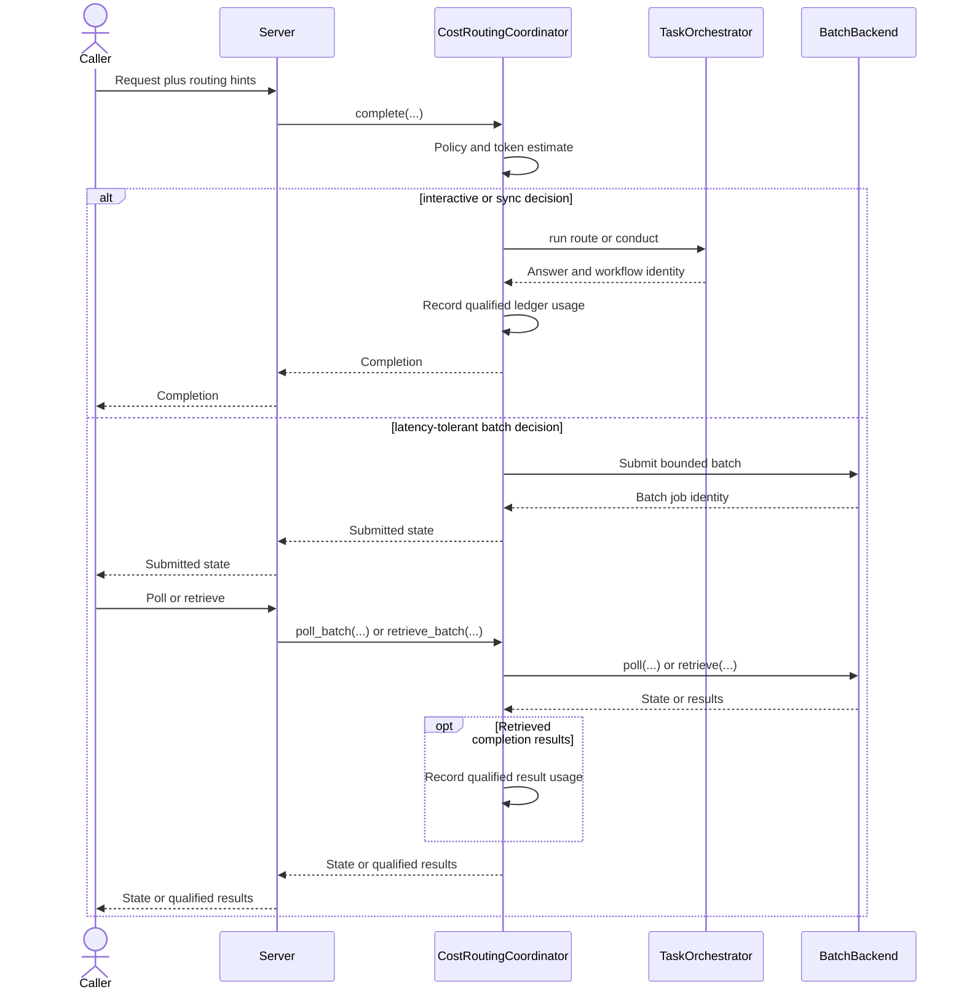
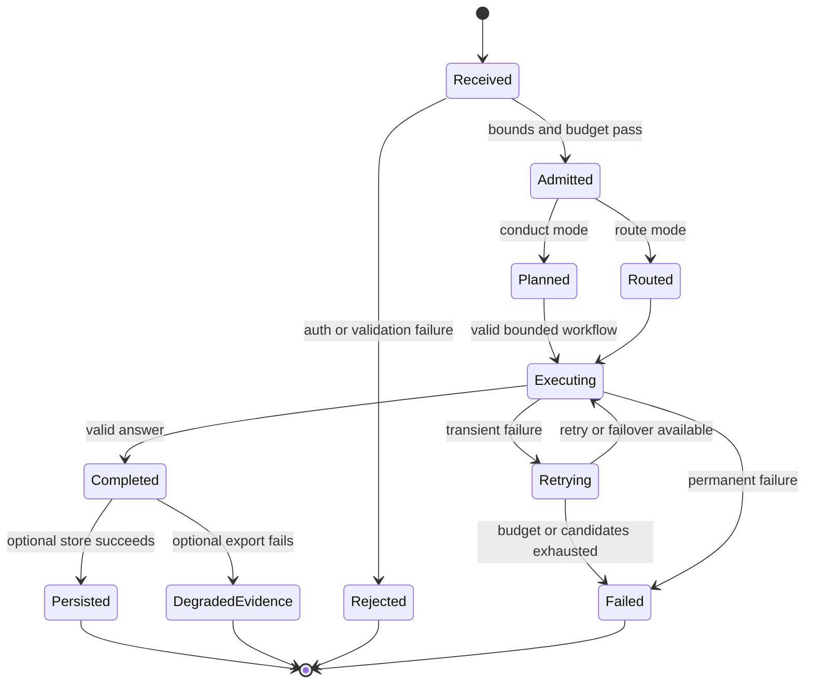
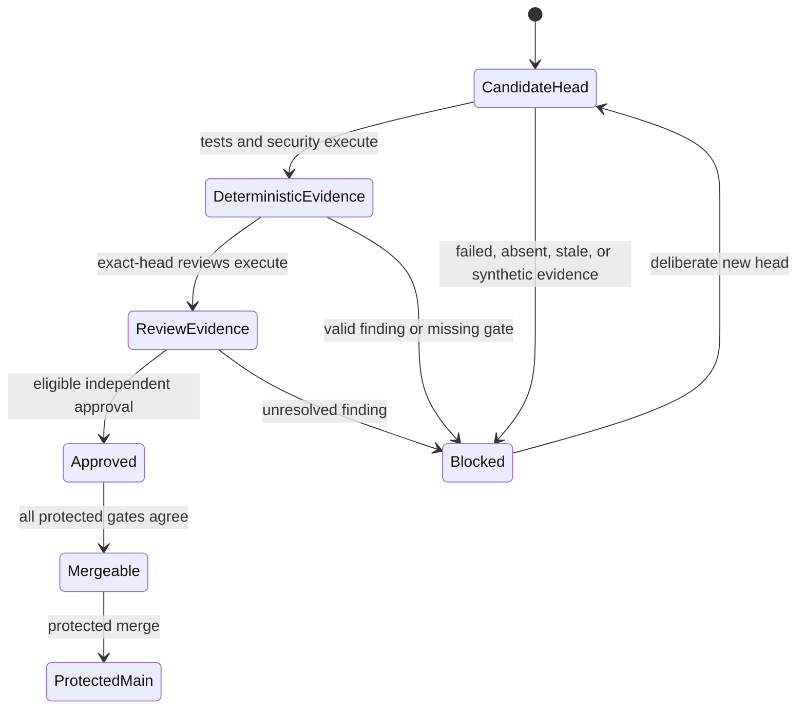
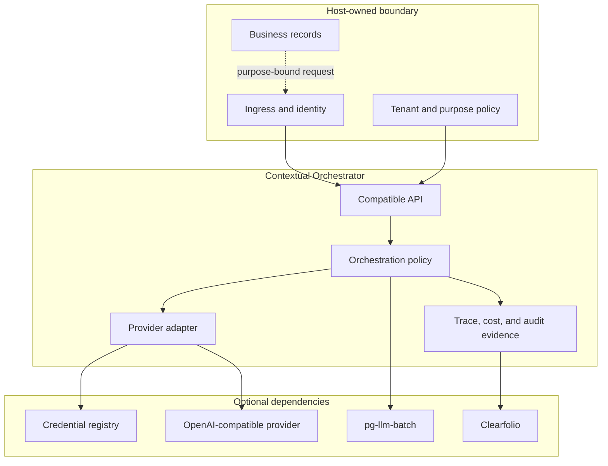
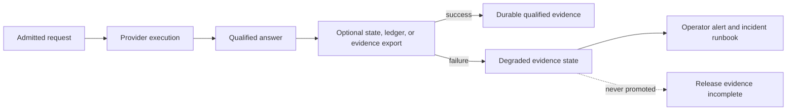

# Runtime and deployment UML

**Document state:** `accepted_architecture`

These diagrams are architecture-as-code. Labels use protected-main class and
resource names. Active-pull-request behavior is called out rather than drawn as
shipped runtime behavior.

## Component topology

The server and admin are delivery adapters. They cannot grant model-provider
authority, change evidence status, or take ownership of host tenancy.

## Route sequence

Mock agents return before credential and network operations. The stronger
DNS-pinned and strict response parser path is `active_pr` in #96. Raw
passthrough and route streaming do not follow this coordinator sequence on
protected main; they bypass ledger recording, and streaming also bypasses
durable workflow state.

## Conduct sequence and access lists

Role-specific reasoning effort and recursive depth controls are
`active_pr`/`planned`; they are not shown as protected-main authority.

## Credential bootstrap and use

Environment variables may select/connect/unlock the KV at bootstrap. They are
not the request-time provider credential source. The cross-process sequence
requires the durable Postgres credential backend. With the default in-memory
backend, the CLI process exits with its registry; registration must occur in the
same long-lived process as provider use.

## Provider failover and circuit breaker

DNS pinning, ambient-proxy and redirect rejection, and strict response parsing
are `active_pr` in #96. This diagram therefore describes the accepted control
flow while `ARCHITECTURE.md` and `TRACEABILITY.md` retain the shipped boundary.

## Sync-versus-batch sequence

The local backend preserves standalone operation. External job persistence and
execution are owned by the injected `pg-llm-batch` contract, but coordinator
handles and result mappings are process-local. Restart loses lookup authority;
chat result replay is not idempotent on protected main.

## Request and provider state machine

`DegradedEvidence` is never converted into complete durable evidence. A model
answer and its export health remain separate facts.

## Evidence and merge authority

A status, check, model review, and human approval are distinct. No transition
may manufacture another authority.

## Deployment topology

The dotted edge is a request projection, not a transfer of business-record
ownership.

## Degraded-mode topology

Optional persistence failure may leave a model answer usable only when the
contract permits it, but it cannot be reported as complete durable evidence.
