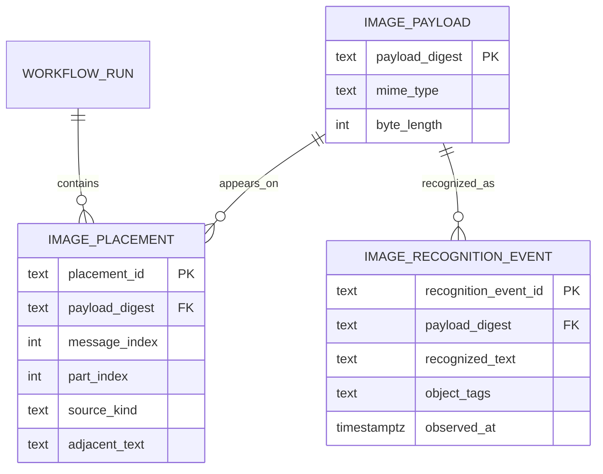

# Architecture Notes

## Sources Read

APA 7th citations (titles retained for paper-contract search):

- Sakana AI. (2026, June 22). *Sakana Fugu: One model to command them all*. https://sakana.ai/fugu-release/
- Tang, Y., Cetin, E., Xu, J., Sun, Q., Nielsen, S., Richard, V., Goda, H., Tymchenko, I., Nguyen, N., Lee, H., Ashiga, M., Kotyan, S., Kuroki, S., & Clanuwat, T. (2026). *Sakana Fugu technical report* (arXiv:2606.21228). arXiv. https://doi.org/10.48550/arXiv.2606.21228
- Xu, J., Sun, Q., Schwendeman, P., Nielsen, S., Cetin, E., & Tang, Y. (2026). *TRINITY: An evolved LLM coordinator* (arXiv:2512.04695). arXiv. https://doi.org/10.48550/arXiv.2512.04695
- Nielsen, S., Cetin, E., Schwendeman, P., Sun, Q., Xu, J., & Tang, Y. (2026). *Learning to orchestrate agents in natural language with the Conductor* (arXiv:2512.04388). arXiv. https://doi.org/10.48550/arXiv.2512.04388
- Faysse, M., Sibille, H., Wu, T., Omrani, B., Viaud, G., Hudelot, C., & Colombo, P. (2024). *ColPali: Efficient document retrieval with vision language models* (arXiv:2407.01449). arXiv. https://doi.org/10.48550/arXiv.2407.01449
- Xu, Y., Li, M., Cui, L., Huang, S., Wei, F., & Zhou, M. (2020). LayoutLM: Pre-training of text and layout for document image understanding. In *Proceedings of the 26th ACM SIGKDD International Conference on Knowledge Discovery & Data Mining* (pp. 1192–1200). Association for Computing Machinery. https://doi.org/10.1145/3394486.3403172
- Masinter, L. (1998). *The "data" URL scheme* (RFC 2397). Internet Engineering Task Force. https://doi.org/10.17487/RFC2397

## What The Architecture Is

The public shape is a single model API. The internal shape is a model pool plus a learned coordinator that decides when to answer directly, when to delegate, how much context each worker receives, when to verify, and how to synthesize the final answer.

The useful split is quality-latency, not separate products:

- Low-latency routing: select one worker for the current query or turn.
- Deep orchestration: create a multi-step workflow when the task needs decomposition, independent attempts, verification, or synthesis.

TRINITY contributes the compact coordinator idea: a small model representation plus a lightweight head can choose agent and role over multiple turns. Its Thinker, Worker, and Verifier contracts are practical enough to implement directly.

Conductor contributes the workflow representation: each step is a natural-language subtask, an assigned worker, and an access list of prior step outputs. This is the key piece for preventing every worker from being dragged into the same transcript while still allowing deliberate collaboration.

The Fugu report combines these ideas into production constraints:

- Fugu is optimized for latency by selecting a worker without expensive coordinator generation.
- Fugu-Ultra is optimized for quality by generating deeper workflows over a broader agent pool.
- The agent pool is swappable, allowing provider preference, model exclusion, and compliance controls.
- Multi-agent tool/function-call workflows need memory discipline: isolate agents inside the current workflow, but keep useful shared memory across turns.

## Implementation Mapping

This repository implements the interface and control plane, not the trained coordinator.

- `contextual_orchestrator.orchestrator.ModelAgent`: one configured worker model.
- `TaskOrchestrator.route_once`: the low-latency routing path.
- `TaskOrchestrator.conduct`: the workflow path with planner, worker, verifier, and synthesizer steps.
- `WorkflowStep.access`: Conductor-style visibility control.
- `collect_image_catalog`: 3NF image payload / placement / recognition-event split so a figure stays next to its pay line.

- `ModelClient`: OpenAI-compatible HTTP client, with `mock://` for local checks.
- `contextual_orchestrator.server`: small `/v1/chat/completions` HTTP server. Buyer next action: send OpenAI `text` + `image_url` parts; read `orchestration.image_content_catalog` to find the figure.

The deliberate simplification is the policy. The paper systems learn routing and topology from rewards; this lab uses deterministic keyword scoring so the repo runs without training data, GPUs, or vendor credentials.

Add learned routing only when there is an evaluation set and logs proving the heuristic policy is the bottleneck.

## Product Planning Interpretation

The product is not a Fugu clone. It is a control-plane prototype for the same public shape: one compatible API with hidden orchestration. The enterprise value comes from exposing the hidden operating evidence:

- pool health and provider exclusion for Fugu-style configurability;
- latency-quality policy for the Fugu versus Fugu-Ultra tradeoff;
- thinker, worker, verifier, and synthesizer roles for TRINITY-style trace review;
- natural-language subtasks and access lists for Conductor-style auditability;
- replayable evaluation runs before any learned coordinator replaces the deterministic policy.

See [product_planning.md](product_planning.md) for the product reboot.
