# Evidence-grade NVIDIA NIM benchmark: engineering decision record

## Decision

The NVIDIA NIM benchmark is an optional, provider-neutral evaluation adapter.
It is not imported by the normal package initializer and it never modifies the
runtime gateway as an import side effect. Live execution uses the same
validation-time-address-pinned HTTPS boundary as the gateway, while dry
execution remains deterministic, network-free, and credential-free.

The benchmark is evidence-generating rather than policy-authorizing. It records
what was discovered, planned, attempted, completed, failed, measured, estimated,
and unknown. It never changes production routing automatically. Every report is
measurement evidence only and keeps `routing_recommendation` null. Observation
counts alone do not validate a decision design or confer production authority.

## Architecture and MSA boundary

`contextual_orchestrator/nim_benchmark.py` owns catalog discovery, capability
probing, equal-budget policy comparison, evidence validity, uncertainty,
Pareto analysis, and artifact serialization. The ordinary gateway remains
standalone and provider-neutral. Other ContextualWisdomLab services may invoke
the benchmark as a module or CLI without taking ownership of its transport,
credential, pricing, or evidence rules.

The boundary preserves the following responsibilities:

- the host workflow owns GitHub Secret delivery and immutable run provenance;
- the benchmark moves the secret into the process-local credential registry and
  resolves it by the `NVIDIA_NIM_API_KEY` credential name;
- the benchmark owns bounded provider calls and secret-redacted artifacts;
- the central `.github` repository owns independent review and protected-branch
  policy; and
- consumers such as naruon may read artifacts but do not receive authority to
  reinterpret unknown prices or incomplete evidence as production facts.

## Provider-egress security contract

A conventional URL opener is not used for live NIM requests. Validation and
connection are one security boundary:

1. Parse an HTTPS URL and reject missing hostnames.
2. Resolve the hostname once for that request.
3. Reject any answer that is not globally routable, including private,
   loopback, link-local, multicast, reserved, unspecified, IPv6 unique-local,
   and RFC 6598 shared address space.
4. Dial only an address from that exact validation result.
5. Preserve the original hostname for HTTP authority, TLS SNI, and certificate
   hostname verification.
6. Do not consult environment proxy settings.
7. Reject every redirect before a bearer credential can reach another origin.
8. Close responses and connections deterministically and use only another
   address from the same validation result for fallback.
9. Read at most 8 MiB plus one sentinel byte from a provider response and fail
   closed before an oversized body can be materialized into benchmark evidence.

RFC 6598 defines `100.64.0.0/10` as shared, non-globally-routable address space.
RFC 4193 defines IPv6 unique-local addresses as local rather than globally
routable. RFC 9110 defines redirects as new target-URI actions and identifies
`Authorization` as resource-specific credential material that merits removal
when redirecting. The implementation chooses the narrower fail-closed policy of
not following redirects at all.

## Dynamic discovery and deterministic probe allocation

`GET /v1/models` is the run-time source of the model inventory. Model identifiers
are not hard-coded as authoritative catalog entries. The parser records invalid
and duplicate entries and sorts the usable inventory.

Every discovered model must receive a completed outcome row for every supported
probe contract in a successful live run. Immediately after the catalog request,
the benchmark computes one complete request plan containing the catalog request,
all `(model_id, capability_name)` probes, and the worst-case equal-budget policy
evaluation reserve. If the configured hard cap is even one request short, the
run fails closed before the first capability probe; a lexicographic model prefix
can never be emitted as routing-readiness evidence.

The acceptance fixture uses 127 discovered models, nine capability contracts,
seven evaluation workers, and thirty locked tasks. Its complete upper bound is
`1 + (127 × 9) + (30 × (2 × 7 + 5 + 5 + 2)) = 1,924` requests. Direct and
cheapest-worker cells reserve a worker call plus a real-time judge call;
route-once reserves its full equal-call envelope, and conduct reserves its
five-call workflow and judge envelope. The monthly workflow runs on the first
day of each month so the next scheduled run falls inside the current reviewed
evidence window; stale evidence still fails closed. It therefore uses a
reviewed hard ceiling of 2,000 requests, leaving bounded room
for catalog growth while retaining a deterministic cap. If a later catalog no
longer fits, the same preflight reports required and configured counts and makes
zero partial probe calls. Once admitted, all probe cells execute under bounded
concurrency; thread scheduling changes only completion order, never inventory
coverage or evaluation capacity.

The video-understanding probe contains a deterministic, decodable one-frame H.264
MP4. Its embedded bytes have SHA-256
`777dda43b5a15162b68a39aa486d5c70c9994d7fe761742fd00d4e13508983c0`.
Startup validation confirms the ISO Base Media File Format structure, a video
handler, AVC sample entry, 16 × 16 dimensions, one sample, and media data. This
prevents a malformed `ftyp`-only stub from turning a capable video model's valid
rejection into a false unsupported classification.

## Fair policy comparison

Direct single-worker, `route_once`, bounded `conduct`, and reviewed
cheapest-worker cells receive the same per-task contract:

- one locked task and scorer version;
- one equal cell-wide prompt-plus-completion token allowance, set to five times
  the per-provider-call output cap by default (`1,320` tokens);
- one five-call maximum envelope;
- one timeout policy; and
- one workflow-depth ceiling.

Provider retries and orchestration tool retries are disabled inside each
benchmark cell so the declared request budget bounds actual egress and the
measured call envelope remains comparable across policies.

The token allowance is cell-wide rather than per request. Prompt estimates are
charged before a call, the output cap is reduced to the remaining allowance,
and provider-reported usage replaces the latest estimate when valid. Booleans,
negative values, NaN, and infinities are not accepted as token counts. A deep
policy cannot obtain five times a single-call arm's total token budget merely by
issuing five calls.

## Cost evidence and price honesty

Actual access cost and hypothetical production cost are separate fields and
separate evidence classes.

As reviewed on 2026-09-05, NVIDIA's NIM General FAQ states that NVIDIA Developer
Program members have free access to hosted NIM API endpoints for prototyping.
The same source distinguishes development, testing, research, and evaluation
from production and states that production requires NVIDIA AI Enterprise. The
report therefore records `actual_cost_usd = 0.0` only for the reviewed hosted
endpoint access context, includes the exact source, review date, validity
horizon, program scope, production distinction, and uncertainty, and refuses a
live run after 2026-10-05 until the source is reviewed again.

No NVIDIA model price is embedded or inferred. A live hypothetical pricing
scenario is optional; absence means `unknown`. If supplied, it must be marked
`reviewed` and include an HTTPS source, reviewer, review date, validity horizon,
rate basis, uncertainty, and explicit input/output rates. Unreviewed, future,
incomplete, or expired evidence fails before network egress. The included
example remains deliberately `example_unreviewed` and is valid only for dry-run
schema testing.

NVIDIA's offering documentation further distinguishes exploratory/free NIM
availability from NIM Certified, which requires NVIDIA AI Enterprise for
enterprise lifecycle, CVE, support, and compliance expectations. The benchmark
does not convert free prototype access into a claim about production licensing,
support, or per-model production price.

## Evidence sufficiency and uncertainty

The bundled thirty-task manifest is an integration fixture with two exploratory
tasks outside the decision set. The former 30-pair/90-percent floors did not
validate sampling, scorer quality, uncertainty or deployment transfer. They no
longer promote a report into production-candidate review. Counts and emitted-cell
completion remain observations; threshold fields and routing recommendation are
null, with `measurement_evidence_only` classification. This also applies when a
caller declares 30,000 tasks but supplies only 30 successful task pairs.

This proposed adaptation preserves the decision-authority slice of canonical
PR #1000 commit `715f24a130416da3a255fa45823910410297845a`. Its separate live
output-token allocation and removal of three source-fix artifacts are not
inherited by this slice; this is not complete supersession of that commit or PR.
No new estimator, threshold or statistical dependency was added. A validated
decision contract still needs target population and assignment design, expected
task/policy/attempt identities, scorer/version evidence, missingness treatment,
precision/error objectives and empirical held-out validation with released
statistical-owner contracts. Removing an unsupported cutoff does not meet those
requirements. Child #1074's locked-cohort and failure-inclusive comparisons must
remain intact when this parent change is integrated.

Paired bootstrap intervals preserve task pairing and expose uncertainty in mean
delivered-score and terminal-outcome-time differences. Pareto frontiers show quality against latency and reviewed
hypothetical cost; policies with unknown cost are excluded from that cost
frontier and named explicitly. HELM motivates standardized multi-metric
conditions and visible incompleteness. FrugalGPT and RouteLLM motivate measuring
cost-quality routing trade-offs, but their results are not treated as evidence
for this repository's models or tasks.

### Locked versus exploratory evidence follow-up (2026-09-07, proposed)

The shared-task comparison filtered locked observations, but policy summaries
and the evidence-sufficiency calculation did not. An externally assembled mixed
evaluation could therefore use exploratory work to change the locked report's
score, completion fraction, hindsight baseline, frontier and review status.
The ordinary evaluator already selects locked tasks; this finding does not
establish contamination in a deployed run.

Committed RED `5675b942` reproduces both directions: exploratory successes
promote wholly failed locked evidence, and exploratory failures dilute wholly
successful locked evidence. In the first case, 3,000 exploratory task pairs
changed the reported successful-pair count from zero to 3,000 and completion
from zero to 0.990099, satisfying a floor meant for locked observations.
These constructed cells are regression fixtures, not empirical accuracy data.

Source `4b0fd961` restricts the existing summary and evidence calculations to
locked observations. The paired comparator already applies that boundary.
Report artifacts retain the original cells, including exploratory observations;
the fix neither discards raw evidence nor silently relabels its split. Filtering
only the top-level assembler was rejected because direct callers of the shared
calculations would retain the inconsistent boundary. No statistical kernel,
dependency, threshold, model request or production routing default changes.

The first related run preserved a RED result: 164 passed and one legacy fixture
failed because it omitted its split. Test-only `23bec0fb` explicitly labels that
fixture locked instead of weakening runtime admission to infer a missing split.
The corrected related run passes **165 tests in 36.22 seconds**, exit zero.
Current-head full/hosted verification, independent review and protected release
remain separate gates. This corrects report provenance and cohort isolation;
it does not establish probability sampling, model accuracy or faster decisions.

### Declared paired-bootstrap coverage (2026-09-07, proposed)

The previous paired comparison used a hidden 2,000-resample 95% percentile
interval and a hard-coded policy subset (`conduct_bounded` versus `route_once`,
optional cheapest versus `route_once`, and hindsight pairs when a unique
winner existed). Those choices were not reconstructible as operator
declarations. Report version 4 requires `bootstrap_resample_count`,
`confidence_level`, and `comparison_pairs` in provenance. The method name is
`paired_bootstrap_percentile`. A coverage that cannot be represented with the
resample count fails closed. CLI and workflow flags carry the same
declarations; 2,000 and 0.95 in those files are run choices, not code
defaults. Hindsight identity remains a measurement field; comparing against it
requires an explicit pair.

Efron (1979) grounds resampling observed task units. Efron and Tibshirani
(1993) ground the percentile interval and treat *B* as Monte Carlo precision.
This slice does not add a statistical dependency or change production
route/conduct defaults. Token and workflow-depth budgets are the successor
slice recorded below.

```mermaid
sequenceDiagram
    participant Operator as Run declaration
    participant Compare as Paired comparison
    participant Interval as Percentile interval
    participant Report as Schema 4 report
    Operator->>Compare: Policy pairs, resample count, coverage, seed
    Compare->>Compare: Fail closed on missing or invalid declarations
    Compare->>Interval: Shared locked-task differences
    Interval->>Report: Mean difference and declared-coverage interval
    Note over Operator,Report: Unobserved pairs are omitted; production gates still apply
```

### Declared workflow depth and token budgets (2026-09-07, proposed)

The previous equal-budget cell used a hidden five-step workflow and a
264-token per-call output cap. Those numbers allocated evaluation compute
and shaped request planning without an operator declaration. Planning,
evaluation, CLI, and provenance now require positive integer declarations.
`None` is a fail-closed sentinel. The equal cell token budget is the product
of the declared output cap and the declared workflow depth. Five and 264 in
the workflow YAML are run choices, not code defaults.

This slice does not change production route/conduct defaults. Held-out
bootstrap coverage is the successor slice recorded below.

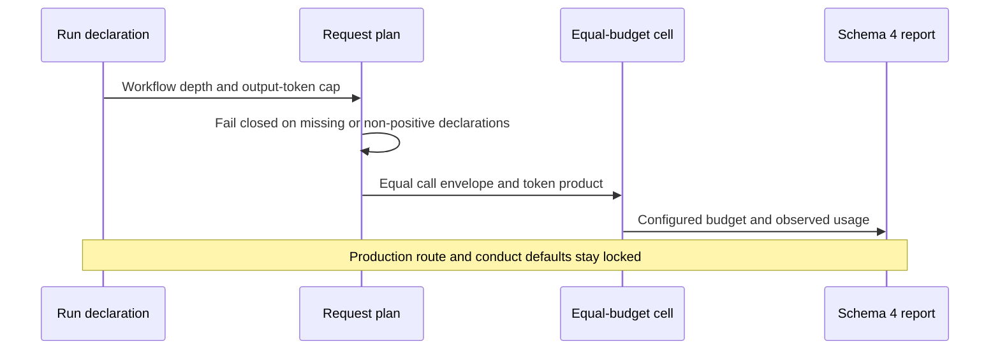

### Declared held-out bootstrap coverage (2026-09-07, proposed)

The psychometric held-out harness used a hidden 2,000-sample 95% paired
interval. Those numbers chose Monte Carlo precision without an operator
declaration. `_paired_bootstrap_mean_ci`, `run_benchmark`, and the adaptive
calibration helper now require resample count, exclusive-unit-interval
coverage, and seed. The existing floor/ceil index mapping is kept so
synthetic fixtures stay comparable. The script entry writes 2,000, 0.95, and
seed 568 as this run's choices. The report records those fields.

Efron (1979) grounds resampling observed units. This slice does not change
production route/conduct defaults. Nested interval key names are the
successor slice recorded below. Other harness sample sizes remain later work.

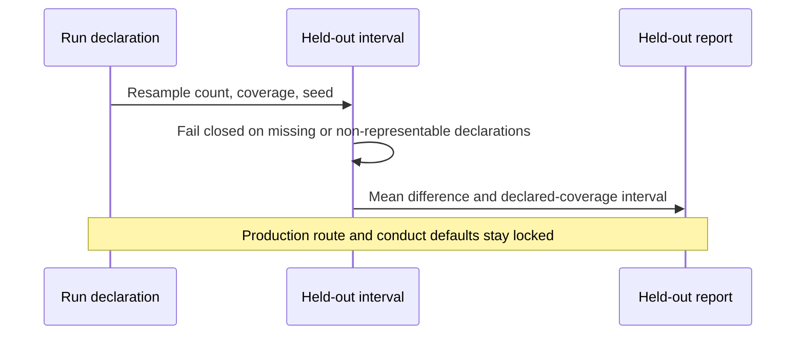

### Coverage-neutral held-out interval keys (2026-09-07, proposed)

After declared coverage, nested report fields still named `*_ci95` implied
95% even when the run declared a different interval. Those fields are now
`*_interval`. Coverage stays in `bootstrap_confidence_level`. IRT diagnostics
that measure actual 95% coverage of standard-error intervals keep their names.
Sequential-drift horizon and censored no-alarm delays are the successor
slice recorded below.

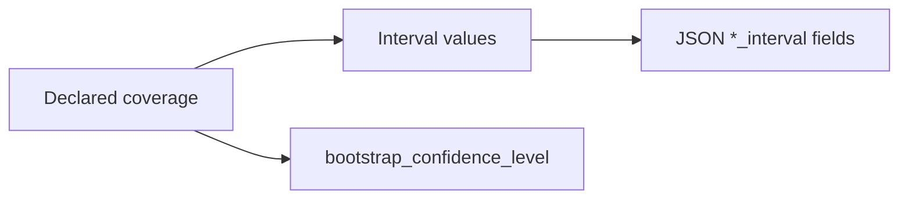

### Declared sequential-drift horizon and censored delays (2026-09-08, proposed)

The held-out CUSUM screen used a hidden 500-replication, 250-observation,
change-at-100 horizon and aborted when a replication never alarmed. Those
choices hid Monte Carlo precision and dropped missed detections from the
delay KPI. Replications, horizon, change-point, and coverage are now
required declarations. No-alarm replications are right-censored at the
remaining post-change length, recorded separately from detected-only delay
quantiles. Empty detection populations yield null quantiles, not horizon-valued
events. All-false-alarm runs preserve counts with a null conditional detection
rate; no eligible candidate preserves all calibration results with false
acceptance. This retains the effective non-detection repair from parent
`fb12256bb09d101b5f6dbf38d93b18cdfe19a926` without removing the required declarations.
The Wilson upper bound uses the declared
coverage and is stored as `false_alarm_rate_upper_bound`.

This slice does not change production route/conduct defaults. Held-out
decision-latency repetitions are the successor slice recorded below.

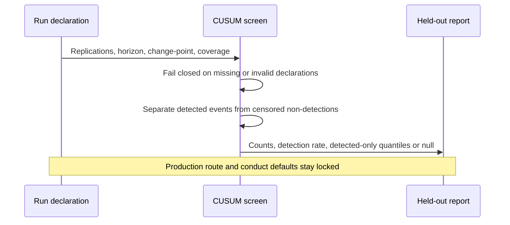

### Declared held-out latency repetitions (2026-09-08, proposed)

Paired ranking timings used a hidden 200-repetition loop per context. That
number chose Monte Carlo precision for decision-latency p50/p95 without an
operator declaration. `_measure_paired_latency` now requires
`repetitions_per_context`. The harness run writes 200 as this run's choice
and records `latency_repetitions_per_context`.

This slice does not change production route/conduct defaults. Held-out
context population is the successor slice recorded below.

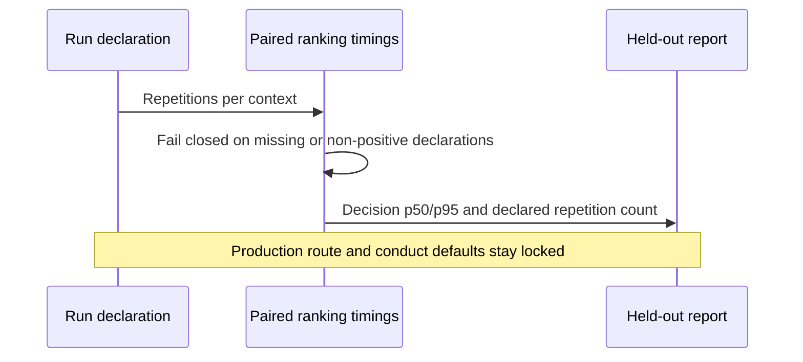

### Declared held-out context population (2026-09-08, proposed)

Accuracy and decision-latency averages used a hidden 24-context population.
That number chose the held-out sample without an operator declaration.
`_build_evidence`, `_evaluate_quality`, and `_measure_paired_latency` now
require `context_count`. The harness run writes 24 as this run's choice and
records `contexts_held_out` / `contexts_train`.

This slice does not change production route/conduct defaults. Assignment-design
trial count is the successor slice recorded below.

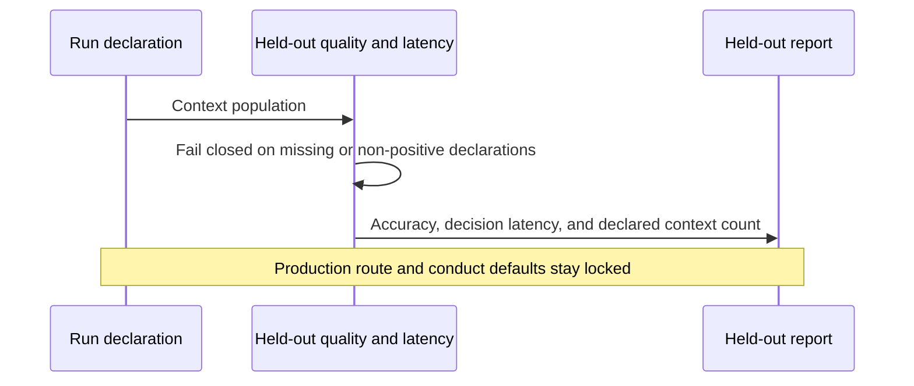

### Declared assignment-design trial count (2026-09-08, proposed)

The epsilon-greedy logging screen used a hidden 24,000-trial loop. That
number chose Monte Carlo precision for inverse-propensity RMSE without an
operator declaration. `_validate_assignment_design` now requires
`trial_count`. The harness run writes 24,000 as this run's choice and
records `trials`.

This slice does not change production route/conduct defaults. Candidate-group
DIF sample size is the successor slice recorded below.

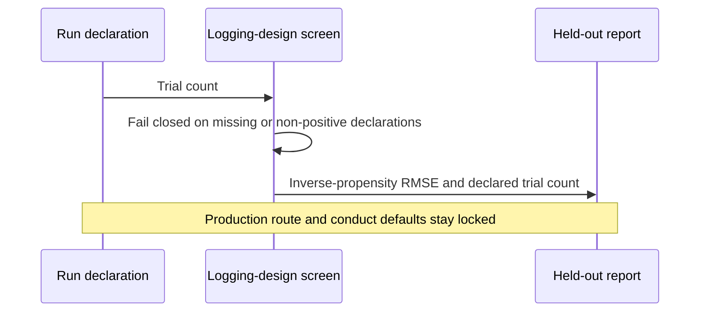

### Declared candidate-group DIF sample size (2026-09-08, proposed)

The purified logistic DIF screen used a hidden 4,000-row two-group sample.
That number chose Monte Carlo precision without an operator declaration.
`_validate_candidate_group_dif` now requires an even `sample_size`. The
harness run writes 4,000 as this run's choice and records `sample_size`.

This slice does not change production route/conduct defaults. Score-reliability
sample size is the successor slice recorded below.

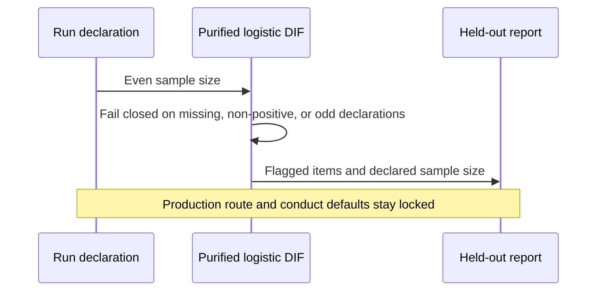

### Declared score-reliability sample size (2026-09-08, proposed)

The empirical-reliability screen used a hidden 1,200-row person sample for
weak- versus strong-information cases. That number chose Monte Carlo
precision without an operator declaration. `_validate_score_reliability` now
requires `sample_size`. The harness run writes 1,200 as this run's choice
and records `sample_size_per_case`.

This slice does not change production route/conduct defaults. Judge-effect
sample size is the successor slice recorded below.

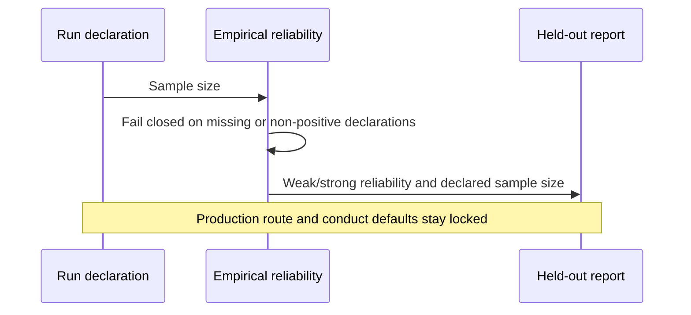

### Declared judge-effect sample size (2026-09-08, proposed)

The many-facet Rasch screen used a hidden 1,000-row fully crossed person
sample. That number chose Monte Carlo precision without an operator
declaration. `_validate_judge_effects` now requires `sample_size`. The
harness run writes 1,000 as this run's choice and records `sample_size`.

This slice does not change production route/conduct defaults. Item-covariate
sample size is the successor slice recorded below.

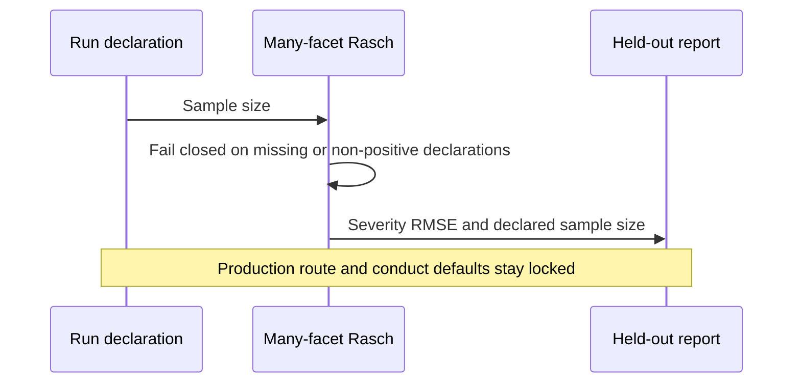

### Declared item-covariate sample size (2026-09-08, proposed)

The multigroup item-covariate screen used a hidden 1,200-row person sample.
That number chose Monte Carlo precision without an operator declaration.
`_validate_item_covariate_effect` now requires `sample_size`. The harness
run writes 1,200 as this run's choice and records `sample_size`.

This slice does not change production route/conduct defaults. Other harness
sample sizes remain later work.

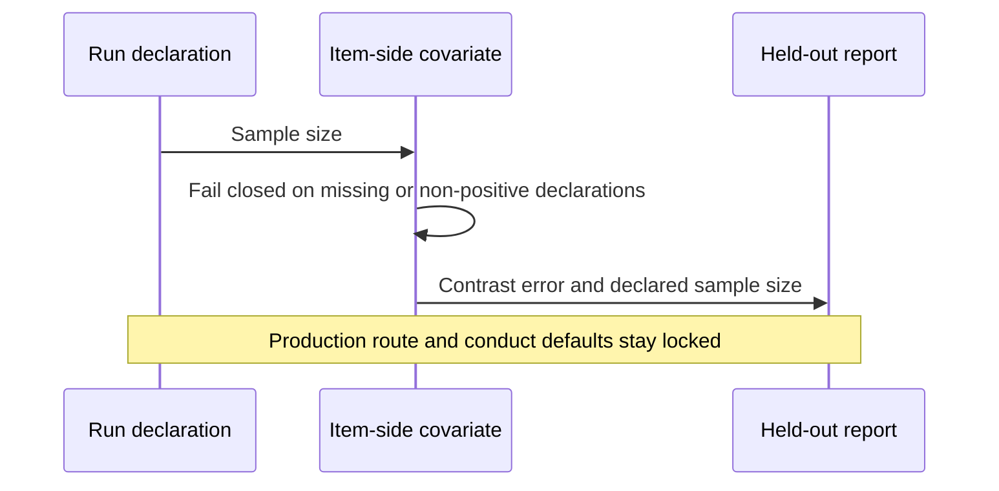

### Failure-inclusive comparison repair (2026-09-05, proposed)

The previous paired comparison selected only jointly successful cells even
though policy summaries included failure in their denominators. This changed
the quantity being estimated between the summary and its uncertainty interval.
The regression fixture gives policy A one successful answer and one failure,
and policy B two successful answers. The old comparison drops the failed pair
and reports a tie. Version 2 retains both pairs and reports mean delivered-score
difference `-0.5`, with percentile interval `[-1, 0]`. Elapsed-time differences
of `-50` and `1950` ms give a mean of `950` ms and interval `[-50, 1950]`.
These hand-checked unit-test values validate calculations, not model accuracy
or a production latency improvement.

The product requirement is to compare successful task delivery per attempted
task. The technical contract reuses the existing paired mean-bootstrap routine
with the same sorted task identities and seed for score and elapsed time.
Successful-outcome and unmatched-task counts expose the denominator; duplicate
observations, invalid outcomes, non-finite or negative elapsed times, and
invalid successful scores fail closed. Raw unscored responses remain null.
No failure reward is written into the psychometric response ledger.

Efron (1979) grounds resampling observed units; choosing task delivery as the
reward is this product's declared evaluation decision. The rejected alternative
was conditioning the headline comparison on both policies succeeding, which
hides reliability differences. The retained limitation is inference conditional
on the observed shared tasks and selected policies. A one-sided missing task is
reported but cannot be imputed, and the hindsight baseline's selection
uncertainty is not included. The 30-successful-pair and completion gates remain
unchanged, and routing recommendations remain absent. Task-level resampling
assumes independent task units; shared task families or time dependence require
a corresponding grouped sampling design before population inference.

```mermaid
sequenceDiagram
    participant Runs as Policy runs
    participant Cells as Observed task cells
    participant Pairs as Locked-task pairing
    participant Report as Comparison report
    Runs->>Cells: Outcome, optional answer score, elapsed time
    Cells->>Pairs: Match policy observations by task identity
    Pairs->>Report: Shared and unmatched task counts
    Pairs->>Report: Delivered-score difference and interval
    Pairs->>Report: Terminal-outcome-time difference and interval
    Note over Cells,Report: Failed raw scores remain null; production gates still apply
```

The [released RankWeave `v0.18.0` comparison API](https://github.com/ContextualWisdomLab/RankWeave/blob/61c49c50d3b4a24fc9bd7c6d3a7f2f4ba19d7be6/src/rankweave/comparison.py) is restricted to retrieval
metrics and paired randomization. It does not accept generic response times or
provide a paired p95 interval, so this repair does not add that dependency or
reinterpret retrieval scores as latency. A future p95 comparison needs a
released statistical-owner contract that resamples shared task pairs and
subtracts the two policy quantiles within each resample, plus a declared
sampling/error design. Mean intervals are not p95 evidence.

The coverage audit also exposed two price-validation tests that accepted the
unrelated, earlier hosted-access-expiry error. Commit `9b4cc199` isolates that
separate precondition and checks the exact intended price-rejection category.
The actual hosted-access expiry tests and production validation remain intact.
All 149 focused tests then pass, with 1,223 statements and 446 branches covered
at 100% and public docstring coverage at 100% on that source commit.

### Public response-time evidence audit (2026-09-05, proposed)

The next product requirement is a reproducible accuracy/time comparison on
observed responses. A public benchmark is useful input only after its observation
and sampling contracts are established; it is not automatically representative
buyer evidence. This audit changes no production default, estimator, or dependency.

Two similarly named sources must remain distinct:

| Source | Evidence inspected | Admission decision |
| --- | --- | --- |
| Feng et al. (2026), LLMRouter / xRouteBench | Paper v1; dataset revision `ea4b6e1b29d9a734f55f0a637baf326bad6aa681`; collection-code revision `da3430baaea672743c3957457b0c76faba19876e` | Candidate for further provenance review, not admitted as failure-inclusive latency evidence. |
| Li et al. (2026), LLMRouterBench | ACL paper, Section 4.2.2 and Figure 8, PDF p. 9 (proceedings p. 37741) | Its latency analysis uses token counts and serving statistics to estimate response time. It cannot establish observed request-level p95 or this gateway's decision overhead. |

The pinned [xRouteBench card](https://huggingface.co/datasets/ulab-ai/xRouteBench/blob/ea4b6e1b29d9a734f55f0a637baf326bad6aa681/README.md)
describes response times in seconds and generic train/test matrices of 80,802 and
67,122 rows. These are publisher metadata, not locally audited row counts.
Its blanket 18-candidate statement cannot be applied to personalized data:
the same card lists 2,464 rows for 2,235 training queries. Do not assume complete
pairing from the dataset name, total size, or a generic scenario's dimensions.

The [outer collector](https://github.com/ulab-uiuc/LLMRouter/blob/da3430baaea672743c3957457b0c76faba19876e/llmrouter/data/api_calling_evaluation.py)
times normal returns but writes zero duration when an exception escapes the
call. The [inner API helper](https://github.com/ulab-uiuc/LLMRouter/blob/da3430baaea672743c3957457b0c76faba19876e/llmrouter/utils/api_calling.py)
instead catches ordinary provider errors and preserves elapsed time. Thus the
claim that *all API failures have zero latency* would be incorrect. The outer
row also omits the inner structured error field; a separate success Boolean
is returned to the collection loop, but the published card does not specify a
terminal-outcome column.

An isolated execution of the reviewed outer function, extracted with Python's
standard-library AST without importing the upstream package, passed these three
controlled checks. No provider call or dataset row was executed:

| Controlled call result | Recorded seconds | Returned success flag |
| --- | --- | --- |
| Successful return; controlled clock advances seven seconds | 7 | true |
| Returned API-error result; same controlled clock | 7 | false |
| Exception escapes the call | 0 | false |

This is a code-level counterexample, not evidence that published rows contain
zero-duration failures. The dataset's generating code revision, attempt
timestamps, retry history, and error counts remain unverified. A read-only
dataset-viewer filter request timed out; no zero count, completeness finding,
or tail estimate is inferred from that failure. The collector also uses
model-dependent timeouts and wall-clock timing; its records are not proof of
this gateway's current timeout policy or monotonic end-to-end measurement.

The pinned dataset API/card declares no dataset license and contains no license
file. Public access, the library's MIT code license, and the paper's CC BY 4.0
license do not establish redistribution rights for constituent task data.
Only the licensed paper is attached; no response rows, prompts, or dataset copy
are committed. Missing permission metadata is an unresolved provenance item,
not a conclusion that every research use is prohibited.

Before using an observed matrix, record and verify:

- the dataset revision, file hashes, permitted use, task/scorer versions, and
  versioned model/deployment plus prompt/decode/tool settings;
- unique task-model-attempt identities, train/test disjointness at the task
  family or conversation level, intended/observed cell counts, and explicit
  terminal outcomes including failures and timeouts;
- observed versus estimated duration, the measured start/end events, retries,
  censoring, and a declared treatment of missing duration that neither inserts
  zero nor silently drops failed tasks from the headline population;
- the target population, sampling and dependence units, error/precision goal,
  quality non-inferiority margin, and locked policy choices before test scoring.

The intended KPIs remain held-out delivered-score difference and separately
measured decision-time and end-to-end p95 differences. A joint admission decision
requires the preregistered accuracy margin and latency improvement with their
uncertainty bounds; the existing 30-task floor is not a tail-precision argument.
Any new generic quantile implementation belongs in a released Rust RankWeave
contract before consumer adoption. The smaller current change is this admission
record, not another unvalidated estimator.

For psychometrics, a mixed collection of exact-match, F1, and judge scores in
the same numeric range does not by itself define one latent response scale.
Model/query orientation, scorer effects, local dependence, anchors, and
invariance still require validation. A delivery reward can support a declared
routing decision without becoming a portable model-ability estimate. This is
our measurement-validity requirement, not a claim made by either benchmark.

#### Follow-up: actual generic-matrix audit

The later audit read **all 147,924 rows** of the pinned revision's
`llmrouter_generic` train/test files, not the other scenarios. It supersedes
the earlier metadata-only status for these two files. The files were fetched
once for local read-only research, then decoded with the already available
PyArrow 25.0.1 reader while network access was denied. No package was installed,
no provider called, and no prompt or response was printed or committed.
The [aggregate evidence](../research/xroute-generic-observation-audit.json)
records file hashes, byte counts, identity definitions, and results.

| Observed property | Train | Test |
| --- | ---: | ---: |
| Rows read, matching Parquet metadata | 80,802 | 67,122 |
| Distinct model labels | 18 | 18 |
| Distinct exact query strings | 4,487 | 3,729 |
| Distinct scored-task fingerprints | 4,488 | 3,729 |
| Repeated scored-task/model rows beyond the first | 18 | 0 |
| Missing pairs in the observed task-by-model rectangle | 0 | 0 |
| Empty response strings | 948 | 1,120 |
| Null task identifiers | 54,900 | 46,800 |
| Fractional scores strictly between zero and one | 6,763 | 806 |
| Zero, negative, or non-finite durations | 0 | 0 |
| Literal `ERROR` / `API Error` response prefixes | 0 | 0 |

The scored-task fingerprint uses exact task name, query, choices, metric, and
reference answer; the stimulus fingerprint omits the metric and reference.
These content identities are audit definitions, not publisher attempt IDs.
Query-only counts agree with the card. A different stimulus/scoring count does
not contradict that card: choices and scoring context also identify a task.
No exact stimulus fingerprint crosses train/test, but semantic, task-family,
or training-corpus leakage was not tested.

All 18 repeated pair groups belong to one ARC-Challenge scored-task fingerprint,
with two rows per model and different embedding identifiers. None is an exact
duplicate row: six groups differ in response text and seventeen in recorded
time. All have equal scores within the group. They may be repeat executions;
without attempt provenance they must not be silently discarded or treated as
independent new items merely because their embedding identifiers differ.

All 2,068 empty responses have zero output tokens and scores, positive input
and total tokens, and positive recorded time. They occur in the two `gpt-oss`
model labels. These are blank-output observations, not confirmed HTTP failures,
model incapacity, or known censored reasoning. The files have no explicit
terminal-status, attempt-ID, or collection-time columns. Zero error-prefix
matches therefore do not establish zero failed attempts.

This evidence **does not confirm zero-duration contamination** in the inspected
data. It redirects the next action to outcome observability and repeated-item
dependence. Before fitting a response model, preserve the empty/unknown outcome
distinction, explain repeated attempts, and choose a scorer-compatible response
model. Before latency inference, establish timing and sampling provenance.
Raw rows remain unchanged; no p95, ability rank, accuracy gain, or production
admission is inferred from this audit.

## Workflow and credential separation

`.github/workflows/nim-benchmark.yml` has separate dry and live jobs. The dry job
never receives `NVIDIA_NIM_API_KEY`. Only the live benchmark step receives the
GitHub Secret, and the credential is never passed through argv or written to an
artifact. Both jobs use immutable action revisions, bounded execution, and
single-flight concurrency. The workflow cannot merge, release, approve its own
changes, or modify routing configuration.

The ordinary test workflow separately proves:

- complete focused production statement and branch coverage;
- 100% public docstrings;
- wheel build and clean-environment import;
- no eager optional benchmark import;
- no compatibility monkeypatch module;
- no temporary branch-writing or source-export repair job; and
- no retained one-use transformation payload.

## Verification contract

An exact pull-request head is eligible for review only after all of the following
succeed:

- deterministic unit and adversarial security tests;
- transport tests for DNS rebinding, proxy isolation, redirects, SNI/authority,
  address fallback, bounded response bodies, and cleanup;
- complete-plan preflight tests for 127 models, the exact boundary, one request short, zero partial egress, deterministic concurrency, and a valid media fixture;
- live pricing and access-evidence expiry tests that prove failure before egress;
- equal token/call budget tests for every comparison arm;
- evidence-sufficiency, Pareto, provenance, and secret-redaction tests;
- 100% statement and branch coverage for the production benchmark module;
- 100% public docstrings;
- package build, install, and import smoke tests;
- repository Tests, Fuzz, Security, Security Scan, and SAST; and
- independent exact-head review with no unresolved actionable thread.

No earlier head, local-only result, queued check, or stale approval is accepted as
release evidence.

## References

Autio, C., Schwartz, R., Dunietz, J., Jain, S., Stanley, M., Tabassi, E., Hall,
P., & Roberts, K. (2024). *Artificial intelligence risk management framework:
Generative artificial intelligence profile* (NIST AI 600-1). National Institute
of Standards and Technology. https://doi.org/10.6028/NIST.AI.600-1

Chen, L., Zaharia, M., & Zou, J. (2023). FrugalGPT: How to use large language
models while reducing cost and improving performance. *arXiv*.
https://doi.org/10.48550/arXiv.2305.05176

Efron, B., & Tibshirani, R. J. (1993). *An introduction to the bootstrap*.
Chapman & Hall. https://doi.org/10.1201/9780429246593

Efron, B. (1979). Bootstrap methods: Another look at the jackknife.
*The Annals of Statistics, 7*(1), 1–26.
https://doi.org/10.1214/aos/1176344552

Fielding, R., Nottingham, M., & Reschke, J. (2022). *HTTP semantics* (RFC 9110;
STD 97). RFC Editor. https://doi.org/10.17487/RFC9110

Feng, T., Yu, F., Zhang, H., Dai, Z., Yuan, L., Lei, Z., Zhang, W., Zhu, K.,
Yue, H., Xuan, K., Liu, G., & You, J. (2026). *LLMRouter: Unified infrastructure
for developing, evaluating, and deploying LLM routers* [Preprint]. arXiv.
https://doi.org/10.48550/arXiv.2608.06867

Hinden, R., & Haberman, B. (2005). *Unique local IPv6 unicast addresses*
(RFC 4193). RFC Editor. https://doi.org/10.17487/RFC4193

Li, H., Zhang, Y., Guo, Z., Wang, C., Tang, S., Zhang, Q., Chen, Y., Qi, B.,
Ye, P., Bai, L., Wang, Z., & Hu, S. (2026). LLMRouterBench: A massive benchmark
and unified framework for LLM routing. In *Findings of the Association for
Computational Linguistics: ACL 2026* (pp. 37733–37754). Association for
Computational Linguistics. https://doi.org/10.18653/v1/2026.findings-acl.1881

Liang, P., Bommasani, R., Lee, T., Tsipras, D., Soylu, D., Yasunaga, M., Zhang,
Y., Narayanan, D., Wu, Y., Kumar, A., Newman, B., Yuan, B., Yan, B., Zhang, C.,
Cosgrove, C., Manning, C. D., Ré, C., Acosta-Navas, D., Hudson, D. A., … Koreeda,
Y. (2023). Holistic evaluation of language models. *Transactions on Machine
Learning Research*. https://doi.org/10.48550/arXiv.2211.09110

NVIDIA Corporation. (n.d.). *General FAQ*. NVIDIA NIM Documentation. Retrieved
August 5, 2026, from https://docs.api.nvidia.com/nim/docs/product

NVIDIA Corporation. (2026, June 4). *NIM offerings*. NVIDIA NIM for Large
Language Models. https://docs.nvidia.com/nim/large-language-models/2.0.5/about-nim-llm/nim-offerings.html

Ong, I., Almahairi, A., Wu, V., Chiang, W.-L., Wu, T., Gonzalez, J. E., Kadous,
M. W., & Stoica, I. (2024). RouteLLM: Learning to route LLMs with preference
data. *arXiv*. https://doi.org/10.48550/arXiv.2406.18665

Weil, J., Kuarsingh, V., Donley, C., Liljenstolpe, C., & Azinger, M. (2012).
*IANA-reserved IPv4 prefix for shared address space* (RFC 6598; BCP 153). RFC
Editor. https://doi.org/10.17487/RFC6598
