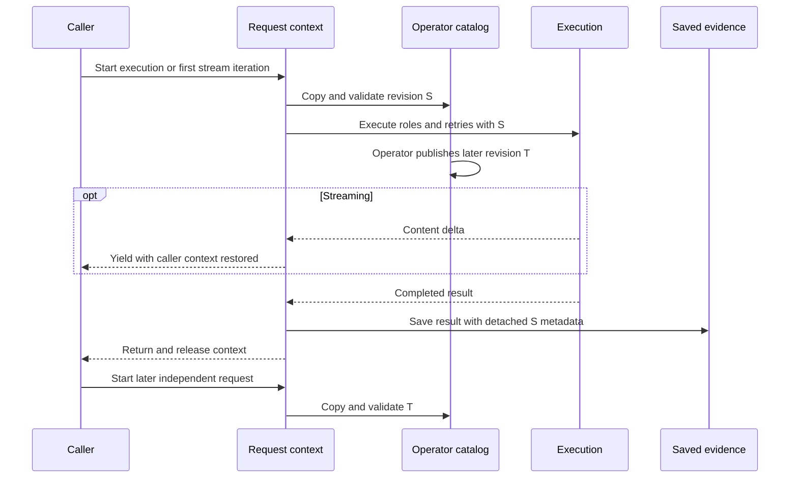

# Provider-neutral reasoning-effort profiles

## Customer next action

Construct `default_role_effort_catalog()` only for an evaluation or an
explicitly configured deployment, run `run_equal_budget_ablation(true_theta)`,
and keep production defaults unchanged while
`production_default_change_allowed(report)` is `false`.

## Contract

`ReasoningEffortProfile` is a versioned, JSON-safe snapshot for thinker,
worker, verifier, synthesizer, planner, and judge. It validates finite numeric
budgets, rejects booleans-as-numbers and unknown keys, and keeps
`reasoning_effort` separate from `temperature`, `top_p`, and `seed`.

The catalog is hashed canonically to identify declared configuration in
synchronous route, streaming route, batch route, generated planning,
verification, and persisted runs. The proposed request-revision repair below
captures the declared effort catalog once per outer execution. It does not
freeze the agent pool or orchestration policy. Cached completions include the catalog
hash in their key, and persisted runs preserve the completed result's snapshot
instead of relabeling it with later settings. See the
[cache attribution repair](DISTRIBUTED_RESPONSE_CACHE.md#effort-catalog-attribution-repair-2026-09-06)
for the preceding sequential repair and its historical limits.
A provider must explicitly declare
`reasoning_effort_supported=true` before the native field is sent. Unknown
support fails closed; the explicit `omit` fallback sends only independently
valid output and sampling controls.

The ablation emits estimated `theta_hat`, RMSE against supplied true
parameters, token budget, workflow/depth/access-list factors, and an
`estimated` measurement status. Synthetic estimates are evidence for tests,
not production quality claims, and cannot unlock a default change.

## Request revision contract (Proposed)

### Requirement and decision

Product requirement: an operator's effort update must affect later independent
requests without changing a request already in progress. The answer, attempted
role profiles, effort component of selection identity, cache identity, and
saved effort metadata must describe the same declared revision. Independent
requests must not wait behind a global lock. Provider compliance with the
declared controls remains a separate observation.

In the context of opt-in effort settings shared by concurrent requests,
facing mixed execution and record revisions after operator updates,
we decided for one validated request-local catalog snapshot
and against constructor-wide freezing, a global execution lock, or metadata-only relabeling,
to achieve consistent attribution while allowing independent requests to progress,
accepting context-management overhead and a separate agent-pool/policy consistency boundary.

This is the implementation proposal for [ADR 0021](../planning/adrs/0021-reasoning-effort-profiles.md),
not a newly accepted ADR or release. Constructor-wide freezing would hide
legitimate later updates. A lock would serialize provider waits and would not
control mutations of the caller-owned mapping. Relabeling output alone would
leave mixed profiles in workflow steps and retries.

### Technical contract and sequence

`complete`, direct `route_once`/`conduct`, `batch_route`, and `stream_route`
establish the boundary. Same-instance nested routing reuses it; a different
orchestrator has its own revision and restores the caller's context on return.
An entire `batch_route` invocation shares one revision. A stream captures it
at first iteration, before selection, preserving normal generator laziness.
All malformed catalog roles/values fail before provider execution, including
cache-disabled and explicit bypass paths. A request started without a catalog
retains that absence even if an operator opts in before it finishes.

The existing canonical snapshot is held in a module-level `ContextVar` with its
owning instance. Profile, key, and evidence readers reuse that snapshot. The
mutable role mapping is copied before validation, and exported metadata is
deep-copied so one returned batch row cannot change another. Stream advancement
and close run in a copied context; yielding restores the caller's context, so
interleaved streams do not borrow one another's effort settings. Exceptions
and early close release the active context. No dependency, statistical kernel,
global lock, new provider call, or production routing default is introduced.



The existing Python control-plane adapter owns this context boundary; it adds
no numerical estimation implementation. Rust-first statistical ownership is
unchanged. The diagram does not promise an atomic transaction over deployment
metadata, the mutable agent pool, sampling overrides outside the role catalog,
or the orchestration policy. Same-instance nested calls belong to their outer
effort scope; the catalog is not a general per-call override API.

### Exact local evidence and KPI

RED `beae9fb45f13d9401357444f0d527ba4be64645a` fails all eight reproduction
cases in 0.34 seconds. Source `1eff633810e0269afda349ae8ccacba3bc9e447d`
passes them in 0.37 seconds. At guard head
`1edf574b81a7d25c9eb54d47a10afd063375c1a6`, **317 integration tests pass in
18.90 seconds**. The focused request suite contains **23 passing cases**,
including actual overlapping threads, interleaved streams, early close,
provider errors, retry, nested orchestrators, malformed catalogs, default-path
opt-in, cache replay, detached batch rows, and later-request updates.
Test-only lint cleanup `ec3ad654` passes the same 23 cases in 0.42 seconds and
the environment's default Ruff selection for the new test file.

The 23-case coverage run at `1edf574b` covers all **43 statements and 12
branches** across the scope decorator and its two wrappers, scope context
manager, snapshot reader, profile reader, and metadata attachment. All seven
definitions are documented. This is not whole-orchestrator or exhaustive
concurrency-interleaving coverage. The changed-definition census against main
`414f2297` is **173/173**: runtime 37/37, scripts 44/44, tests 92/92, using the
existing AST-difference scope rather than excluding private/nested definitions.

For a fixed one-worker unit fixture with real-time judging disabled and cache
disabled, the number of real catalog validations per completion changes as
follows. The baseline is `beae9fb4`, the candidate is `1edf574b`; answer,
snapshot, and selected deployment identities are equal between versions.

| Mode | Catalog | Before | After |
|---|---|---:|---:|
| Route | Opted out | 0 | 0 |
| Conduct | Opted out | 0 | 0 |
| Route | Opted in | 2 | 1 |
| Conduct | Opted in | 5 | 1 |

This is an operation-count KPI with zero external calls, **not a wall-clock
latency result**, quality improvement, or buyer p95 result. The correctness KPI
is eight failing revision fixtures to zero, with the broader guards retained.

Reproduce the request guards and validation-count invariant:

```sh
.venv/bin/pytest -q tests/test_request_effort_snapshot.py
.venv/bin/python -m coverage run --branch -m pytest -q tests/test_request_effort_snapshot.py
.venv/bin/python -m coverage json -o request-effort-coverage.json
uv tool run --offline ruff check tests/test_request_effort_snapshot.py
```

Evidence is in `/tmp/co-1067-request-effort.3j8tar`: `red-pytest.log`,
`green-{pytest.log,junit.xml}`, `final-focused-{pytest.log,junit.xml}`,
`final-coverage-{pytest.log,data}`, `final-coverage.json`, and
`validation-count-profile.json`. Full-suite, hosted checks, independent review,
protected merge, immutable release, and live provider/measurement validity
remain separate gates. Synthetic unit fixtures cannot authorize production.

## Verification

```text
uv run pytest -q tests/test_reasoning_effort_profile.py tests/fuzz/test_fuzz_properties.py
uv run ruff check .
```

## Research basis (APA 7th)

Python Software Foundation. (n.d.). *contextvars — Context variables*.
Python documentation. Retrieved September 6, 2026, from
https://docs.python.org/3/library/contextvars.html

Sakana AI. (2026). *Sakana Fugu technical report*.
https://github.com/SakanaAI/fugu/blob/main/Fugu_technical_report.pdf

Xu, J., Sun, Q., Schwendeman, P., Nielsen, S., Cetin, E., & Tang, Y. (2025).
*Trinity: An evolved LLM coordinator* (arXiv:2512.04695).
https://doi.org/10.48550/arXiv.2512.04695

Nielsen, S., Cetin, E., Schwendeman, P., Sun, Q., Xu, J., & Tang, Y. (2025).
*Learning to orchestrate agents in natural language with the Conductor*
(arXiv:2512.04388). https://doi.org/10.48550/arXiv.2512.04388

Baker, F. B. (2001). *The basics of item response theory* (2nd ed.). ERIC
Clearinghouse on Assessment and Evaluation. https://eric.ed.gov/?id=ED458219
