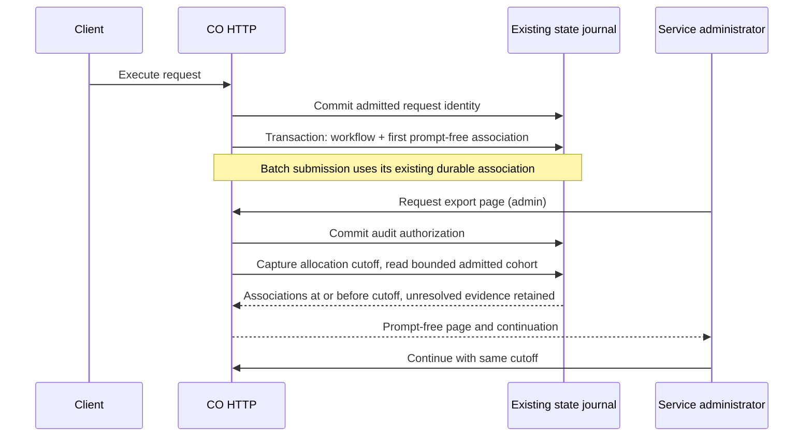

# Request outcome export: proposed contract and evidence

## Integrated recovery, 2026-09-12

The original archive remains historical evidence below. This successor starts at
integrated stack `81ad64cf77a49f7bc2a57f4851a5c3259387ce5d`, preserving its current
main transport, tool, timeout and admission-finalization repairs. RED `b9cf0df7`
executed real HTTP workflow, batch and capacity rejection, restarted the server,
then failed because the admin export returned 404 (1 failed, 2.38s).

`7541ca11` restores the archive's exporter delta relative to `73404f89`, not a
whole-file replacement. Export, workflow-link, persistence and API suites passed
71 tests in 21.00s. This used a read-only isolated native namespace with the source
checkout. At that historical checkpoint, installed/full/rendered verification was
outstanding; subsequent scoped evidence is recorded below. Protected review, merge
and release are not established. Historical screenshots are not current acceptance.

PR #1126's exported field constant and its test remain available for compatibility.
It was only a reserved name, not an implemented analytics projection. The new
authorized endpoint returns `observations`; retaining the name does not claim an
analytics-snapshot field or full real-world cohort reconciliation.

ADR 0131 is retained as Proposed; recheck its number across live PRs before
publication. No predecessor is closed and no historical recovery commit is removed.

### Full and installed pre-repair acceptance

Frozen `e2e66f00` first attempted full collection with the focused-test interpreter;
process 95819 stopped with one collection error in 11.93s because Hypothesis was
absent. No tests ran. Log: `/tmp/co-export-full-e2e66f00.log`.
Using the existing root `.venv/bin/python` read-only, process 22202 completed
**3,722 passed, 2 skipped, 144.70s**; log
`/tmp/co-export-full-e2e66f00-locked.log`. Native namespace append makes this
source integration evidence.

Separately, the root reviewer built core from exact `e2e66f00` archive and installed
core plus native into `/tmp/co-export-package-e2e66f00.XroFpq`. Process 12044
completed **72 passed, 11.43s**, using `python -I` outside the checkout. Both import
origins were asserted under installed site-packages. Runtime dependencies used
the hash-locked requirements; test tooling included pytest 9.1.1.
Core SHA-256: `4f8be3db93c0e22c3cc92f29b3a300b731c524674f0703ca4c12f78b81bf6b71`.
Native SHA-256: `8dfee5d228a28733136e25c6006f77006bcba095863a667e0f2a3e71ca8c7c04`;
the native source diff from its build checkpoint `3051bdf6` to `e2e66f00` was empty.

### Malformed retained metadata follow-up

`c4802bcc` added a real SQLite migration RED: syntactically invalid retained
workflow-link JSON prevented index creation (1 failed, 1.93s). Earlier malformed
tests covered valid JSON with invalid shapes, not invalid JSON syntax. Startup
rolled back and preserved data, but export could not start.

`3b7ac04e` guards both unique-index extraction and prior-origin lookup with
`CASE WHEN json_valid(payload)`. The old unguarded index is replaced within the
existing migration transaction; subsequent startup keeps the guarded index.
Invalid metadata rows remain stored and counted by export; valid workflow origins
remain unique. `4e89529c` verifies legacy-index upgrade, retained rows, uniqueness
and repeat startup. The five focused suites completed **74 passed, 8.43s** at
that exact head, process 66371. Full and installed results above precede this fix
and do not prove its final acceptance; both must be repeated before delivery.

### Integrated frozen checkpoint aae29136

Ordinary merge of research head `dcaf2b29` produced
`aae29136f9ff8dbba892db81c9ca2f9140fad8de`. Its full source run 73193 completed
**1 failed, 3,723 passed, 2 skipped, 166.90s**, log
`/tmp/co-export-full-final-20260912.log`. The failure is the paper inventory
contract: the newly merged LART review references arXiv `2512.07019` without an
inventory entry. This is not full-suite GREEN; the research owner must repair
the inventory before renewed verification.

Independent installed acceptance at the same exact archive completed **74 passed,
8.47s**, root process 42305. Both package imports resolved under
`/tmp/co-export-package-aae29136.DnIyXx/installed` using `python -I` from `/tmp`.
Core SHA-256: `419d6bcc7fe5d77493b917d77bbd7207612253179901886bb7bd9e1ff883f5f7`.
Native SHA-256 remains `8dfee5d228a28733136e25c6006f77006bcba095863a667e0f2a3e71ca8c7c04`;
its source is unchanged from the native build checkpoint.

The root reviewer directly inspected three screenshots in the actual browser at
`http://127.0.0.1:18767`, 1265 × 712, English, frozen `aae29136`: runbook top,
complete sequence diagram, and ADR top after navigating its visible link.
All four actors, admission/association/audit commits, batch note, cutoff read,
reply and continuation were legible without overlap or cutoff. ADR title and
Proposed frontmatter were visible. Images are in tool output, not saved files.
Other document sections, lower ADR, mobile widths, other locales and other links
remain uninspected. These scoped checks do not establish a full UI audit.

### Inventory repair and full verification

The research owner repaired the missing LART inventory entry at `9a49cb84`;
ordinary merge produced frozen `40d344dc4733e6fa2b8d45817faba8d4ba4f6dbd`.
Full source verification, process 73240, completed **3,724 passed, 2 skipped,
156.29s**. Log: `/tmp/co-export-full-inventory-repaired.log`. The interpreter was
the root project's existing `.venv/bin/python`, read-only, with the isolated native
namespace appended before `pytest.main(["tests", "-q"])`. No tests were excluded
to repair the earlier failure. This validates the complete source suite at that
head; the earlier failed run remains recorded above.

Changes after `aae29136` are documentation/inventory only, so its installed
74-test runtime acceptance remains applicable to the unchanged implementation,
not a newly built final-head package. Protected checks, independent approval,
publication and the remaining visual audit are separate outstanding gates.

## PRD: operator job and acceptance

An authorized service administrator needs a repeatable list of admitted requests
and their persisted workflow/batch associations to prepare an evaluation cohort.
The export must preserve unsuccessful/unmatched admissions and report missing or
invalid evidence. It must not expose prompts, answers, recovery descriptors,
owner digests, provider configuration, or infer customer correctness.

Acceptance is HTTP role enforcement, durable association rollback, restart and
cutoff replay, bounded output, and explicit unresolved/truncated evidence. This
is an engineering linkage KPI; no observed customer accuracy or latency gain is
claimed. Operators must obtain permitted-use data and independent adjudication
separately. A batch submission association is not proof of delivered item results.

## API contract

`GET /api/v1/request_outcome_exports` requires service-wide admin authority and
durably audits the route-owned `audit_replay` purpose. It is not owner-scoped.
The existing external verifier authenticates the admin scope only; no new
purpose claim verification is implied. Failed audit persistence prevents export.

Query parameters are integer `page_size` (1–200, default 100), `after_sequence`
(nonnegative, default 0), and `high_water_sequence` (nonnegative committed
allocation cutoff). A nonzero continuation requires the original high-water.
Unknown/duplicate parameters, bools, negative/out-of-range and future cursors
are rejected. No-store returns unavailable. First fetch obtains the high-water;
reuse it with `next_after_sequence` until the continuation is null.

Response contains `schema_version=1`, `scope=service_admin_retained_admissions`,
`measurement_complete=false`, `reconciliation_required=true`, cutoff, page size,
continuation and `observations`. Each observation retains its admission sequence
and trusted request identity, decision status, workflow outcomes, batch
associations, `link_status`, `links_truncated` and `invalid_association_count`.
Invalid admission identities return null identity and `identity_unavailable`.
Malformed linked metadata is counted and omitted, not exposed or treated as valid.
`unmatched` means no supported retained association, not a failed customer answer.

Workflow outcomes include workflow ID, original cache status and source sequence.
Cache hits are reused outcomes, not new provider executions. Batch associations
include job ID and its original custom IDs, not later retrieval identity. IDs
are scalar printable strings limited to 256 characters. They can still contain
user-chosen meaning; this API is restricted metadata, not a PII anonymizer.
Each admission exports at most 16 workflow and 16 batch associations; a batch
exports at most 100 custom IDs. Excess sets `links_truncated=true`; clients must
not use a truncated page as a complete denominator. All admissions remain present.

## TRD: persistence, query and dependency boundaries

The shared `_StateStore._save_sync` source workflow transaction appends the first
`workflow_request_link`. A unique workflow-origin expression index prevents
duplicates; a conflicting origin rolls the whole transaction back. No event is
claimed durable from queue acceptance. Existing batch submission events stay the
canonical batch association owner and are not copied into another journal.

Admission/phase/projection queries use the existing kind/key/sequence indexes.
The batch request-ID expression index uses the same SQL expression and predicate
as the query; EXPLAIN coverage checks that index is selected. Startup builds
indexes over existing data transactionally; there is no historical event backfill.
This startup scan is not repeated as a full-ledger JSON scan on each export page.

The cutoff uses SQLite's committed AUTOINCREMENT allocation sequence. Concurrent
later admissions and finalizations are excluded, and keyed workflow replacement
cannot delete its metadata association. Pre-projection workflows remain unmatched;
their historical state is not reconstructed. Missing ingress receipts due to
storage failure still require external ingress reconciliation.



No dependency on unreleased numerical owners, no new service, no estimator and
no raw owner code/DB access across repositories are introduced. Consumer uptake
must wait for protected release; this candidate is not a production contract.

## Reproduction and experiment ledger

Isolated worktree `/tmp/co-request-outcome-export-20260909`, base `73404f89`.
Read AGENTS/CLAUDE and both prior linkage runbooks first. Own Python 3.14.6
environment: `uv sync --locked --extra api --extra db --extra queue --group dev`.
CodeGraph initialized here (439 files); the separate live batch checkout was
not changed. Native source is unchanged, reused read-only from the base artifact:

```sh
.venv/bin/python -c 'import contextual_orchestrator; contextual_orchestrator.__path__.append("/tmp/co-receipt-wheel-install-20260909/lib/python3.14/site-packages/contextual_orchestrator"); import pytest; raise SystemExit(pytest.main(["tests/test_request_outcome_export.py", "tests/test_workflow_request_link.py", "tests/test_persistence.py", "-q"]))'
```

This test-only namespace append is source-integration evidence, not installation
of a successor wheel. Preserve the shared native environment. Its base hash is
recorded in [workflow reproduction](workflow_request_link.md).

| Exact checkpoint | Scope/result | Decision |
| --- | --- | --- |
| `3e14dfbb` | HTTP export RED: 1 failed, 5.37s; admin receives 404 after restart | Implement endpoint |
| `083612a8` | 1 failed, 1.51s; malformed request was not admitted | Correct test to real admitted capacity rejection |
| `c57efb79` | 1 failed, 1.93s; cutoff loses replaced workflow | Reject current-row join |
| `7929a3a6` | HTTP restart/replacement: 1 passed, 1.94s | Keep transactional projection |
| `aff524ee` | 1 failed, 14 passed, 12.20s; conflicting origin accepted | Enforce one origin |
| `8fb2571b` | 4 failed, 13 passed, 11.06s; metadata/status/identity gaps | Repair validation |
| `03480774` | Three-file focused: 48 passed, 17.96s | Keep bounded validation |
| `4eaed252` | 1 failed, 18 passed, 11.33s; direct-store pruning cursor edge | Use allocation high-water |
| `62c5f3b5` | 6 failed, 18 passed, 14.75s; nested metadata and cursor | Preserve unresolved rows |
| `5288a0b9` | Three-file focused: 55 passed, 22.30s | Keep repair |
| `ece0bc84` | Three-file focused: 59 passed, 22.23s; migration and bool cursor | Focused source evidence only |
| `c56f90a8` | OpenAPI RED: 1 failed, 28 deselected, 0.40s | Publish bounded query contract |
| `9e7479e1` | Four-file focused: 67 passed, 22.75s | Keep API contract |
| `f0304d7b` | Four-file focused: 68 passed, 23.08s; full suite: 3,521 passed, 2 skipped, 848.44s | Pre-final-repair source evidence |
| `2c488861` | Blank-query HTTP RED: 3 failed, 8 passed, 22 deselected, 6.32s | Repair endpoint-local parsing |
| `fb733978` | Four-file focused: 71 passed, 24.98s | Final parser repair verified; full suite pending |

The pruning RED is a direct-store contract test, not a reproduced HTTP failure:
the ordinary admin audit write can mask a declining retained maximum. HTTP tests
use controlled provider output and prove routing/persistence boundaries, not
remote pg-llm-batch integration, actual adjudicated accuracy or measured latency.
The full-suite result above belongs only to `f0304d7b`; final parser/document
repairs need separate verification. Installed wheels, hosted reviews, protected
merge and release remain unverified. ADR: [Proposed 0131](../planning/adrs/0131-request-outcome-export.md).

## Independent review and visual repair

Independent source review at `f0304d7b` found no additional persistence/privacy
defect in its bounded scope; it is not an approval. A separate review reproduced
blank-query acceptance because global `parse_qs` dropped blank values and the
integer helper treated an empty value as absent. This endpoint now parses with
`keep_blank_values=True` and explicitly rejects empty values before conversion.
Legacy endpoint parsing is unchanged.

The root agent directly opened all seven overlapping browser screenshots of the
runbook and ADR at 1129 × 1022, English, source `f0304d7b`. Text, tables, code
wrapping, ADR options/decision/consequences/rollback/citations were legible without
horizontal cutoff or overlap. The preview renderer initially mangled YAML
frontmatter; rendering it separately fixed that preview-only defect and retained
visible Proposed status. Links, focus, mobile sizes and other locales were not
tested. These are documentation checks, not full product-UI acceptance.

Mermaid 11.12.0 initially produced an **error SVG**. Counting one SVG was a false
positive and is not rendering acceptance. Direct visual inspection and the exact
parser both exposed semicolons splitting sequence messages. Replacing the two
semicolons with commas passed an in-memory parser probe; final source rendering
and screenshot inspection are still pending until recorded separately. Verification
must reject syntax-error text and require expected participants and message labels.
The temporary renderer and its locked dependencies are isolated outside the
repository/test environment; no Figma publication occurred.

Final source `fb733978` rendered with Mermaid 11.12.0 and passed a browser check
that rejects error SVGs and requires all four participants and expected messages.
The root agent directly inspected `verified-sequence.png` (1001 × 536 crop from
a 1129 × 1022 en-US viewport): actors, transactional association, audit commit,
cutoff query, responses and continuation were readable without overlap or clipping.
Images remain in `/tmp/co-outcome-export-preview.KTt6nn/`, not published assets.

At 390 × 844 en-US, the initial preview scaled the diagram illegibly. The temporary
renderer now preserves a 1000px diagram width in a horizontally scrollable region
with an explicit scroll instruction. `narrow-left.png`, `narrow-middle.png` and
`narrow-right.png` capture overlapping pans at 0, 329 and 658 pixels. Labels are
readable across the pan sequence; viewport cropping is intentional. This is a
preview-only layout repair, not a change to the source diagram or proof of GitHub
rendering. Keyboard interaction, link navigation and other locales remain
unverified. The earlier error-SVG and narrow scaling failures are retained as
failed checks, not replaced with passing baselines. The current-head full suite
and separate installed-wheel acceptance remain pending after this documentation
checkpoint.
