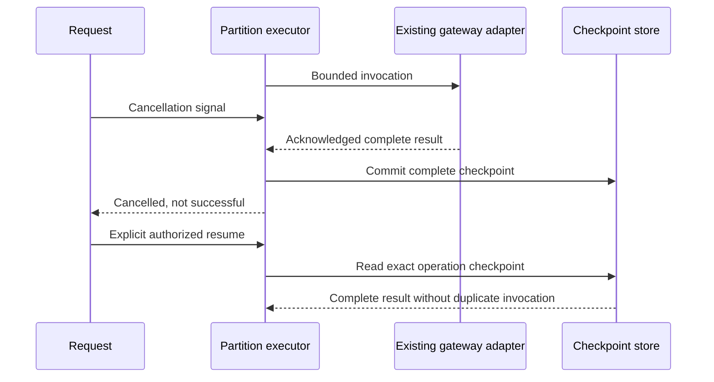

# Request partition cancellation repair — 2026-09-10

Status: Proposed. Continuation of #1117, not a production rollout or a full Fugu implementation. Preserve parent `d797d54db3d2fcc5983425a4b012172409c00b41` and its three additive files. The initial module was reconstructed and its Git blob verified as `2180508474369c93bb45fc710b0deb21788542d0` before running tests.

## Reproduction and causal change

The original `_perform` checked cancellation only before an invocation. A cancellation raised while the final reducer was executing did not prevent `run()` from returning a successful `PartitionResult`. The earlier map-cancellation test alone did not reveal this: a later reducer happened to perform another pre-dispatch check.

The new final-call regression failed with `DID NOT RAISE PartitionError`. The repair adds a cancellation fence after validation and checkpoint completion, including the cached-result path. An acknowledged response remains durable and can be reused on a later authorized resume, but the cancelled request does not return that result as success. No blanket inference timeout, model selection, payment policy or provider termination classification changed.

This is a local post-call outcome fence, not a distributed exactly-once guarantee or an atomic external cancellation protocol. Uncertain provider outcomes still require reconciliation. The prototype has no production HTTP wiring, actual model-specific input counter or durable cross-service admission implementation.

## Fresh verification

`python3 -m pytest -q -W error tests/test_partition_cancellation_fence.py` executes four cases: cancellation after map, after final reduce, before provider invocation, and a single-map completion without any reducer. The changed two executable lines and their two branch arcs are covered. Module coverage from these narrow tests is not 100%, and no whole-repository GREEN is claimed. The inherited 49-test/100% statement in the original PR/ADR is historical and was not independently rerun in this repair. Use current hosted checks for integration acceptance.

## Architecture and research boundary

Keep the whole-request inventory and capacity/continuation layer outside learned worker/topology selection. Preserve every source and cross-file obligation; lineage coverage is not semantic correctness. The central review-memory companion is ContextualWisdomLab/.github#2068. Runtime migration must preserve this cancellation/resume behavior in Rust; the existing Python prototype is not approval to create a new Python production runtime.

Sakana Fugu's basic variant selects workers without TRINITY role assignment (§3.1.1). Ultra supplies learned workflows and access lists (§3.2.1), isolates tool histories within a workflow and shares memory across workflows (§3.2.2). Its five-step limit is a stated training setup (§3.2.3), not authority to cap a complete large-review request at five calls. An external-input approach also appears in Recursive Language Models; its results are not CWL performance evidence.

## Remaining product gaps

Real admitted payload counting for every eligible route; gateway/HTTP continuation; shared inner-call usage reservations; semantic oversized-unit refinement; persistent authorization and retention; actual OpenCode/Noema/Strix fresh-session adapters; immutable release and exact-consumer replay. These remain open, not repaired by this four-line change. Link this record into the canonical product-technical-gap-baseline during full-tree owner integration; the existing baseline is not replaced by a truncated snapshot.

## References

Sakana AI. (2026). *Sakana Fugu technical report* (arXiv:2606.21228, Version 2). arXiv. https://arxiv.org/html/2606.21228v2

Zhang, A. L., Kraska, T., & Khattab, O. (2026). *Recursive language models* (arXiv:2512.24601, Version 3; original preprint 2025). arXiv. https://arxiv.org/html/2512.24601v3
