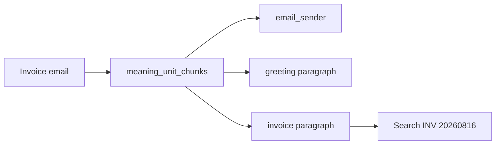

# Meaning-unit embedding chunking

## Buyer next action

On `POST /v1/batch/embeddings`, send `"chunking_strategy": "meaning_units"` with
the raw email, HTML, or mixed image body. Read `chunk_units` in the completed
document. Each `chunk_units[i]` is the source slice behind `embeddings[i]`.
Search for an invoice id against those units — not against one averaged
document vector.

Omit `chunking_strategy` or send JSON null to keep the existing naruon
one-vector-per-input contract. `"source_document"` is an explicit alias for
the same behavior; it does not request chunk expansion or alter token-budget
map/reduce boundaries.

## Why this exists

`CostRoutingCoordinator` already splits oversized inputs so a provider call
stays under a token/character ceiling, then **averages those parts back into
one vector**. That is a transport safety valve. It is not retrieval.

A naruon invoice email that begins with “Good morning” and later says
`INV-20260816` / `1840.00 USD` must not become a single point. The greeting
and the balance line are different meaning units (Zhao et al., 2024).

Similarity-breakpoint “semantic chunking” is not used. Qu et al. (2025) found
that cost is not justified by consistent gains over simpler splits. This
gateway cuts at linguistic units:

- email parties (`email_sender`, `email_recipient`, `email_subject`, `email_copy`)
- innermost HTML block leaves (`html_block`), so Gmail wrapper `div` elements
  do not glue sibling paragraphs together
- RFC 2397 `data:image` spans (`embedded_image`), including parameters,
  base64url characters, and RFC 2045 line wrapping, with the original
  `source_offset` so a later OCR/object-tag job can attach to the same place
- remaining prose as `body_paragraph` (default retrieval grain)

`unit_grain=body_sentence` is available in-process for UAX #29-style sentence
cuts. The HTTP field stays `meaning_units` so buyers get paragraph-level
invoice isolation by default.

## Standalone and as a module

- Standalone: `meaning_unit_chunks(text)` and `expand_embedding_inputs(...)`
  have no HTTP or provider dependency.
- As a module: the batch embeddings handler expands inputs before
  `complete_embeddings_batch`. Token-budget map/reduce still runs **per unit**.

## Embedded images

A base64 image in the body is a first-class unit. The 3NF target is
`embedded_image` plus child `image_text_span` / `image_object_tag` tables
(see `docs/database_conventions.md`). This slice records position and media
type in `chunk_units`; it does not invent OCR text. Live OCR/object tags
belong on an opt-in NIM job (`NVIDIA_NIM_API_KEY`), not on the default path.

## References

Zhao, J., Ji, Z., Ye, Y., Feng, X., Zhang, X., & Rong, C. (2024).
*Meta-chunking: Learning text segmentation and semantic completion via
logical perception*. arXiv. https://doi.org/10.48550/arXiv.2410.12788

Qu, R., Tu, R., & Bao, F. (2025). Is semantic chunking worth the computational
cost? In *Findings of the Association for Computational Linguistics: NAACL
2025* (pp. 2012–2027). Association for Computational Linguistics.
https://aclanthology.org/2025.findings-naacl.114/

Unicode Consortium. (2024). *Unicode Standard Annex #29: Unicode text
segmentation*. https://www.unicode.org/reports/tr29/

Lewis, P., Perez, E., Piktus, A., Petroni, F., Karpukhin, V., Goyal, N.,
Küttler, H., Lewis, M., Yih, W., Rocktäschel, T., Riedel, S., & Kiela, D.
(2020). Retrieval-augmented generation for knowledge-intensive NLP tasks.
In *Advances in Neural Information Processing Systems, 33*.
https://doi.org/10.48550/arXiv.2005.11401
