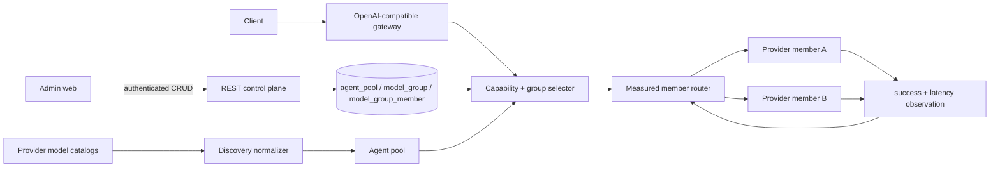
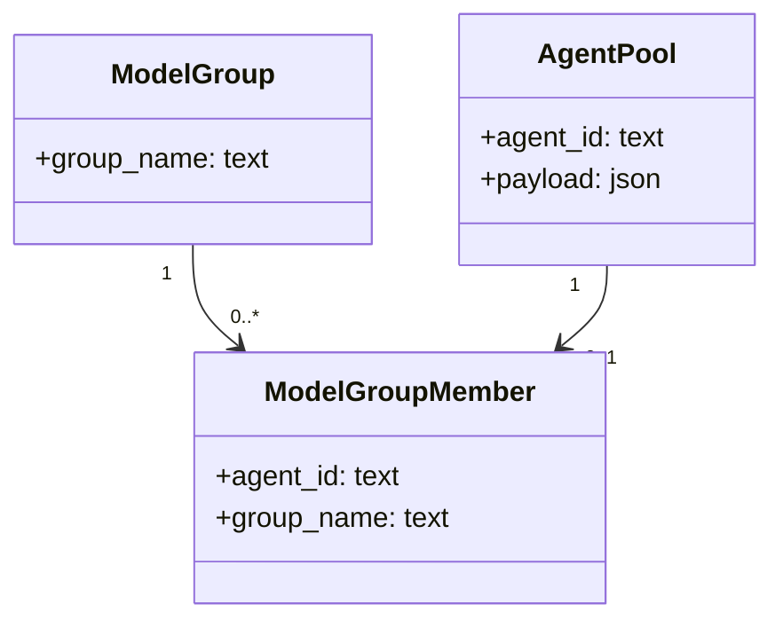

# Model Group Product and Technical Specification

- Status: Implemented on PR #834; protected-main release pending
- Date: 2026-08-25
- Normative decision: [ADR 0032](planning/adrs/0032-model-group-cost-aware-discovery.md)
- Figma file ID: `vsZMd8WAv42HDRgcZuNcWk`

## PRD

### Problem and outcome

Provider model identifiers are inventory addresses, not durable product identities.
Operators need to compose differently named provider models into a logical group,
route each request to an enabled capable member using measured evidence, and change
that composition without redeploying the gateway. Discovery must retain provider
catalog, modality, and price provenance so a temporary free model can disappear
without breaking a hard-coded group.

### Users and stories

- A gateway operator can create, inspect, edit, and delete a logical model group
  through authenticated REST and Admin web surfaces.
- An operator can add differently named provider models to a group only by explicit
  assertion; the gateway never infers equivalence from names.
- An API consumer can address the group wherever it can address a model and receive
  bounded member failover for text, image, video, speech, transcription,
  embeddings, rerank, and audio workloads.
- A cost operator can distinguish provider-declared free, priced, and unknown-price
  entries and can inspect the source evidence used for that classification.

### Acceptance criteria

1. Group membership survives restart in normalized relations and is editable
   without process restart.
2. `GET/POST /api/v1/model_groups` and
   `GET/PATCH/DELETE /api/v1/model_groups/{group_name}` are authenticated and
   reject invalid or unknown resources honestly.
3. A group request considers only enabled members supporting the requested
   capability and fails over without changing the public group identifier.
4. Member order uses observed stability and latency; no hand-authored weight is
   introduced.
5. Discovery queries the full OpenRouter modality catalog and OpenCode Zen model
   catalog, preserving input/output direction and provider pricing evidence.
6. Only complete structured price evidence whose monetary components are all
   exactly zero is free; model-name suffixes, missing prices, and malformed prices
   remain unknown.
7. No transient provider model identifier or implicit provider-alias equivalence
   appears in production configuration, source, or deterministic tests.
8. Equivalent endpoints race only when every operator-reviewed endpoint contract
   field matches; the first modality-valid completed response wins within the
   configured concurrency and deadline bounds.

### Non-goals

Optional endpoint racing is a replica policy inside the selected logical group,
not model selection. Missing or unequal contract fields retain sequential
failover; see `docs/doctoring/equivalent-endpoint-racing.md`.

- Research papers do not establish that two provider identifiers are the same
  model. Group membership is operator/provider provenance, not statistical
  inference.
- The current success-per-second member order is not a distinct-model quality
  router. Quality/cost routing requires calibrated evaluation and ablation.
- A synchronous video submission does not prove provider-affine polling or durable
  result ownership; that remains a production Gap.

## TRD

### Components and data flow

The discovery normalizer maps provider-declared `embeddings` to the internal
`embedding` capability while retaining `input:<modality>` and
`output:<modality>` tags. Group selection first enforces enabled/capability
eligibility, then orders members by the Beta-Bernoulli posterior success mean
divided by Jacobson EWMA latency. A cache hit returns the exact cached group
response and intentionally creates no synthetic provider observation.

### Persistence model

`model_group_member.agent_id` is both its primary key and a foreign key, so one
provider agent belongs to at most one logical group. Deleting a group removes
membership, not the provider agent. Legacy JSON membership migrates
transactionally into these relations.

### REST contract

| Method and resource | Success | Principal errors |
|---|---:|---|
| `GET /api/v1/model_groups` | 200 | 401/403 |
| `POST /api/v1/model_groups` | 201 | 400 invalid input, 409 duplicate |
| `GET /api/v1/model_groups/{group_name}` | 200 | 404 unknown group |
| `PATCH /api/v1/model_groups/{group_name}` | 200 | 400 invalid member, 404 unknown group |
| `DELETE /api/v1/model_groups/{group_name}` | 204 | 404 unknown group |
| Capability request with unknown explicit model/group | — | 400 `invalid_model` |
| Capability request with no eligible member | — | 503 `capability_unavailable` |

### Security, operations, and UI audit

- Credentials are resolved from the KV registry; environment variables are
  bootstrap transport only.
- Control-plane mutations use the existing authenticated admin boundary and do
  not disclose provider credentials.
- Admin editing uses native labelled controls, keyboard operation, visible focus,
  and an `aria-live` feedback region. Capability coverage is textual rather than
  color-only; the existing responsive table/token system is reused.
- No new chart is justified: measured values are displayed directly. Animation is
  limited to existing feedback behavior, and no interaction depends on motion.
- Touch targets, responsive layout, typography/color tokens, navigation, form
  validation, performance, and accessibility remain governed by the existing
  Admin design system and regression contracts.
- Multi-replica observation durability, video job ownership, and opt-in spend-
  capped live canaries remain explicitly tracked in
  `docs/product-technical-gap-baseline.md`.

## Evidence and limits

MMR-Bench supplies primary evidence that modality-aware signals improve the
cost/accuracy frontier for multimodal routing, but it is a 2026 preprint and does
not validate provider alias equivalence. RouteLLM shows that learned preference
routers can reduce cost while preserving response quality; it motivates a future
calibrated distinct-model layer, not the current intra-group reliability rule.
FrugalGPT similarly motivates cost-aware cascades. Jacobson supplies the EWMA
latency estimator; the Beta-Bernoulli posterior is the conjugate estimator for
binary success observations. The quotient of those estimates is a transparent
engineering policy with units of expected successful responses per second, not a
published optimum.

OpenRouter's current official documentation defines `output_modalities=all`,
input/output modality metadata, and zero-valued pricing. OpenCode's current Zen
documentation publishes the mutable availability endpoint `/zen/v1/models`, while
its model documentation states that OpenCode builds its catalog from Models.dev.
Discovery therefore intersects Zen availability with the structured Models.dev
`opencode` cost and modality records. A metadata outage preserves availability but
fails closed to unknown cost; no model-name suffix is price evidence. Normalized
provider-catalog serving tags preserve the resulting `cost:free` and directed
modality evidence across last-known-good reloads, so durable bootstrap cannot
silently downgrade a free multimodal model to unknown.

## References

Chen, L., Zaharia, M., & Zou, J. (2024). FrugalGPT: How to use large language
models while reducing cost and improving performance. *Transactions on Machine
Learning Research*. https://openreview.net/forum?id=cSimKw5p6R

Jacobson, V. (1988). Congestion avoidance and control. *ACM SIGCOMM Computer
Communication Review, 18*(4), 314–329. https://doi.org/10.1145/52325.52356

Ma, H., Lai, G., & Ye, H.-J. (2026). MMR-Bench: A comprehensive benchmark for
multimodal LLM routing [Preprint]. *arXiv*.
https://doi.org/10.48550/arXiv.2601.17814

Ong, I., Almahairi, A., Wu, V., Chiang, W.-L., Wu, T., Gonzalez, J. E., Kadous,
M. W., & Stoica, I. (2024). RouteLLM: Learning to route LLMs with preference
data [Preprint]. *arXiv*. https://doi.org/10.48550/arXiv.2406.18665

OpenCode. (2026). *Zen*. https://opencode.ai/docs/zen/

OpenCode. (2026). *Models*. https://opencode.ai/v2/docs/models

Models.dev. (2026). *Models.dev API*. https://models.dev/api.json

OpenRouter. (2026). *Models*. https://openrouter.ai/docs/guides/overview/models
