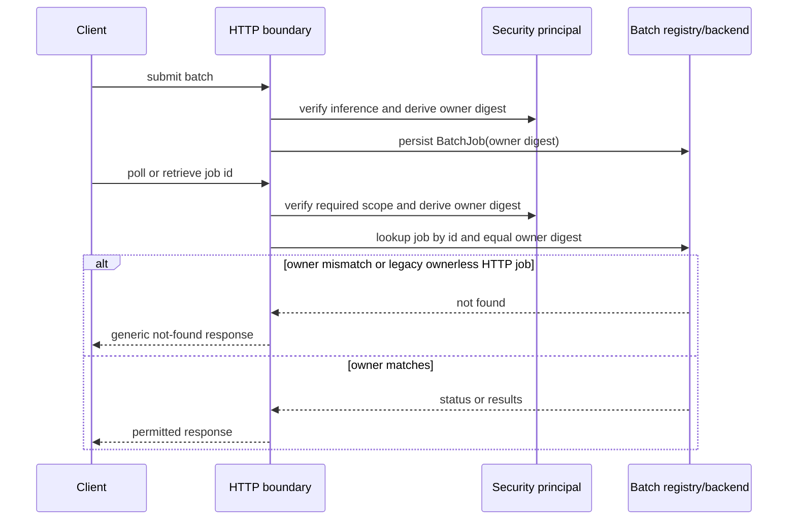

# ADR 0019: Bind workflow evidence to the authenticated principal

## Decision

Treat workflow runs, access reports, and evaluation runs as owner-scoped
objects. At the authenticated HTTP boundary, derive a non-secret SHA-256 key
from the authenticated deployment principal, attach it to newly persisted
records, and require the same key for list and detail reads. Static split
admin/inference credentials are normalized to one deployment principal so the
admin evidence plane can read runs created by the inference plane. An owner
mismatch is intentionally reported as not found so identifiers cannot be
confirmed across owners.

The library API continues to support local single-process callers that omit an
owner key. HTTP callers do not omit it. Deployments with an external bearer
verifier may use stable per-principal credentials; token rotation may revoke
access to older evidence and must be handled by the deployment's identity
policy.

Batch routing jobs follow the same boundary. The coordinator stores the
principal digest on each HTTP-created `BatchJob`; status polling and result
retrieval require an equal digest and report an owner mismatch as not found
before calling the backend. Result retrieval additionally requires both
inference and trace-purpose authorization. Legacy in-process jobs without an
owner remain available only through the library API, not through an
owner-bound HTTP request.

## Consequences

- A bearer cannot use a guessed workflow identifier to read another owner's
  trace or access report.
- The stored digest is an authorization lookup key, not a user identity and is
  never rendered in public payloads.
- Shared static credentials represent one deployment principal; multi-principal
  deployments must issue distinct verified bearers. External bearer deployments
  currently use the bearer credential digest as that principal key, so token
  rotation can revoke access to older evidence.
- Old records without an owner key are not visible through the owner-bound HTTP
  resource routes, which is fail-closed during migration.
- A guessed batch routing job identifier cannot retrieve another principal's
  provider result or trigger its cost recording.

## Acceptance evidence

Owner mismatch, list filtering, evaluation ownership, digest stability, and
response redaction are covered by
`tests/test_workflow_run_object_authorization.py`.
Batch status/result ownership and the public trace-plus-inference security
contract are covered by `tests/test_cost_review_server.py`,
`tests/test_cost_router_boundaries.py`, and `tests/test_api_contract.py`.

## References

Open Worldwide Application Security Project. (2023). *OWASP API Security Top
10: 2023 (API1:2023 Broken Object Level Authorization).*
https://owasp.org/API-Security/editions/2023/en/0xa1-broken-object-level-authorization/

National Institute of Standards and Technology. (2020). *Digital identity
guidelines: Authentication and lifecycle management* (SP 800-63B).
https://doi.org/10.6028/NIST.SP.800-63b
