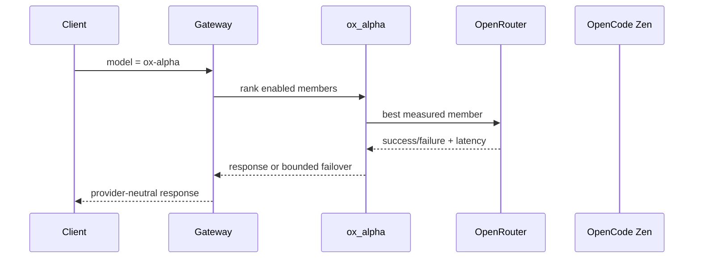

# ADR 0026: Measured model groups and cost-aware discovery

- Status: Proposed on the active feature head
- Date: 2026-08-25
- Figma file ID: Not applicable; this change extends the existing embedded admin table and introduces no new design artifact.

## Product requirement

Operators need one logical model name when several providers expose the same underlying model. For example, an operator can assign OpenRouter `stealth/ox-alpha` and OpenCode Zen `openai/x-preview-f-free` to `ox_alpha`; the mechanism accepts any valid group and member set. Model discovery remains provider-specific and retains the complete catalog; zero-cost entries are additionally classified so cost policy can distinguish free, priced, and unknown-price models.

## Decision and technical contract

`ModelAgent.group_name` is persisted by the existing Agent Pool database, accepted by its create/PATCH APIs, and shown with measured routing evidence in the Admin web table. Static role/capability ranking chooses a logical model group before its members are ordered by observed successful responses per second. An explicit group alias resolves to the currently preferred enabled member. Failover and circuit-breaker behavior remain intact. Discovery never guesses that differently named provider models are equivalent; an operator or future verified canonical-identity feed must assert that relationship.

Stability uses the posterior mean of a Bernoulli success probability under a uniform Beta(1, 1) prior. Latency uses Jacobson's exponentially weighted estimator with gain 1/8. The ranking quantity `posterior success probability / EWMA seconds` has the interpretable unit expected successful responses per second and contains no arbitrary cross-metric weight. This quotient is a gateway design decision, not a claim reproduced from the cited routing studies. RouteLLM and FrugalGPT support learned cost/quality routing between distinct models; they motivate the later quality-aware layer but do not validate treating provider aliases as different model quality.

OpenRouter discovery reads its provider-reported per-token prices and recognizes explicit zero prices. OpenCode Zen discovery uses its documented `/zen/v1/models` endpoint; because that response currently omits prices, only identifiers explicitly ending in `-free` or `:free` are classified free. Unknown price is never converted to zero. All discovered models remain available for later policy decisions.

## Data, web, and operational boundaries

Group membership survives restart in the existing `agent_pool` database payload. Authenticated REST resources provide `GET/POST /api/v1/model_groups` and `GET/PATCH/DELETE /api/v1/model_groups/{group_name}`; deleting a group retains its provider agents. The existing worker-agent create/PATCH API also accepts `group_name`. Admin shows the group, posterior success probability, and EWMA latency instead of fabricated capacity/success figures. The observation ledger intentionally resets on process restart: persisting it without a measurement horizon would let stale provider incidents dominate current routing. Add a normalized, time-windowed observation table when multi-instance aggregation and an explicit retention/decay policy are specified.

## Verification and gaps

- Contract tests cover canonical aliases, static tie behavior, measured reordering, snapshot safety, DB/API group persistence, full-catalog discovery, free classification, and both ox-alpha aliases.
- Gap: provider-reported OpenCode Zen pricing is unavailable in `/models`; retain `unknown` rather than infer paid prices.
- Gap: response quality is not yet in this intra-model score. Distinct-model composition must use calibrated evaluation evidence (for example fast-mlsirm), not a hand-authored weight.
- Gap: multi-replica telemetry needs a time-windowed durable store and concurrency-safe aggregation before production horizontal scaling.

## References

Chen, L., Zaharia, M., & Zou, J. (2024). FrugalGPT: How to use large language models while reducing cost and improving performance. *Transactions on Machine Learning Research*. https://arxiv.org/abs/2305.05176

Jacobson, V. (1988). Congestion avoidance and control. *ACM SIGCOMM Computer Communication Review, 18*(4), 314–329. https://doi.org/10.1145/52325.52356

Ong, I., Almahairi, A., Wu, V., Chiang, W.-L., Wu, T., Gonzalez, J. E., Kadous, M. W., & Stoica, I. (2024). *RouteLLM: Learning to route LLMs with preference data* [Preprint]. arXiv. https://arxiv.org/abs/2406.18665

OpenCode. (2026). *Zen*. https://opencode.ai/docs/zen

OpenRouter. (2026). *List all models and their properties*. https://openrouter.ai/docs/api/api-reference/models/get-models
