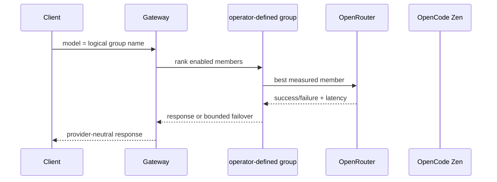
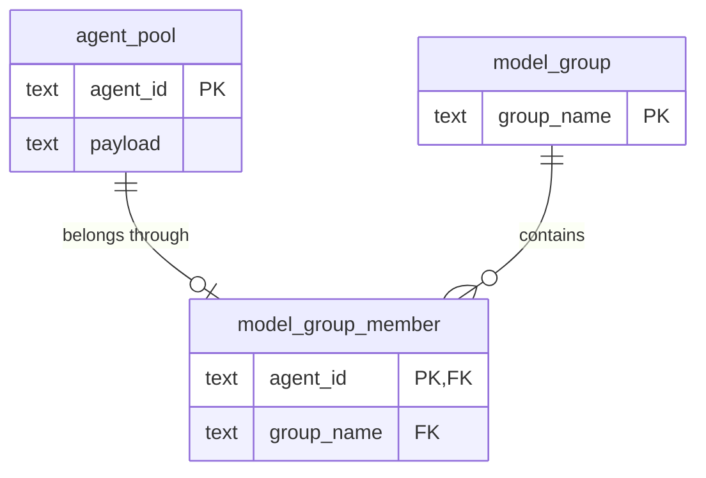

# ADR 0032: Measured model groups and cost-aware discovery

- Status: Accepted on PR #834; protected-main delivery pending
- Date: 2026-08-25
- Figma file ID: `vsZMd8WAv42HDRgcZuNcWk`; this change reuses the existing Agent Pool table rather than introducing a new visual pattern.
- Product/technical specification: [`docs/model-group-product-technical-spec.md`](../../model-group-product-technical-spec.md)

## Product requirement

Operators need one logical model name when several providers expose the same underlying model under unrelated identifiers. Groups are entirely operator-defined: discovery never infers equivalence from provider or model names, and no model family is built in. Model discovery remains provider-specific and retains the complete catalog; zero-cost entries are additionally classified so cost policy can distinguish free, priced, and unknown-price models.

Every configured KV credential is a separate provider-account and catalog boundary. Discovery queries every registered credential independently and retains rows by `(provider_name, credential_name, model_id)`; it never assumes that two keys for the same vendor expose the same models, entitlements, price, privacy policy, availability, or failure state. NVIDIA's primary/sub keys are one example, not a special case. Provider-family inference is absent. Only an explicit operator-defined `model_group` may assert that deployments represent one logical model and may therefore share measured routing decisions.

## Decision and technical contract

`ModelAgent.group_name` is persisted by the existing Agent Pool database, accepted by its create/PATCH APIs, and shown with measured routing evidence in the Admin web table. Static role/capability ranking chooses a logical model group before its members are ordered by observed successful responses per second. An explicit group alias resolves to the currently preferred enabled member. Failover and circuit-breaker behavior remain intact. Discovery never guesses that differently named provider models are equivalent; an operator or future verified canonical-identity feed must assert that relationship.

Capability routing is modality-aware rather than model-name-aware. Discovery preserves provider-declared input and output modalities and exposes `text`, `image`, `video`, `speech`, `transcription`, `embedding`, `rerank`, and `audio` tags; it does not infer a missing modality from a model identifier. The same measured group-member selection and failover path serves text/chat, images, videos, speech, transcription, embeddings, reranking, and audio. OpenRouter is queried with `output_modalities=all`, because its API otherwise defaults to text-only discovery. Provider-declared direction is retained as `input:<modality>` and `output:<modality>` tags so an input-capable vision model is not mistaken for an image generator.

Stability uses the posterior mean of a Bernoulli success probability under a uniform Beta(1, 1) prior. Latency uses Jacobson's exponentially weighted estimator with gain 1/8. The ranking quantity `posterior success probability / EWMA seconds` has the interpretable unit expected successful responses per second and contains no arbitrary cross-metric weight. This quotient is a gateway design decision, not a claim reproduced from the cited routing studies. RouteLLM and FrugalGPT support learned cost/quality routing between distinct models; they motivate the later quality-aware layer but do not validate treating provider aliases as different model quality.

Each group member also reports the maximum completed requests and provider-reported total tokens observed in any trailing 60-second window as `max_observed_rpm` and `max_observed_tpm`. These are achieved lower bounds from real gateway traffic, not inferred provider quotas or promises of sustainable capacity. Requests with absent total-token usage still count toward RPM but add nothing to TPM; the gateway never estimates missing tokens for this evidence. The counters reset with the existing process-local routing ledger and never cause probe traffic.

OpenRouter discovery reads its provider-reported per-token prices and recognizes explicit zero prices. OpenCode Zen discovery intersects its documented `/zen/v1/models` availability response with the `opencode` catalog in Models.dev, which OpenCode documents as a source for its own model catalog. Only structured cost records whose declared monetary components are all exactly zero are classified free. A missing, malformed, unmatched, or temporarily unavailable metadata record remains unknown; model-name suffixes are never treated as price evidence. All available models remain discoverable for later policy decisions.

Privacy discovery is also model-specific rather than inferred from price. The
OpenRouter ZDR endpoint inventory is joined to every paid and free catalog row;
absence from a successfully fetched, structurally valid, **non-empty** inventory
is explicit non-support. The official response schema permits an empty `data`
array, so a completely empty inventory remains unknown, as does an inventory
failure; discovery does not turn either ambiguous state into blanket
non-support. Free-model endpoint/provider policy
records additionally expose whether at least one route prohibits training or
prompt retention and retain their HTTPS policy sources. A configured gateway may
publish the same fields through model metadata, but a logical model receives a
value only when every deployment agrees. Thus free status never implies privacy,
and paid status never implies retention.

OpenRouter's authenticated catalog rows remain ordinary serving candidates.
The ZDR inventory qualifies only matching account-model routes when a request
requires ZDR; it does not make the entire OpenRouter account evidence-only and
does not exclude non-ZDR routes from ordinary requests. Missing or failed ZDR
evidence therefore fails closed only for `zdr_only` selection, not for general
inference.

OpenAI catalog rows also retain OpenAI's official data-controls documentation
as policy evidence. Because approval and enablement are organization/project
settings that the Models API does not disclose, discovery leaves the actual ZDR
status unknown instead of converting endpoint eligibility into a false runtime
claim. This source/effective-state split is the contract for adding further
providers.

When Wardnet is registered in the credential registry, discovery delegates
policy crawling to Wardnet's authenticated bounded outbound-fetch API. Wardnet,
not this Python service, owns destination policy, DNS pinning, redirects, and
body limits. Contextual-orchestrator then selects only a discovered route with
explicit ZDR evidence, requests a strict JSON-schema assessment, and accepts a
verdict only when its evidence quote is a literal substring of the crawled
document. The analyzer may enrich no-training and no-prompt-retention fields;
optional ZDR availability is reported as policy analysis and never substituted
for proof that an account enabled ZDR.
An optional Camoufox MCP renderer handles client-rendered policy pages after
Wardnet approval. Each browser tab uses Wardnet's dedicated-token egress proxy;
deployment also assigns Wardnet as the Camoufox container UDP/TCP DNS resolver,
disables Firefox trusted recursive resolution, and blocks direct egress.
Rendering fails back to the bounded static document when that full boundary is
unavailable.

Durable provider-catalog refreshes store explicit cost, capability, and directed
modality evidence in normalized serving-tag rows. Last-known-good reads reconstruct
those semantics before selection and Agent Pool synchronization; otherwise
`orchestrator/free` would lose its evidence after the first database round trip.

Two durable virtual models replace transient examples: `orchestrator/auto` uses
the full eligible pool, while `orchestrator/free` admits only models carrying
discovery's explicit `cost:free` evidence or an operator-configured exact zero
price. An empty free pool fails closed instead of spending money. Both retain
role/capability ranking and measured group-member routing. On `/v1/responses`,
streamed orchestration progress uses OpenAI's
`response.reasoning_summary_part.*` and
`response.reasoning_summary_text.*` events. These contain fixed stage summaries,
not hidden chain-of-thought or intermediate agent output.

## Data, web, and operational boundaries

Group membership survives restart in normalized `model_group` and `model_group_member` relations; the agent JSON payload no longer duplicates `group_name`. Startup migrates legacy payload membership transactionally without dropping agent configuration. Authenticated REST resources provide `GET/POST /api/v1/model_groups` and `GET/PATCH/DELETE /api/v1/model_groups/{group_name}`; deleting a group retains its provider agents. The existing worker-agent create/PATCH API also accepts `group_name`. Admin provides a keyboard/native-form editor backed by those same resources and shows capability coverage, posterior success probability, and EWMA latency instead of fabricated capacity/success figures. The observation ledger intentionally resets on process restart: persisting it without a measurement horizon would let stale provider incidents dominate current routing. Add a normalized, time-windowed observation table when multi-instance aggregation and an explicit retention/decay policy are specified.

## Verification and gaps

- Contract tests cover canonical aliases, static tie behavior, measured reordering, snapshot safety, DB/API group persistence, full-catalog discovery, free classification, and the absence of implicit grouping.
- Capability tests cover all eight requested model surfaces, group-scoped measured selection, binary speech preservation, and OpenRouter modality metadata without paid inference. An opt-in live test may use a currently free model, but the deterministic contract suite never assumes that a transient free model will remain listed.
- OpenCode Zen `/zen/v1/models` availability is joined to Models.dev cost/modality metadata; if either catalog lacks matching structured cost evidence, retain `unknown` rather than infer a price.
- Gap: response quality is not yet in this intra-model score. Distinct-model composition must use calibrated evaluation evidence (for example fast-mlsirm), not a hand-authored weight.
- Gap: multi-replica telemetry needs a time-windowed durable store and concurrency-safe aggregation before production horizontal scaling.
- Gap: final answer deltas for conducted workflows begin after synthesis; true
  token streaming across dependent workflow steps would require a cancellable
  asynchronous execution graph.

## References

Chen, L., Zaharia, M., & Zou, J. (2024). FrugalGPT: How to use large language models while reducing cost and improving performance. *Transactions on Machine Learning Research*. https://arxiv.org/abs/2305.05176

Jacobson, V. (1988). Congestion avoidance and control. *ACM SIGCOMM Computer Communication Review, 18*(4), 314–329. https://doi.org/10.1145/52325.52356

Ong, I., Almahairi, A., Wu, V., Chiang, W.-L., Wu, T., Gonzalez, J. E., Kadous, M. W., & Stoica, I. (2024). *RouteLLM: Learning to route LLMs with preference data* [Preprint]. arXiv. https://arxiv.org/abs/2406.18665

OpenCode. (2026). *Zen*. https://opencode.ai/docs/zen

OpenCode. (2026). *Models*. https://opencode.ai/v2/docs/models

Models.dev. (2026). *Models.dev API*. https://models.dev/api.json

OpenAI. (2026). *OpenAI OpenAPI specification: Responses streaming events*.
https://github.com/openai/openai-openapi/blob/master/openapi.yaml

OpenRouter. (2026). *List all models and their properties*. https://openrouter.ai/docs/api/api-reference/models/get-models

OpenRouter. (2026). *Preview the impact of ZDR on the available endpoints*. https://openrouter.ai/docs/api/api-reference/endpoints/preview-the-impact-of-zdr-on-the-available-endpoints

OpenRouter. (2026). *Provider logging and data policies*. https://openrouter.ai/docs/guides/privacy/provider-logging

OpenRouter. (2026). *Zero data retention enforcement*. https://openrouter.ai/docs/features/provider-routing#zero-data-retention-enforcement

OpenRouter. (2026). *Create speech*. https://openrouter.ai/docs/api/api-reference/speech/create-audio-speech

OpenRouter. (2026). *Image generation*. https://openrouter.ai/docs/guides/overview/multimodal/image-generation

OpenRouter. (2026). *Create transcription*. https://openrouter.ai/docs/api/api-reference/transcriptions/create-audio-transcriptions

OpenRouter. (2026). *Submit a rerank request*. https://openrouter.ai/docs/api/api-reference/rerank/create-rerank

OpenRouter. (2026). *Submit a video generation request*. https://openrouter.ai/docs/api/api-reference/video-generation/create-videos

Ma, H., Lai, G., & Ye, H.-J. (2026). *MMR-Bench: A comprehensive benchmark for multimodal LLM routing* [Preprint]. arXiv. https://arxiv.org/abs/2601.17814
