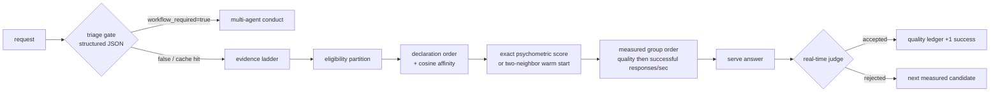

# ADR 0034: Anti-heuristic routing with measured evidence ledgers

- Status: Proposed; stacked on ADR 0032 (PR #834)
- Date: 2026-08-25
- Figma file ID: `vsZMd8WAv42HDRgcZuNcWk` (no new visual pattern; Admin routing-evidence table gains a token-throughput column)
- Doctoring record: [`docs/doctoring/measured-routing-evidence.md`](../../doctoring/measured-routing-evidence.md)

## Product requirement

Buyers of an LLM gateway ask one question first: "why did this request go to
that model?" Any answer that cites a hand-maintained keyword table is not
auditable, silently rots as vocabulary drifts, and cannot be defended in an
enterprise review. Routing therefore must be explainable only through three
evidence classes: operator declarations (priority, capability tags,
exclusions), semantic similarity computed from operator-declared metadata,
and measured transport behavior observed on this deployment.

## Decision

All task-keyword heuristics are removed from the routing path.
`DOMAIN_HINTS` and `COMPLEX_HINTS` tables are deleted from the orchestrator;
the conduct-hint threshold policy field is retired from route selection.

The replacement ordering ladder is evidence-only:

1. **Eligibility contracts** — operator `provider_exclusions` and the
   general-chat capability gate (`is_general_chat_agent_model_id`) always
   partition candidates before any scoring. These are endpoint-compatibility
   gates, not heuristics.
2. **Static declaration order** — `_static_rank_key` orders by
   `(-role_fit, -priority, has_affinity, -cosine_affinity, agent.id)`.
   Role fit is exact tag membership declared by operators. Cosine affinity
   is computed between the request text embedding and each candidate's
   declared metadata document via the pool's own embedding member
   (Karpukhin et al., 2020 dense-retrieval formulation), cached per text
   hash with an LRU bound so repeated requests cost no additional calls.
3. **Measured intra-group order** — inside one logical model group, members
   are ordered by judged answer quality first (real-time judge feeding the
   quality Beta-Bernoulli ledger) and transport evidence second. Both ledgers
   rank by posterior stability divided by EWMA latency, in expected successful
   responses per second. Token throughput remains separately observable and
   never changes the comparable-unit score.

### Psychometric warm start for unseen contexts

An exact previously judged context keeps its fitted model probabilities. The
production default for an unseen context remains the previously validated
single nearest finite-cosine context, including its existing non-positive
fallback. The experimental held-out harness may enable two-neighbor
interpolation, require positive similarity, and average each available
candidate probability using those similarities as weights. No usable vector
returns no psychometric evidence and falls back to the existing measured order.

This bounded Nadaraya-style local interpolation replaces a discontinuous
nearest-context copy without adding a trained router or bandwidth parameter.
The seeded smooth-response benchmark is regression evidence only. It cannot
authorize a production-policy change until a preregistered buyer-held-out
matrix shows non-inferior accuracy and acceptable end-to-end latency.

The fitted value is a conditional success estimate for one versioned deployment
candidate: endpoint, model revision, system prompt, decoding policy, and enabled
tools. Declared candidate configuration and the active role effort/sampling
catalog are hashed into the evidence identity; a changed model, endpoint,
capability, or decode policy cannot inherit earlier rows. Source commit
`0554b3ac` preserves the production similarity rule and adds policy-change and
restart invalidation tests.
Persistence source commit `ffb1383b` serializes observation writes with
candidate retention and pruning; a barrier-driven regression proves a
concurrent pool update cannot silently delete or later revive a valid row.
It is not a context-free "LLM ability" measurement. Scores must not be
linked across candidate-catalog, policy, domain, or time changes unless anchor
interactions establish scale continuity. Production calibration must also test
local dependence and subgroup/domain DIF, report estimate uncertainty, model
judge/rater effects, and record randomized exposure or routing propensity so
adaptively missing outcomes do not turn the incumbent policy into ground truth.
Failure of any required check yields no psychometric evidence and preserves the
existing measured order.

IRT-Router defines LLM deployments as test takers and queries as items. Under
that orientation, query language or domain is an item/context property, not a
person-group label. The gateway therefore will not manufacture a conventional
person-group DIF result by passing buyer language or domain as the group vector.
The paper supplies a useful constrained response predictor, but monotonicity and
selected face-valid examples do not identify its latent scale or establish
psychometric construct validity. CO therefore does not call its learned
coordinates stable ability or difficulty measurements.
More specifically, its MIRT query discrimination vector is learned without a
reported positive-coordinate orientation, while the 25-dimensional latent
space has no reported anchor or other rotation, reflection, and scale
identification convention. A fitted coordinate can therefore change sign or
meaning across recalibration, and increasing an individual coordinate is not
shown to increase success probability. Production evidence must reject such a
model unless the intended score direction is constrained and tested, the scale
is identified and linked, and item/model fit plus estimate uncertainty are
reported separately from predictive loss.
When enough versioned candidate deployments support a preregistered comparison,
provider family or decode-policy cohort may be tested as a candidate-group DIF
screen through the released `fast-mlsirm` API. Language and domain require an
item-side model instead. The released multigroup item-covariate path supports
one preregistered difficulty contrast by adapting Debeer and Janssen (2013).
Multilingual-IRT (Lior et al., 2026) supplies the fuller research direction:
explicit language difficulty deviations, separated language/content
discrimination, and language-specific ability residuals. The latter terms
remain canonical-owner gaps. Buyer-language and cross-domain validity gates
therefore remain false rather than re-labeling a routing predictor as an
invariant measurement model.

The missing-candidate path remains fail-closed at zero prediction coverage
until observations exist. Source `f4513527` adds a separate onboarding design
screen rather than fabricating a cold-start score. Across 400 known synthetic
candidates and a 31-query bank, the released Rust-backed maximum-information
EAP path reaches target SE 0.5 after 7.1775 queries on average, compared with
10.47 for a seeded random order. It reduces theta RMSE from 0.607152 to
0.575996 and unobserved-probability MSE from 0.014746 to 0.007504. Paired 95%
intervals are `[-3.4125, -3.18]` queries, `[-0.080874, 0.006129]` theta
squared error, and `[-0.008804, -0.005716]` unobserved-probability squared
error. Because the theta interval includes zero, no general theta-accuracy gain
is claimed. The maximum of 12 calibration queries is an onboarding burden, not
live routing latency; the one-dimensional synthetic bank does not establish
construct validity, invariance, or buyer performance. Production admission
remains unchanged.

Source `f4cceb59` adds a decision-oriented stopping screen at an explicit
synthetic cut of zero. A 95% normal interval that excludes the cut stops
calibration early; otherwise it truncates at 12 queries. Across the same 400
known candidates, it averages 9.875 queries and stops early for 41%, while its
decisions and 0.9125 accuracy exactly match the fixed-length path. The paired
query-delta interval is `[-2.425, -1.835]` and the accuracy-delta interval is
`[0, 0]`. This does not establish calibrated interval coverage, acceptable
near-cut risk, buyer decision costs, or provider-call latency. It remains a
benchmark design candidate, not a production stopping rule.
Source `298e1fc8` prevents the aggregate savings from hiding near-cut risk.
Candidates within 0.5 of the synthetic cut stop early only 3% of the time,
average 11.86 queries, and reach 0.70 accuracy. Candidates at least 1.0 away
stop early 68%, average 8.305 queries, and reach 1.0 accuracy. These strata are
descriptive checks on known truth, not calibrated buyer subgroup guarantees.
Source `e2cb547f` also reports the abstention boundary directly. The interval
resolves 42.5% of all candidates with 1.0 conditional synthetic accuracy, but
only 3% within 0.5 of the cut. Unresolved candidates remain unresolved evidence;
the benchmark must not silently turn them into production routing decisions.
Source `e1ff2e61` adds a development-selected, independent-seed reject-option
screen. Maximizing coverage subject to a 2.5% Wilson 95% error upper bound
selects `z=1.645`. Against `z=1.96` on the same holdout responses, coverage
rises from 44.25% to 56% with paired interval `[8.75, 14.75]` percentage points,
while all-candidate mean queries fall from 9.88 to 8.395 with paired interval
`[-1.715, -1.2625]`. Observed selective risk is zero, its Wilson upper bound is
1.686%, and the positive/negative coverage gap is 3 points. This is a synthetic
risk–coverage KPI, not an adopted buyer threshold.

Source commit `0f875e3f` runs the released single-coefficient item-covariate
path on 1,200 synthetic candidate observations and 12 items. The fit converges
after 941 iterations and recovers true `delta=-0.8` as `-0.789650` (absolute
error `0.010350`). The report still leaves the buyer language/domain component
`not_executed`; synthetic recovery cannot establish buyer invariance.

Source commit `b0f3703f` reuses the released Oakes observed-information API on
1,200 synthetic observations and six known item intercepts. The converged fit
reports intercept RMSE `0.039160`, 95% Wald-interval coverage `1.0`, and mean
interval width `0.295945`. This checks the implemented uncertainty calculation,
not buyer calibration: the API conditions on population parameters and does not
support anchors, zero inflation, or item covariates, so `parameter_uncertainty`
remains `not_executed`.

Source commit `2e129e2a` adds the distinct longitudinal-invariance check required
by Millsap (2010) and the common-item drift risk described by Babcock and Albano
(2012). Two known parameter sets are linked through seven stable anchors; the
screen recovers the one injected drift item with no stable-item false positive.
The fixed `0.25` tolerance is deliberately reported as an effect-size screen,
not a significance test. `parameter_invariance` remains `not_executed` until
versioned buyer recalibrations, stable anchors, sampling uncertainty, and
preregistered review rules exist.

Source commit `7c3e6e98` adds false-alarm rate and detection-delay p50/p95 as
separate temporal KPIs, motivated by Chen, Lee, and Li (2022). Source commit
`1b3b7244` searches thresholds 6.0 through 7.0 on 500 calibration runs, requiring
the 95% Wilson false-alarm upper bound and p95 delay to meet the synthetic
limits. It evaluates the selected `6.6` threshold on a separate 500-run seed:
held-out false alarms are `2.4%` with upper bound `4.15%`, delay p50 is 10, and
p95 is 20. This is not the paper's multistream Bayesian compound-risk procedure.
`sequential_drift` remains `not_executed` until buyer time-series observations,
declared change risks, and preregistered false-alarm and delay targets exist.

Source commit `5c6ba17a` adds a separate candidate-roster invariance screen
motivated by Tinsley and Dawis (1975). Full and reduced synthetic rosters are
calibrated independently and linked through 200 common items. For the 16
retained candidates, linked-score RMSE is `0.010866`, correlation is
`0.999999`, and maximum absolute shift is `0.016498`. This is a calculation
check, not a general sample-free claim: `candidate_roster_invariance` remains
`not_executed` until versioned buyer rosters, common buyer items, identified
linking, and preregistered shift targets exist.

Source commit `c7c4a13f` adds the distinct functional-impact screen motivated
by Guo, Zheng, and Chang (2015). One injected item shift creates synthetic TCC
area difference `0.123355`; the released backward elimination identifies that
item and reduces the remaining difference to zero. Its caller-supplied `0.05`
threshold and no-reentry search are narrower than the published method, so the
result cannot supply a universal drift decision or open the buyer gate.

Source commit `1dce9688` adds the alternate-form score-comparability boundary
required by AERA, APA, and NCME (2014, Standards 5.16–5.18). A released linear
equating API recovers known slope `2` and intercept `1`, reducing raw cross-form
RMSE from `6.782330` to zero; 300-bootstrap 95% intervals cover all 11 known
equivalent scores. Equal synthetic form populations make this a calculation
contract, not evidence that versioned buyer forms are interchangeable.
`score_equating` remains `not_executed` pending buyer forms, comparable
populations or anchors, and preregistered equating-error targets.

Source commit `a18e25f7` adds the response-pattern screen described by Meijer
(1996) and Tendeiro et al. (2016). The released nonparametric ZU3 calculation
ranks one injected inverted pattern first among 1,000 synthetic candidates and
separates it from the next-highest pattern by `1.818719`. This is a review
signal, not a diagnosis: no universal cutoff or causal label is attached, and
`response_pattern_fit` remains `not_executed` without complete buyer responses
and a preregistered human-review policy.

Source commit `73e07a8e` adds Horn (1965) parallel analysis as a bounded
dimensionality screen. It recovers two known dimensions from 1,000 synthetic
binary response vectors across 12 items. Tran and Formann (2009) show why that
success cannot establish unidimensionality or construct validity: performance
depends on sample size, discrimination, and the correlation matrix, and Pearson
correlations are particularly weak for binary data. `construct_dimensionality`
therefore remains `not_executed` until buyer responses, a preregistered construct
structure, and confirmatory holdout fit exist.

Source commit `7f13dc7d` adds the distinct limited-information M2 global-fit
screen derived from Maydeu-Olivares and Joe (2005). A fitted one-factor design
produces M2 `45.744317` with `p=0.105619`; fitting that same one-factor model to
known two-factor data produces M2 `287.163678` with `p≈2.27e-41`. Xu et al.
(2017) show that sensitivity depends on the form of multidimensionality, so
this synthetic separation cannot establish a construct or universal cutoff.
`global_model_fit` remains `not_executed` until a converged buyer calibration,
complete responses, a preregistered model, and held-out review exist.

Source commit `5b50e10c` adds empirical reliability as a separate precision
screen following Bechger et al. (2003). With 1,200 synthetic responses and 12
items, raising true item discrimination from `0.45` to `1.5` raises posterior
reliability from `0.366437` to `0.800436`. Stanley and Edwards (2016) show why
this cannot substitute for model fit; it also says nothing by itself about
invariance or construct validity. `score_reliability` therefore remains
`not_executed` until buyer calibration, posterior errors, a purpose-specific
target, and separate model-fit evidence exist.

Source commit `015c4bf6` adds a two-facet G-study and D-study following Huebner
and Lucht (2019). An 80-candidate, 12-query, four-occasion synthetic design
separates candidate, query, occasion, and interaction variance. Dependability
rises from `0.401565` for one query and one occasion to `0.849616` for 12 and
four. The calculation clamps negative ANOVA components for D-study quantities
and assumes a complete balanced design, so `generalizability_design` remains
`not_executed` until buyer observations, random-facet justification, and a
preregistered dependability target exist.

Source commit `b4efa489` adds the conditional precision screen required by
Lord's test-information tradition and the released Magis (2013) calculation.
Across trait points `[-2, 0, 2]`, spreading 12 item difficulties across
`[-2, 2]` improves worst information by `15.789%` and reduces worst conditional
standard error from `0.890897` to `0.827931`; center information falls because
precision is redistributed rather than created. `conditional_information`
remains `not_executed` until buyer-relevant trait regions, calibrated items,
and purpose-specific precision targets exist.

Source commit `0b19116e` adds the decision-level consequence required by
Rudner (2001, 2005). At a declared synthetic cut of zero, lowering score
standard error from `0.8` to `0.2` raises expected classification accuracy
from `0.814182` to `0.996895` and consistency from `0.710275` to `0.993829`.
This confirms that measurement error propagates into routing decisions; it
does not choose a buyer cut or encode asymmetric decision costs.
`classification_decision` remains `not_executed` until buyer-linked measures,
valid standard errors, an explicit cut and cost model, and preregistered targets
exist.

Source commit `452a3649` adds the economic boundary omitted by classification
accuracy alone. The released Taylor-Russell calculation raises synthetic
selected success from `0.500273` at validity `0.2` to `0.723515` at validity
`0.6`. The paired Brogden-Cronbach-Gleser analogue reports net utility
`5,626.64` at total measurement cost `2,000`, then `-2,373.36` at cost `10,000`
without changing validity or selected success. This is a personnel-selection
analogue, not a validated multi-model routing economy. `decision_utility`
remains `not_executed` until buyer-valued outcome units, request volume, routing
cost, selection ratio, and a preregistered utility target exist.

Source commit `68831dff` applies Stenhaug and Domingue's (2022) predictive-fit
split. The current held-out contexts test unseen queries for four already
observed candidate deployments; they do not test a new deployment's complete
response vector. The report now records those axes separately and leaves the
unseen-candidate task separate. Source commit `54833bd8` executes that path
across 24 contexts and records zero psychometric prediction coverage because
the router does not fabricate a score for an unobserved candidate.
`predictive_fit` cannot pass until
versioned buyer outcomes support both held-out-query and held-out-candidate
scoring.

### Workflow triage without keywords

The auto-mode decision "route directly or run the multi-agent workflow" is
made by a structured triage call, not by keyword counting. The triage model
must reply with exactly `{"workflow_required": bool}`; any other payload
(including extra keys, wrong types, or duplicate keys) fails closed to the
conducted workflow. Verdicts are memoized by content hash. Speed is
explicitly not a design constraint here; correctness is.

### Real-time judging on direct routes

When `policy.realtime_judge` is enabled (default), every direct-route answer
is judged before it is returned. Accepted answers record one success
observation in the quality ledger (with provider token counts when
reported); rejected answers record one failure and fail over to the next
measured candidate within the configured retry budget. The final trace row
carries the verdict so callers can audit every accept/reject decision.
Disabling the flag keeps the legacy verification shape for deployments
without a judge-capable member.

## Alternatives rejected

- Keeping keyword tables behind a feature flag: preserves silent rot and
  unauditable decisions; deletion is cheaper than guarding.
- Learned routers trained offline (RouteLLM-style): require labeled
  preference data this gateway does not have per deployment; measured
  ledgers give per-deployment truth without training data.
- Treating neural IRT coordinates as portable model ability: predictive fit
  alone does not establish construct validity, invariance, scale linking, DIF,
  or uncertainty. The same numerical score can change when the candidate pool,
  judge, prompt policy, or exposure policy changes.
- Pure latency routing: ignores whether answers were actually acceptable;
  the quality ledger exists precisely because fast wrong answers are worse
  than slower verified ones.

## Consequences

- Every miss now costs triage + worker + (optional) judge provider calls.
  Cache-hit economics are unaffected: hits replay stored answers with zero
  executions. Tests that assert exact call counts pin single-step routing
  with the judge disabled to keep counts meaningful.
- The mock transport's deterministic embeddings exist only as a test
  fixture (`MOCK_EMBEDDING_DIMENSION = 8`) and never serve production.
- Admin surfaces gain `routing_evidence.quality` alongside the existing
  transport ledger so operators can see both accuracy and throughput.

## Acceptance evidence

- `tests/test_measured_routing_evidence.py`: 29 tests covering exact
  Jacobson EWMA arithmetic, Laplace-prior stability products, cosine
  ordering, strict triage parsing, verdict caching, and judge-driven
  failover within budget.
- `tests/test_chat_model_capability_isolation.py::test_stale_embedding_agent_cannot_win_synthesizer_selection`
  proves the capability gate survives the rewrite.
- Full suite green: 1891 unit/contract tests plus 12 property/fuzz tests.
- PR #1061 candidate evidence: the fixed 24-training/24-held-out synthetic
  surface reduces expected Brier from 0.1438369123 to 0.1418346845, log loss from
  0.4525311878 to 0.4475784303, and mean top-choice regret from 0.0024259478 to
  zero while decision p50 remains near 0.02 ms. Eleven focused psychometric
  tests cover exact and interpolated scoring, iterable candidates, persistence,
  and routing integration. Buyer-held-out and protected-main evidence remain
  open, so two-neighbor interpolation remains disabled in production.
- Source commit `94615dff` compares baseline and candidate within each held-out
  context, adds deterministic 2,000-resample paired bootstrap intervals, and
  repeats decision timing 200 times per context with alternating execution
  order. The Brier and log-loss intervals favor the candidate, but paired
  context-median latency is slower by `[0.0047666, 0.0054775]` ms; this
  strengthens the accuracy evidence without opening the production gate.
- Source commit `92b9309b` adds calibration as a distinct paired accuracy gate.
  Two-neighbor interpolation reduces held-out logit calibration RMSE from
  `0.231235` to `0.025803`; its candidate-minus-baseline 95% interval is
  `[-0.208030, -0.202924]`. Calibration slope moves from `0.991445` to
  `1.014030`, while near-zero intercepts reflect the symmetric synthetic design.
  Buyer outcomes remain required before probabilities are operationally trusted.
- Report-contract commit `2cc8427f` makes every point delta explicit and fails
  the focused test if a metric loses its paired interval or falls outside it.
- Gate commit `079b3f80` requires accuracy, latency, buyer-heldout, and
  measurement-validity decisions to all pass. The synthetic run passes only
  accuracy and therefore emits `production_default_change_allowed=false`.
- Source commit `70cfc91f` restores constant-space `max()` selection for the
  production single-neighbor default. Its isolated 512-row selection evidence
  is 5.5 µs versus 27 µs for full sorting; the experimental top-2 path keeps
  sorting because it requires two ordered neighbors.
- Source commit `972bd4a0` removes repeated generator and membership passes
  from the experimental weighted interpolation while preserving candidates
  present in only one neighbor. Across ten alternating whole-process pairs,
  candidate decision p50 fell from median `0.0180415` to `0.016708` ms (7.39%)
  and the paired latency-delta CI upper bound fell from median `0.0022899` to
  `0.0006677` ms (70.84%). Brier, log loss, and regret were unchanged. The
  upper bound remains positive, so the latency production gate stays closed.
- Source commit `260fa1dd` reuses the validated query-vector norm across all
  retained contexts. In five before/after local runs, median candidate p50 fell
  from `0.023167` to `0.015042` ms (35.07%); median paired latency-delta CI upper
  bound fell from `0.0008368` to `0.0006112` ms. Accuracy metrics were
  bit-identical, but the positive upper bound keeps the gate closed.
- Measurement-validity gate remains open: versioned measurement units, anchors,
  local-dependence checks, DIF, uncertainty, judge effects, and adaptive-exposure
  correction have no buyer-held-out evidence yet. Consequently these fitted
  values may order candidates only inside the current deployment sample and
  cannot be published as stable model abilities.
- `fast-mlsirm` owner PR #1748 at `8461914a5bf04f9732add77761dd121bbec00103`
  exposes its existing Rust Chen-Thissen signed X2/G2 local-dependence indices
  to Python. An independent detached-worktree audit passed 44 focused fitstats,
  control-safety, and result-contract tests in 4.71 seconds, and the owner diff
  passes `git diff --check`. The PR remains Draft, `REVIEW_REQUIRED`, and
  blocked; its hosted rollup is not green and no independent approval exists.
  This closes an API prerequisite only; buyer execution remains absent.
- Source commit `1309b3ce` reports gate evidence state explicitly: synthetic
  accuracy is `passed`, decision latency is `failed`, and buyer-heldout plus
  measurement-validity work is `not_executed`. Compatibility Booleans remain
  false unless the state is `passed`, so missing evidence cannot authorize use.
- Source commit `c690ebe7` decomposes measurement validity into scale linking,
  local independence, candidate-group DIF, item language/domain effects, judge
  effects, and adaptive exposure. Every component is presently `not_executed`;
  an aggregate label can no longer hide which evidence is absent.
- Source commit `fdb8e57a` records whether each component's canonical owner
  contract is released, pending review, or not implemented, plus the buyer
  evidence still required. Availability never changes an unexecuted component
  into a pass.
- Source commit `7edccae0` normalizes each retained context embedding once at
  observation time. Five paired local runs reduced median candidate decision
  p50 from `0.016083` to `0.009791` ms with unchanged quality, but the positive
  paired latency-delta CI upper bound keeps the production gate closed.
- Source commit `00b2eef3` records the released-but-limited multigroup
  item-covariate owner contract. It supports one preregistered item-side
  difficulty contrast, not language-specific discrimination or residuals, and
  does not pass without linked buyer observations and anchors.
- Source commit `a095b41f` distinguishes the released CAT exposure-control
  contract from CO's missing randomized-assignment or propensity ledger. The
  former limits repeated item administration; it cannot identify responses for
  candidate deployments that the gateway did not invoke.
- Source commit `46e15555` records the ordered versioned candidate set, actual
  attempts, selected deployment, and policy hash on every route, conducted
  workflow, and streaming trace row. The receipt marks deterministic propensity
  as `not_identified`; it is audit evidence, not a correction for missing outcomes.
- Source commit `2c783b98` validates the next observation-design step without
  changing production routing: a preregistered 20% ε-greedy simulation gives
  each of four candidates probability at least 0.05. Across 24,000 fixed-seed
  trials, inverse-propensity value RMSE is 0.008943 and all known true values
  fall inside their 95% intervals. Buyer execution remains required.
- Source commit `36dbf3bb` makes the adaptive-selection counterfactual explicit.
  Naive means from the selected observations have RMSE `0.321979`; reusing the
  logged assignment probabilities reduces RMSE to `0.008943`, an improvement
  of `0.313036`. Production routing remains deterministic and unidentified.
- Source commit `ca6e9a75` validates Stocking–Lord common-item linking on six
  synthetic anchors with a known affine scale change. It converges with
  true-parameter RMSE `3.24e-16`; the production component remains unexecuted
  until versioned buyer anchors establish invariance across recalibrations.
- Source commit `d0d81e8f` validates purified logistic candidate-cohort DIF on
  a known shifted item. Purification stabilizes with seven anchors, recall 1.0,
  and zero false positives; the unpurified extra flag is retained as evidence
  of matching-score contamination. Buyer DIF remains unexecuted.
- Source commit `ac28b6d0` validates a connected many-facet Rasch design across
  1,000 synthetic respondents, six items, and three judges. The fit converges
  in five iterations, recovers judge order, and reports severity RMSE 0.018292;
  buyer judge observations remain unexecuted.

## References

See the doctoring record for full APA 7 references (Jacobson, 1988;
Laplace via Gelman et al., 2013; Karpukhin et al., 2020; Ong et al., 2024;
Chen et al., 2023; Chen & Thissen, 1997; Zheng et al., 2023; Jeon et al., 2021; Nadaraya, 1964;
Song et al., 2025; Lior et al., 2026; Debeer & Janssen, 2013; Doebler, 2012;
Finkelman et al., 2009; Barrada et al., 2007; Horvitz & Thompson, 1952;
Dudík et al., 2011; Swaminathan & Joachims, 2015; Stocking & Lord, 1983;
Swaminathan & Rogers, 1990; French & Maller, 2007; Linacre, 1989; Eckes, 2015;
Bock & Aitkin, 1981).
