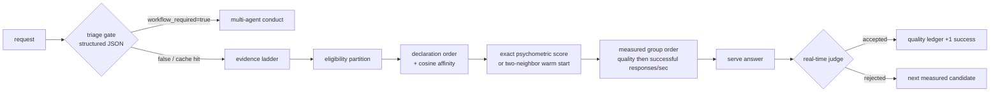

# ADR 0034: Anti-heuristic routing with measured evidence ledgers

- Status: Proposed; stacked on ADR 0032 (PR #834)
- Date: 2026-08-25
- Figma file ID: `vsZMd8WAv42HDRgcZuNcWk` (no new visual pattern; Admin routing-evidence table gains a token-throughput column)
- Doctoring record: [`docs/doctoring/measured-routing-evidence.md`](../../doctoring/measured-routing-evidence.md)

## Product requirement

Buyers of an LLM gateway ask one question first: "why did this request go to
that model?" Any answer that cites a hand-maintained keyword table is not
auditable, silently rots as vocabulary drifts, and cannot be defended in an
enterprise review. Routing therefore must be explainable only through three
evidence classes: operator declarations (priority, capability tags,
exclusions), semantic similarity computed from operator-declared metadata,
and measured transport behavior observed on this deployment.

## Decision

All task-keyword heuristics are removed from the routing path.
`DOMAIN_HINTS` and `COMPLEX_HINTS` tables are deleted from the orchestrator;
the conduct-hint threshold policy field is retired from route selection.

The replacement ordering ladder is evidence-only:

1. **Eligibility contracts** — operator `provider_exclusions` and the
   general-chat capability gate (`is_general_chat_agent_model_id`) always
   partition candidates before any scoring. These are endpoint-compatibility
   gates, not heuristics.
2. **Static declaration order** — `_static_rank_key` orders by
   `(-role_fit, -priority, has_affinity, -cosine_affinity, agent.id)`.
   Role fit is exact tag membership declared by operators. Cosine affinity
   is computed between the request text embedding and each candidate's
   declared metadata document via the pool's own embedding member
   (Karpukhin et al., 2020 dense-retrieval formulation), cached per text
   hash with an LRU bound so repeated requests cost no additional calls.
3. **Measured intra-group order** — inside one logical model group, members
   are ordered by judged answer quality first (real-time judge feeding the
   quality Beta-Bernoulli ledger) and transport evidence second. Both ledgers
   rank by posterior stability divided by EWMA latency, in expected successful
   responses per second. Token throughput remains separately observable and
   never changes the comparable-unit score.

### Psychometric warm start for unseen contexts

An exact previously judged context keeps its fitted model probabilities. The
production default for an unseen context remains the previously validated
single nearest finite-cosine context, including its existing non-positive
fallback. The experimental held-out harness may enable two-neighbor
interpolation, require positive similarity, and average each available
candidate probability using those similarities as weights. No usable vector
returns no psychometric evidence and falls back to the existing measured order.

This bounded Nadaraya-style local interpolation replaces a discontinuous
nearest-context copy without adding a trained router or bandwidth parameter.
The seeded smooth-response benchmark is regression evidence only. It cannot
authorize a production-policy change until a preregistered buyer-held-out
matrix shows non-inferior accuracy and acceptable end-to-end latency.

The fitted value is a conditional success estimate for one versioned deployment
candidate: endpoint, model revision, system prompt, decoding policy, and enabled
tools. Declared candidate configuration and the active role effort/sampling
catalog are hashed into the evidence identity; a changed model, endpoint,
capability, or decode policy cannot inherit earlier rows. Source commit
`0554b3ac` preserves the production similarity rule and adds policy-change and
restart invalidation tests.
It is not a context-free "LLM ability" measurement. Scores must not be
linked across candidate-catalog, policy, domain, or time changes unless anchor
interactions establish scale continuity. Production calibration must also test
local dependence and subgroup/domain DIF, report estimate uncertainty, model
judge/rater effects, and record randomized exposure or routing propensity so
adaptively missing outcomes do not turn the incumbent policy into ground truth.
Failure of any required check yields no psychometric evidence and preserves the
existing measured order.

### Workflow triage without keywords

The auto-mode decision "route directly or run the multi-agent workflow" is
made by a structured triage call, not by keyword counting. The triage model
must reply with exactly `{"workflow_required": bool}`; any other payload
(including extra keys, wrong types, or duplicate keys) fails closed to the
conducted workflow. Verdicts are memoized by content hash. Speed is
explicitly not a design constraint here; correctness is.

### Real-time judging on direct routes

When `policy.realtime_judge` is enabled (default), every direct-route answer
is judged before it is returned. Accepted answers record one success
observation in the quality ledger (with provider token counts when
reported); rejected answers record one failure and fail over to the next
measured candidate within the configured retry budget. The final trace row
carries the verdict so callers can audit every accept/reject decision.
Disabling the flag keeps the legacy verification shape for deployments
without a judge-capable member.

## Alternatives rejected

- Keeping keyword tables behind a feature flag: preserves silent rot and
  unauditable decisions; deletion is cheaper than guarding.
- Learned routers trained offline (RouteLLM-style): require labeled
  preference data this gateway does not have per deployment; measured
  ledgers give per-deployment truth without training data.
- Treating neural IRT coordinates as portable model ability: predictive fit
  alone does not establish construct validity, invariance, scale linking, DIF,
  or uncertainty. The same numerical score can change when the candidate pool,
  judge, prompt policy, or exposure policy changes.
- Pure latency routing: ignores whether answers were actually acceptable;
  the quality ledger exists precisely because fast wrong answers are worse
  than slower verified ones.

## Consequences

- Every miss now costs triage + worker + (optional) judge provider calls.
  Cache-hit economics are unaffected: hits replay stored answers with zero
  executions. Tests that assert exact call counts pin single-step routing
  with the judge disabled to keep counts meaningful.
- The mock transport's deterministic embeddings exist only as a test
  fixture (`MOCK_EMBEDDING_DIMENSION = 8`) and never serve production.
- Admin surfaces gain `routing_evidence.quality` alongside the existing
  transport ledger so operators can see both accuracy and throughput.

## Acceptance evidence

- `tests/test_measured_routing_evidence.py`: 29 tests covering exact
  Jacobson EWMA arithmetic, Laplace-prior stability products, cosine
  ordering, strict triage parsing, verdict caching, and judge-driven
  failover within budget.
- `tests/test_chat_model_capability_isolation.py::test_stale_embedding_agent_cannot_win_synthesizer_selection`
  proves the capability gate survives the rewrite.
- Full suite green: 1891 unit/contract tests plus 12 property/fuzz tests.
- PR #1061 candidate evidence: the fixed 24-training/24-held-out synthetic
  surface reduces expected Brier from 0.1438369123 to 0.1418346845, log loss from
  0.4525311878 to 0.4475784303, and mean top-choice regret from 0.0024259478 to
  zero while decision p50 remains near 0.02 ms. Eleven focused psychometric
  tests cover exact and interpolated scoring, iterable candidates, persistence,
  and routing integration. Buyer-held-out and protected-main evidence remain
  open, so two-neighbor interpolation remains disabled in production.
- Source commit `94615dff` compares baseline and candidate within each held-out
  context, adds deterministic 2,000-resample paired bootstrap intervals, and
  repeats decision timing 200 times per context with alternating execution
  order. The Brier and log-loss intervals favor the candidate, but paired
  context-median latency is slower by `[0.0047666, 0.0054775]` ms; this
  strengthens the accuracy evidence without opening the production gate.
- Report-contract commit `2cc8427f` makes every point delta explicit and fails
  the focused test if a metric loses its paired interval or falls outside it.
- Measurement-validity gate remains open: versioned measurement units, anchors,
  local-dependence checks, DIF, uncertainty, judge effects, and adaptive-exposure
  correction have no buyer-held-out evidence yet. Consequently these fitted
  values may order candidates only inside the current deployment sample and
  cannot be published as stable model abilities.

## References

See the doctoring record for full APA 7 references (Jacobson, 1988;
Laplace via Gelman et al., 2013; Karpukhin et al., 2020; Ong et al., 2024;
Chen et al., 2023; Zheng et al., 2023; Jeon et al., 2021; Nadaraya, 1964;
Song et al., 2025).
