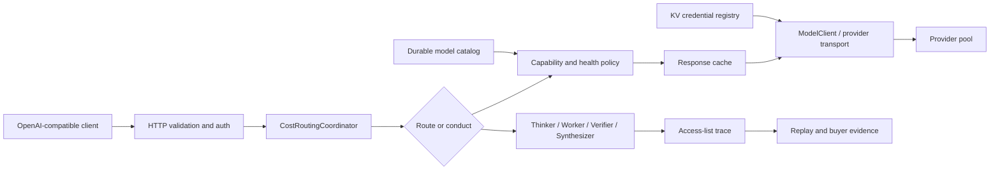

# Product and Technical Gap Baseline

**Snapshot convention:** the initial inventory records its observation time
below; each live continuation carries its own recheck time.
**Source of truth:** `main` at `e226e1197bdfc890c9d8e5b9b648c78857d7e465`
**Product boundary:** one OpenAI-compatible gateway plus its operator evidence
control plane. Fugu, TRINITY, and Conductor are research inputs, not separate
deployables.
**Customer next action:** use this document to select the next mergeable PR and
to verify its exact-head evidence before approving or releasing it.

**Normative decision record:** [ADR 0023 — Product and technical gap
baseline](planning/adrs/0023-product-technical-gap-baseline.md). The earlier
ADR 0016 filename was renamed to ADR 0023 to avoid an identifier collision; no
normative ADR 0016 file remains. Privacy requirements additionally follow
[ADR 0010 — PII audit, not masking](planning/adrs/0010-pii-audit-not-mask.md).

> This is a dated planning snapshot, not a live merge dashboard. PR heads,
> checks, reviews, and base relationships can change after publication. Always
> refetch the remote exact head and protected rules before acting on a row.

## 1. Product requirements (PRD)

Contextual Orchestrator must let an application keep using an OpenAI-compatible
API while the platform chooses between a single-worker route and a deeper,
verifiable workflow. A buyer should be able to answer four questions without
reading source code:

1. Which provider/model handled the request and why was it selected?
2. Which workflow roles saw which prior outputs?
3. What happened when a provider, tool, cache, or verifier failed?
4. Can the same evidence be replayed, audited, and operated as a standalone
   service or an imported module?

The existing product plan covers API compatibility, managed agent pools,
latency/quality policy, trace/access evidence, evaluation replay, i18n, and
buyer-readiness endpoints. The open queue shows that reliability, provider
bootstrap, secure credential use, purpose-limited PII access, and release-grade
operability are still being closed.

## 2. Technical requirements (TRD)

| Boundary | Required behavior | Acceptance evidence |
|---|---|---|
| API | Preserve `/v1/chat/completions` and compatible error/stream contracts. | Contract tests plus hosted required workflows. |
| Routing | Select by capability, provider health, cost, model mode, and explicit exclusions; do not route embedding-only models to chat synthesis. Embedding endpoints may delegate model selection to an enabled `embedding` capability agent. | Exact-head capability-isolation, discovery, failover, and [#789](https://github.com/ContextualWisdomLab/contextual-orchestrator/pull/789) embedding-contract tests. |
| Orchestration | Allocate shallow or deep work by task need; retain Thinker/Worker/Verifier/Synthesizer evidence, bounded recursion, and Conductor-style access lists. | Replayable workflow trace and equal-budget ablation evidence for [#568](https://github.com/ContextualWisdomLab/contextual-orchestrator/issues/568). |
| Provider plane | Discover model capabilities and price honestly, bootstrap credentials from KV, and use secure provider transport with fail-closed malformed responses. | Catalog/bootstrap, provider-contract, and security checks for [#764](https://github.com/ContextualWisdomLab/contextual-orchestrator/pull/764)/[#765](https://github.com/ContextualWisdomLab/contextual-orchestrator/pull/765)/[#768](https://github.com/ContextualWisdomLab/contextual-orchestrator/pull/768)/[#769](https://github.com/ContextualWisdomLab/contextual-orchestrator/pull/769)/[#770](https://github.com/ContextualWisdomLab/contextual-orchestrator/pull/770). |
| Failure plane | Classify tool failures, fail safely, preserve upstream truth, and retry only within a bounded policy. | [#771](https://github.com/ContextualWisdomLab/contextual-orchestrator/pull/771) focused/full tests and hosted security checks. |
| Cache plane | Optional injected Redis/Dragonfly-compatible response cache; deterministic keys, strict bypass, local fallback, fail-open backend behavior, and no cross-model reuse. | [#772](https://github.com/ContextualWisdomLab/contextual-orchestrator/pull/772) focused/full tests and RFC 9111 review. |
| Privacy | Do not blanket-mask operational PII. Enforce purpose-limited authorization, field-level encryption at rest, credential redaction, and auditable access. | [ADR 0010](planning/adrs/0010-pii-audit-not-mask.md) follow-up [#762](https://github.com/ContextualWisdomLab/contextual-orchestrator/pull/762) plus implementation tests. |
| Persistence | Keep database objects at least two words in `snake_case` and keep schemas in third normal form. | Schema convention review and migration tests. |
| Packaging | Keep one deployable product until a second consumer, independent cadence, or security-provenance boundary requires extraction; every extracted component must work standalone and as a submodule. | Packaging ADR and consumer integration proof. |
| Operability | Maintain one scheduler owner for product development; do not add a duplicate scheduler. The org target is for OpenCode, Noema, and Strix to use the gateway path without `COPILOT_GITHUB_TOKEN`; this repository must not claim that migration is complete until each central workflow removes its direct provider endpoint/key fallback. Central `.github` PR [#1198](https://github.com/ContextualWisdomLab/.github/pull/1198) currently carries the minute-17 target caller with `max_prs=50`, `max_dispatches=1`, and non-cancelling concurrency; its root branch is still protected-path pending. Earlier [#1178](https://github.com/ContextualWisdomLab/.github/pull/1178) merged only into a non-main stack base. Related gateway route PR [#1170](https://github.com/ContextualWisdomLab/.github/pull/1170) and target [#790](https://github.com/ContextualWisdomLab/contextual-orchestrator/pull/790) remain protected prerequisites. Noema/Strix gateway migration remains an external prerequisite, not observed completion evidence. Superseded [#1183](https://github.com/ContextualWisdomLab/.github/pull/1183) is closed without merge. |
| Release | Release only from exact-head green evidence; update version and `CHANGELOG.md`. | Protected normal merge followed by release checks. |

## 3. Current architecture and UML-level flow

The public API stays small; the control plane owns provider selection,
capability isolation, workflow evidence, cache policy, and failure truth. Rust
is not warranted for the current stdlib Python gateway solely by preference:
the current product gap is correctness and operational evidence. Revisit a
Rust boundary when profiling demonstrates transport, parsing, or concurrency
cost that the existing process cannot meet, and preserve the OpenAI-compatible
module contract.

### Runtime role mapping

`thinker` is the canonical runtime and trace role for planning work. `planner`
is the planning responsibility, not a separate `WorkflowStep.role`: the
generated-plan path selects its planner model through the `thinker` role,
invokes that control-plane planning call, and then emits execution trace rows
with the declared `thinker`, `worker`, `verifier`, or `synthesizer` roles. A
planner call itself is not silently relabeled as a distinct `planner` trace
role. This keeps the documented role vocabulary aligned with
`TaskOrchestrator.ROLE_TAGS`, `WorkflowStep.role`, and the API trace contract.

## 4. PR inventory at the source-of-truth snapshot

Checks below are a snapshot, not approval. `queued` and `in_progress` are not
 failures, but they also are not merge evidence. Protected main requires two
 approving reviews, an additional approval for unattributed changes,
 last-push approval, resolved threads, all
required workflows, and a normal merge.

| PR | Exact head at snapshot | State / base | Evidence boundary and next action |
|---:|---|---|---|
| [#809](https://github.com/ContextualWisdomLab/contextual-orchestrator/pull/809) | `756d2a76bb91c0c65aac6c15bbab8270dd0ea479` | open, based on main; 22 hosted check-runs at snapshot (`15` queued), approvals `0` | Documentation-only public docstring completion for telemetry ledger and HTTP handler methods. Exact-head local evidence is `1435 passed`, interrogate `100%`, compileall/actionlint/diff-check passed, Semgrep found `0` findings, and pip-audit found no known vulnerabilities. Protected hosted Checks and independent approval remain required. Decision: `WAIT_AND_REMEDIATE`. |
| [#808](https://github.com/ContextualWisdomLab/contextual-orchestrator/pull/808) | `1f19590c8f70d95dc08507985ace3cb18d482188` | open, based on main; 22 hosted check-runs with 15 queued at snapshot, approvals `0` | Documentation/configuration alignment for the credential-key example and stale KV deviation note. No source merge decision until protected Checks and independent approval complete. Decision: `WAIT_AND_REMEDIATE`. |
| [#807](https://github.com/ContextualWisdomLab/contextual-orchestrator/pull/807) | `8bdbd5f16e158aefbdf872c2824035da7a125a74` | open, based on main; 22 hosted check-runs at snapshot (`15` queued), approvals `0` | Provider error-boundary repair. The valid ProviderResponseError probe-classification finding was fixed on this exact head; local focused reliability/discovery/MLX evidence is `75 passed`, and the full suite is `1440 passed`. Local compileall, actionlint, diff-check, Semgrep, and pip-audit passed; measured statement coverage is `90%`, branch coverage approximately `84%`, and interrogate docstring coverage `95.8%`, below the repository's 100% quality standard. Protected hosted Checks and independent approval remain required. Decision: `WAIT_AND_REMEDIATE`. |
| [#806](https://github.com/ContextualWisdomLab/contextual-orchestrator/pull/806) | `10b87361cff4f4ed5a5d0dd17baee3e840f53b01` | open, based on main; required Checks queued at snapshot | Test-only CLI mock-boundary repair. Exact-head local evidence is `1435 passed in 533.09s`; protected independent approval and terminal Checks remain required. |
| [#805](https://github.com/ContextualWisdomLab/contextual-orchestrator/pull/805) | `3bd723c04a9f827f432bc1f1904599da7b54e78e` | closed without merge, based on `fix/auto-reasoning-effort-contract-rebased` at `96d5f0946a56a80344eeb77bf89e16e7e05609d2` | Structured provider-feature orchestration and bounded workflow retention. The prior open-head evidence is stale; this PR closed at the 3bd head without protected merge or release evidence. Reopen/new PR work must re-establish exact-head verification, hosted Checks, and independent approval. |
| [#804](https://github.com/ContextualWisdomLab/contextual-orchestrator/pull/804) | `a1f6716dd2d87a9b5975ebf9770d760837980025` | open, based on main; required Checks queued at snapshot | Root security repair for the Strix agent-pool resource-boundary finding: GET, PATCH, and DELETE resolve pool and worker together. Local exact-head evidence is `1436 passed`; protected independent approval and terminal Checks remain required. |
| [#803](https://github.com/ContextualWisdomLab/contextual-orchestrator/pull/803) | `33f312c7782b07285b782c87bf6214d73a8a6975` | open, based on main; required Checks pending at snapshot | Purpose-limited PII event protection with explicit field encryption and KV-backed AES-256-GCM, plus bounded durable audit retention and hash-complete CI runtime locks. Local exact-head evidence is `1448 passed in 527.54s`, `38` focused persistence/security tests passed, and hash-locked installation succeeded; the Devin disk-exhaustion finding is fixed and resolved. Protected independent approval and terminal Checks remain required. |
| [#802](https://github.com/ContextualWisdomLab/contextual-orchestrator/pull/802) | `b2fe47e78ade89b13aa4c239c71562c65af5f12e` | open, stacked on `fix/auto-reasoning-effort-contract-rebased`; mergeable clean, hosted check-runs absent, approvals `0` | Provider telemetry session-correlation change with hash-locked OpenTelemetry dependencies and library-research evidence. The current valid LocalBatchBackend ContextVar propagation finding is fixed on this exact head; focused batch/API/embedding tests are `21 passed`. Remaining Devin notes are informational or resolved. Protected hosted Checks and independent approval remain required. Decision: `WAIT_AND_REMEDIATE`. |
| [#798](https://github.com/ContextualWisdomLab/contextual-orchestrator/pull/798) | `b0b043da79468a5816faacd95c6781e5d0d4f46b` | closed without merge, based on main | Reintroduced a target-local hourly caller for central #1170, but it duplicated the live central `.github#1178` scheduler's target, bounded dispatch, and ownership boundary. It was closed on 2026-08-21 to keep one scheduler authority and avoid duplicate PR mutations; the exact-head contract evidence is historical and does not establish a scheduled production run. |
| [#797](https://github.com/ContextualWisdomLab/contextual-orchestrator/pull/797) | `5dccb65fdd6088deb7c014f819340cceeb89c313` | closed without merge, based on main | Hourly target-repository caller used the central reusable review/fix workflow with `max_prs=1`, `max_dispatches=1`, explicit scheduler secrets, and no `COPILOT_GITHUB_TOKEN` or manual dispatch. It was closed on 2026-08-20 after central #1183 was superseded; its exact-head proof (`2 passed`, `actionlint`, `compileall`, diff-check) is historical and does not establish merge or release evidence. |
| [#796](https://github.com/ContextualWisdomLab/contextual-orchestrator/pull/796) | `dc3302dd53a2aa397f19e567923f4febfa217356` | ready, based on [#795](https://github.com/ContextualWisdomLab/contextual-orchestrator/pull/795) | Cost-ledger normalization separates execution facts from attribution dimensions, keeps migration transactional, enables SQLite foreign keys before schema work, maps nullable legacy attribution to `unattributed`, and rolls back failed append writes. Exact current-head proof is focused `59 passed`, full `1454 passed in 522.91s`, compileall, and diff-check clean; it includes static migration SQL, seeded-catalog rollback, FK enforcement/cascade, PostgreSQL metadata selection, qualified SQL naming, failed-append rollback, and current stack naming coverage. Hosted Checks and independent approval remain required. |
| [#794](https://github.com/ContextualWisdomLab/contextual-orchestrator/pull/794) | `48a8c79481ebf42749418c7b1d93d8553c9fb4b7` | ready, based on main | Database naming repair renames the single-word state table to `orchestration_records`, preserves legacy rows through an atomic fail-closed migration, uses static migration DDL to satisfy SQL-safety scanning, closes the connection on schema failure, and covers qualified, quoted, and inline-constraint database-object declarations while reusing the canonical naming predicate. Exact-current-head persistence/naming proof is `16 passed`, Ruff/compileall/diff-check clean; the previous full-suite evidence belongs to a predecessor head. Hosted Checks and independent approval remain required. |
| [#795](https://github.com/ContextualWisdomLab/contextual-orchestrator/pull/795) | `1968998dabf48d9558c3cc62b32937f745d11be8` | ready, based on [#794](https://github.com/ContextualWisdomLab/contextual-orchestrator/pull/794) | Durable agent-pool storage is normalized into scalar, ordered-tag, and provider-exclusion tables; legacy JSON migration remains transactional, every SQLite connection enables foreign-key enforcement before work begins, and the current #794 canonical naming-gate repair is included in the head tree. Exact-current-head focused proof is `26 passed`, Ruff/compileall/diff-check clean; no full-suite result is claimed for this head. Hosted Checks and independent approval remain required. |
| [#793](https://github.com/ContextualWisdomLab/contextual-orchestrator/pull/793) | `3651a8181d0844a8daa196a73aff401fd34e78da` | ready, based on main | Request-framing repair rejects ambiguous/unbounded Content-Length before integer conversion and closes the connection after framing failure. Exact-head local proof is focused `31 passed` and full `1443 passed`; hosted Checks are pending and independent approval remains required. |
| [#792](https://github.com/ContextualWisdomLab/contextual-orchestrator/pull/792) | `236a28b3f73380aaa39aa7b19a2bc475c2cbdf6f` | ready, based on main | Documentation-only release gap closure: adds the canonical SemVer changelog and explicitly keeps `0.1.0` unreleased until protected main, required Checks, independent review, and release artifacts are verified. Normal merge still requires the protected gate. |
| [#790](https://github.com/ContextualWisdomLab/contextual-orchestrator/pull/790) | `8d31fa50cc6de8ddc3e6b91576e7251c5aa7d914` | ready, based on main | Latest exact head includes the normal provider-diverse discovery stack merge, keeps the gateway auth token outside the provider-key bootstrap gate, covers model-discovery rejection paths, rejects `gte-*` embedding families from chat-capability roles, and keeps foreign-currency prices out of direct ranking. Exact-current-head focused gateway/discovery/capability proof is `194 passed`; Ruff/compileall/diff-check pass. Hosted Checks and independent approval remain required; predecessor-head evidence does not transfer. |
| [#788](https://github.com/ContextualWisdomLab/contextual-orchestrator/pull/788) | `8000659b7dd299c2564d0d50bbea679cf0bb3810` | ready, based on main | Review opaque admin-session TTL/revocation, same-origin cookie state changes, and Secure-by-default deployment. Run `32376890077` first exhausted NVIDIA NIM and then emitted an unsupported hardcoded-AWS-token claim at `server.py:1932`; the exact PR tree has no AWS token pattern, and the failed Strix job was rerun through the Actions API. Treat the rerun as pending until a fresh exact-head result is terminal. |
| [#789](https://github.com/ContextualWisdomLab/contextual-orchestrator/pull/789) | `fb4691838ea193004a8a375a426ec328c3faf1f8` | ready, based on main | Embedding requests may omit `model`; the existing ranking policy resolves an enabled embedding agent, and startup now activates discovered agents with a regression for that path. Exact-head discovery/embedding/server-startup proof is `19 passed`, compileall and diff-check clean; prior full-suite evidence does not transfer. Hosted Checks and independent approval remain required. |
| [#801](https://github.com/ContextualWisdomLab/contextual-orchestrator/pull/801) | `eb9ec5f4e3f8ecbcf96cb132f58a212981ff0a6d` | open, stacked on [#765](https://github.com/ContextualWisdomLab/contextual-orchestrator/pull/765) at `39072a654261c3570496849bb4da1e2c340e2fbc` | Explicit `argv` injection lets LineageWeave invoke the CLI without mutating process arguments. The earlier Strix ImportError report belongs to predecessor head `1ed5148f`; current hosted Checks remain queued, and the trusted central context repair is canonical PR [.github#1153](https://github.com/ContextualWisdomLab/.github/pull/1153), currently at `035343c8a68e880a4abf27f7c947bfed9dbaafcf`. |
| [#799](https://github.com/ContextualWisdomLab/contextual-orchestrator/pull/799) | `0eb0a9b7323b9de17311c0b990838c71de644d00` | ready, based on main | Restores test-contract names, removes an impossible duplicate JSON key, and removes an unused import without runtime changes. Focused HTTP honesty/security proof is `38 passed`; hosted Checks and independent approval remain required. |
| [#782](https://github.com/ContextualWisdomLab/contextual-orchestrator/pull/782) | `1e7ddb96256a9379b3d8d4bb39c70a646f302bed` | ready, based on main | Review owner-bound workflow/access/evaluation reads, split-token admin evidence visibility, migration fail-closed behavior, and exact-head protected Checks before merge. |
| [#780](https://github.com/ContextualWisdomLab/contextual-orchestrator/pull/780) | `e4e6b7cf27f061ece9f0e03ce82a248480b31597` | ready, based on main | Parent-integrated current head includes #781 trace-purpose authorization and hardened trace fixtures. Exact proof is `1443 passed in 556.14s`; Ruff, compileall, and diff-check pass. Hosted Checks are freshly queued and protected independent approval remains required. |
| [#775](https://github.com/ContextualWisdomLab/contextual-orchestrator/pull/775) | `fb8fb621faa66859e36fa9496d3d6deefd09c18e` | ready, based on main | Promoted after exact-head review: marker regression test passed, Python 3.10 resolver skips Atheris, Linux CPython 3.12 resolves Atheris 3.1.0, and the generated hash lock preserves `python_full_version == 3.12.*`. Hosted Checks are green; protected independent approval remains required. |
| [#784](https://github.com/ContextualWisdomLab/contextual-orchestrator/pull/784) | `912645f1003d6dea2e83967b3f1987039b4fb8a3` | open, stacked on `fix/agent-pool-boundary-current` at `a1f6716dd2d87a9b5975ebf9770d760837980025`; Checks rerunning | Root #804 agent-pool ownership repair was merged into the PR branch non-force before changing the PR base. Merge-result exact-tree evidence is `57` focused tests passed and `1466 passed in 540.29s`, plus compileall/actionlint/diff-check. Prior Strix IDOR failure is dependency-owned by #804; exact-head SSRF probes reject HTTP and private HTTPS destinations before transport. Independent approval and fresh hosted Checks remain required. |
| [#785](https://github.com/ContextualWisdomLab/contextual-orchestrator/pull/785) | `ec609fa7b526a995346c34434e277eb12f5a0246` | ready, based on main | Issue [#568](https://github.com/ContextualWisdomLab/contextual-orchestrator/issues/568) exact-head proof is full suite `1461 passed in 580.97s`, focused judge/failover/passthrough/profile suite `69 passed`, and Ruff/diff clean; independent approval and protected Checks remain required. |
| [#773](https://github.com/ContextualWisdomLab/contextual-orchestrator/pull/773) | self-reference — refetch live PR head | ready, based on main | This document is the PR's own changing artifact, so embedding its content SHA would become stale on every refresh commit. Refetch the live PR #773 head before relying on this row; review the dated product/technical gap register and ADR 0023 against the other exact heads. |
| [#772](https://github.com/ContextualWisdomLab/contextual-orchestrator/pull/772) | `f72ddc886cc55a3243ebe79f6498c7f942409c83` | ready, based on main | Review cache-key isolation, strict bypass parsing, fail-open backend behavior, malformed cache entries, and routing/cost/stream interactions; exact-head cache/cost/ledger proof is `63 passed`, with full suite `1451 passed`. |
| [#771](https://github.com/ContextualWisdomLab/contextual-orchestrator/pull/771) | `cc806cdb809068b78388d843758086747a21750a` | live head advanced after prior audit; required workflows queued, approvals `0`; prior evidence stale | The live head added a malformed-provider-response fail-closed repair, so the earlier `e258875e` proof no longer transfers. Exact local follow-up `276ed4f0` adds terminal `409 tool_execution_stopped` preservation across chat/raw retry layers and HTTP contract coverage: focused `114 passed`, direct fallback file `96 passed`, full `1538 passed`, compileall/actionlint/diff-check/Semgrep/pip-audit clean. That follow-up could not yet be pushed because the active all-branch ruleset rejected the update until PR-required workflows are satisfied. Repository coverage remains `90%` statement / `146` partial branches and docstring `95.9%`, below the 100% standard. Decision: `WAIT_AND_REMEDIATE`. |
| [#770](https://github.com/ContextualWisdomLab/contextual-orchestrator/pull/770) | `7494f227d0ca84f65ccaac6af9614c59d1fc233b` | ready, based on [#768](https://github.com/ContextualWisdomLab/contextual-orchestrator/pull/768) | Current stack consumes the shared ordinary-chat classifier and price-honest provider-diverse selection. The latest exact head removes a trailing blank line from the doctoring record; focused discovery/bootstrap/model-selection proof is `32 passed`, and Ruff/compileall/diff-check pass. Hosted Checks must regenerate on this exact head; obtain independent current-head approval before protected merge. |
| [#769](https://github.com/ContextualWisdomLab/contextual-orchestrator/pull/769) | `9654c285c54443acf6358193925f4e0e8ae501ce` | ready, based on main | Core repository workflows succeeded on this head; obtain exact-head independent approval and remaining protected contexts. |
| [#768](https://github.com/ContextualWisdomLab/contextual-orchestrator/pull/768) | `88fee976ca4222309f625058a6f95f09e66744ec` | exact head verified; hosted checks terminal except Trivy/Scorecard neutral; approvals `0` | Current capability boundary includes ShieldGemma, legacy Completions, direct-run regressions, and exact `/v1/responses` normalization. Current head has `21` successful, `8` skipped, and `2` neutral infrastructure findings because the code-scanning baseline reports missing main-branch workflow configuration; the repository delegates those gates to central required workflows. No source failure or unresolved current-head finding was found, but protected independent approval remains required. Decision: `WAIT_AND_REMEDIATE`. |
| [#765](https://github.com/ContextualWisdomLab/contextual-orchestrator/pull/765) | `a4e4f683e3a4f39fc740b9028158da7e7c2bc219` | ready, based on main | Exact head closes the Strix SSRF finding: empty URL userinfo is rejected by presence across discovery, origin, low-level transport, and provider URL validation; empty fragments are rejected as well. Concurrent remote security coverage was preserved. Focused proof is `103 passed` across PR regressions, discovery, local gateway, and security hardening; full exact-head proof is `1519 passed in 556.04s`, with compileall/diff-check clean. The later Devin Responses-batch report was revalidated against the pre-coordinator 400 guard and closed with `13 passed` routing-contract tests without a source change. Hosted Checks are queued on this exact head and independent approval remains required. |
| [#764](https://github.com/ContextualWisdomLab/contextual-orchestrator/pull/764) | `ea5ab0e932a299640275fd98ef83ad462e46e2c0` | ready, based on [#770](https://github.com/ContextualWisdomLab/contextual-orchestrator/pull/770) | Current remote stack owns durable five-provider credentials and normalized catalog persistence; the latest docs bind bootstrap success to durable KV registration after rollback. Current-head catalog/bootstrap proof is focused `14 passed`; the code-equivalent prior head had full `1542 passed`. Hosted Checks and independent approval remain required. |
| [#763](https://github.com/ContextualWisdomLab/contextual-orchestrator/pull/763) | `531c74f49f228929425b485838f18e355aaa0cdf` | ready, based on [#765](https://github.com/ContextualWisdomLab/contextual-orchestrator/pull/765) — parent advanced to `a4e4f683e3a4f39fc740b9028158da7e7c2bc219` | Current stack integrates #765 and #768 gateway/capability boundaries with one-shot local Responses translation, local concurrency coordination, concrete-model stickiness, adaptive provider failover, an embedding-specific capability filter, and the parent’s direct sampling contract. The prior `150 passed`/`1589 passed` proof belonged to the pre-repair parent base and does not transfer; current hosted Checks and independent approval remain required. |
| [#762](https://github.com/ContextualWisdomLab/contextual-orchestrator/pull/762) | `8f87bcaeddff0866e26900e41deeafe208d8f9e4` | ready, based on main | The exact-head ADR closes the documented purpose, classification, AEAD/KMS, migration, and audit-gate review gaps; merge the design only after current-head independent approval, then implement its acceptance criteria separately. |

### Live recheck continuation — 2026-08-21 21:48 KST

The following rows supersede the corresponding snapshot rows above for the
listed PRs. This continuation preserves the older snapshot so predecessor
evidence cannot be mistaken for current-head evidence.

| PR | Current exact identity | Live gate evidence and decision |
|---:|---|---|
| [#765](https://github.com/ContextualWisdomLab/contextual-orchestrator/pull/765) | head `537915715c4b050d4b5fa18ce2b7559080c675ba`, base `e226e1197bdfc890c9d8e5b9b648c78857d7e465` | Open, non-Draft, mergeable but blocked; 22 check-runs (`7` skipped, `15` queued), formal approval absent. The latest review dispositions and stacked repairs are recorded in the PR; queued checks and no approval keep the normal merge gate closed. Decision: `WAIT_AND_REMEDIATE`. |
| [#768](https://github.com/ContextualWisdomLab/contextual-orchestrator/pull/768) | head `88fee976ca4222309f625058a6f95f09e66744ec`, base `e226e1197bdfc890c9d8e5b9b648c78857d7e465` | Open, non-Draft, mergeable but blocked; 31 terminal runs (`21` success, `8` skipped, `2` neutral), formal approval absent. Neutral Trivy/Scorecard results are infrastructure-baseline warnings, not source success. Decision: `WAIT_AND_REMEDIATE`. |
| [#771](https://github.com/ContextualWisdomLab/contextual-orchestrator/pull/771) | head `cc806cdb809068b78388d843758086747a21750a`, base `e226e1197bdfc890c9d8e5b9b648c78857d7e465` | Open, non-Draft, mergeable but blocked; 22 check-runs (`7` skipped, `15` queued), formal approval absent. Local follow-up `276ed4f0` is not remote evidence: its normal push was rejected by the active required-workflow ruleset. Decision: `WAIT_AND_REMEDIATE`. |
| [#807](https://github.com/ContextualWisdomLab/contextual-orchestrator/pull/807) | head `f0d44f78f820f4ee34280294115e13d2ed541e14`, base `e226e1197bdfc890c9d8e5b9b648c78857d7e465` | Open, non-Draft, mergeable but blocked; 22 check-runs (`7` skipped, `15` queued), formal approval absent. Local cleanup `e898ce0a` removes an unreachable error branch and passed 104 targeted tests, but normal push was rejected by the active ruleset. Decision: `WAIT_AND_REMEDIATE`. |
| [#810](https://github.com/ContextualWisdomLab/contextual-orchestrator/pull/810) | head `513a8157e667a6adbe7b91b5e802887a55fe9cd8`, base `537915715c4b050d4b5fa18ce2b7559080c675ba` | Open, non-Draft, mergeable but blocked; 17 check-runs (`8` skipped/completed, `9` queued), formal approval absent. Local follow-up `7929f707` preserves budget stops during generated planning; full local suite passed `1646` and compileall/actionlint/diff-check/Semgrep/pip-audit were clean. Normal push was rejected by the active ruleset. Decision: `WAIT_AND_REMEDIATE`. |
| [#811](https://github.com/ContextualWisdomLab/contextual-orchestrator/pull/811) | head `f0b0dd565f93d8f4aa90ca6ad67544c6b6b8051f`, base `cc806cdb809068b78388d843758086747a21750a` | Open, non-Draft, mergeable but blocked; review decision `REVIEW_REQUIRED`, no formal approval, and 17 check-runs (`8` skipped/completed, `9` queued). Exact-head focused provider/tool tests passed `115`; this is a dependent stack item over #771. Decision: `WAIT_AND_REMEDIATE`. |
| [#812](https://github.com/ContextualWisdomLab/contextual-orchestrator/pull/812) | head `dffa870589f464bd674bc64cd0c16334b5e48712`, base `f0d44f78f820f4ee34280294115e13d2ed541e14` | Remote follow-up for #807; one-file unreachable-branch cleanup, 17 check-runs (`8` skipped, `9` queued), formal approvals `0`, Devin no-issues review. Exact targeted local verification `104 passed`. Decision: `WAIT_AND_REMEDIATE`. |
| [#813](https://github.com/ContextualWisdomLab/contextual-orchestrator/pull/813) | head `6e5e19325af79c3c72eb4ff2671b3be4830068c4`, base `537915715c4b050d4b5fa18ce2b7559080c675ba` | Remote follow-up for #810; exact tree equivalent to the locally verified budget-stop repair, 17 check-runs (`8` skipped, `9` queued), formal approvals `0`. Equivalent local tree passed the full `1646`-test suite and static/security checks. Decision: `WAIT_AND_REMEDIATE`. |

### Live recheck continuation — 2026-08-21 22:38 KST

This continuation supersedes the #803 row above for its new exact head and
keeps the hosted gate separate from local evidence.

| PR | Current exact identity | Live gate evidence and decision |
|---:|---|---|
| [#803](https://github.com/ContextualWisdomLab/contextual-orchestrator/pull/803) | head `5c51c3a93bbd1779745f94502ca4d702b2e051d5`, base `e226e1197bdfc890c9d8e5b9b648c78857d7e465` | Open, non-Draft, mergeable but blocked; 22 hosted check-runs (`7` completed/skipped, `15` queued), formal approval `0`, exact head unchanged since the follow-up push. Local exact-head evidence is `1451 passed`, focused PII/persistence/admin `23 passed`, `pii_protection.py` 100% statement/branch, repository aggregate 90% statement with 146 partial branches, interrogate 95.9%, pip-audit clean, Semgrep 0, actionlint/compileall/diff-check clean. Authorization-decision churn is now isolated from substantive audit retention; undecryptable replay rows degrade individually. Decision: `WAIT_AND_REMEDIATE`. |

### Live stack continuation — 2026-08-21 22:45 KST

Normal non-main stack transitions observed after the previous recheck:

| PR | Current exact identity | Live gate evidence and decision |
|---:|---|---|
| [#764](https://github.com/ContextualWisdomLab/contextual-orchestrator/pull/764) | head `ea5ab0e932a299640275fd98ef83ad462e46e2c0`, base `6b603efeb9728d7c142f090153925948c0f1248f` | Normal merge into non-main stack branch completed at merge commit `074f0e4425de4714aeecc9ee56d9f8e512c2c2e6` after exact recheck: `CLEAN`, 25/25 terminal checks, failures `0`. Decision: `NORMAL_MERGE`. |
| [#770](https://github.com/ContextualWisdomLab/contextual-orchestrator/pull/770) | head `074f0e4425de4714aeecc9ee56d9f8e512c2c2e6`, base `88fee976ca4222309f625058a6f95f09e66744ec` | Automatic normal stack transition completed at merge commit `84b010a56524b97bc9f507f016501ce5bd855d84` after #764 advanced its parent branch. This is non-main stack integration, not protected-main release evidence. Decision: `NORMAL_MERGE`. |
| [#796](https://github.com/ContextualWisdomLab/contextual-orchestrator/pull/796) | head `dc3302dd53a2aa397f19e567923f4febfa217356`, base `1968998dabf48d9558c3cc62b32937f745d11be8` | Normal merge into non-main stack branch completed at merge commit `820ac3b76934e345fb79133a269fc2c44dd7e351` after exact recheck: `CLEAN`, 25/25 terminal checks, failures `0`. Decision: `NORMAL_MERGE`. |
| [#795](https://github.com/ContextualWisdomLab/contextual-orchestrator/pull/795) | head `820ac3b76934e345fb79133a269fc2c44dd7e351`, base `48a8c79481ebf42749418c7b1d93d8553c9fb4b7` | Parent stack head advanced after #796; current state is `UNSTABLE` with no current hosted check-runs, so prior child evidence is not reused. Decision: `WAIT_AND_REMEDIATE`. |
| [#768](https://github.com/ContextualWisdomLab/contextual-orchestrator/pull/768) | head `84b010a56524b97bc9f507f016501ce5bd855d84`, base `e226e1197bdfc890c9d8e5b9b648c78857d7e465` | Main-target root now includes the #764/#770 stack merge; open, non-Draft, mergeable but blocked, 22 checks (`7` terminal, `15` queued), review required and formal approval absent. Decision: `WAIT_AND_REMEDIATE`. |

### Live recheck continuation — 2026-08-21 23:09 KST

This continuation supersedes the prior #803 entry for its new exact head and
keeps local verification separate from the still-pending protected gate.

| PR | Current exact identity | Live gate evidence and decision |
|---:|---|---|
| [#803](https://github.com/ContextualWisdomLab/contextual-orchestrator/pull/803) | head `606eb3788681bf04928c5be9325f2ca499412069`, base `e226e1197bdfc890c9d8e5b9b648c78857d7e465` | Open, non-Draft, mergeable but blocked; 24 hosted check-runs (`7` completed/skipped, `15` queued, `2` review-provider contexts), failures `0`, formal approval `0`. The latest rate-limit retention finding was verified against the bounded `authorization` stream; the exact durable-retention regression test passed. Local exact-head evidence is `1453 passed in 523.18s`, focused PII/persistence/security `43 passed`, PII protection `100%` statement/branch, repository aggregate `90%` statement with `146` partial branches, interrogate `95.9%`, pip-audit clean, Semgrep `0`, actionlint/compileall/diff-check clean. Decision: `WAIT_AND_REMEDIATE`. |
| [#801](https://github.com/ContextualWisdomLab/contextual-orchestrator/pull/801) | head `eb9ec5f4e3f8ecbcf96cb132f58a212981ff0a6d`, recorded base `39072a654261c3570496849bb4da1e2c340e2fbc`; live parent branch `70f8b4dbb6b8d5749140581c50bcdf3b31ad8475` | The requested explicit-argv CLI change and regression test are already present in the live parent tree. The stale PR head was not pushed or merged; `CLEAN` against the recorded base is not current-parent evidence. Decision: `WAIT_AND_REMEDIATE` as a no-op stack item. |

PR [#791](https://github.com/ContextualWisdomLab/contextual-orchestrator/pull/791) was merged into its stacked base branch on 2026-08-20. PR [#800](https://github.com/ContextualWisdomLab/contextual-orchestrator/pull/800) was closed unmerged and superseded by [#801](https://github.com/ContextualWisdomLab/contextual-orchestrator/pull/801). PR [#779](https://github.com/ContextualWisdomLab/contextual-orchestrator/pull/779) was merged into the #765 parent branch at `a4e9a780a56c08e131367f3b904f5c855b3a1b33`; PR [#778](https://github.com/ContextualWisdomLab/contextual-orchestrator/pull/778) was then merged into the same #765 parent branch at `0a3ab0b901d0b39d610f26538243bb5b3c1b3c61`; PR [#781](https://github.com/ContextualWisdomLab/contextual-orchestrator/pull/781) was merged into the #780 parent branch at `30476b3365ad9825a6dd2b35ac5ee10ef3c34879`; PRs [#776](https://github.com/ContextualWisdomLab/contextual-orchestrator/pull/776), [#783](https://github.com/ContextualWisdomLab/contextual-orchestrator/pull/783), and [#787](https://github.com/ContextualWisdomLab/contextual-orchestrator/pull/787) were merged into their non-main stack branches with merge commits `3e6c4205e707eee70387bb429866b689de848753`, `637e941fd9237780d2fe90150514b048d1675387`, and `41c0c87ef4c4cf335b71d07b990734944db4b89e`. None is a protected-main release. PR [#774](https://github.com/ContextualWisdomLab/contextual-orchestrator/pull/774) was closed unmerged as the stale-base predecessor of [#779](https://github.com/ContextualWisdomLab/contextual-orchestrator/pull/779). Its local
or predecessor-head evidence does not transfer. Issue [#745](https://github.com/ContextualWisdomLab/contextual-orchestrator/issues/745) is represented by
[#772](https://github.com/ContextualWisdomLab/contextual-orchestrator/pull/772) and issue [#567](https://github.com/ContextualWisdomLab/contextual-orchestrator/issues/567) by [#771](https://github.com/ContextualWisdomLab/contextual-orchestrator/pull/771). A draft or implementation PR is not treated as
completed until the protected-main contract is satisfied.

### Live exact-head continuation — 2026-08-22 01:19 KST

This continuation supersedes older rows for the listed PRs. Hosted gate
evidence and local verification are intentionally kept separate; no predecessor
head or approval is reused.

| PR | Current exact identity | Live gate evidence and local verification | Decision |
|---:|---|---|---|
| [#765](https://github.com/ContextualWisdomLab/contextual-orchestrator/pull/765) | head `d19e3492192e21e4a040fa3fc13a0793443731bf`, base `e226e1197bdfc890c9d8e5b9b648c78857d7e465` | Open, non-Draft, mergeable but blocked; 19 success, 8 skipped, 2 neutral, and 1 queued check-run; approvals `0`. Exact local full suite `1729 passed`, focused suite `78 passed`, aggregate statement/branch coverage `92%`, and interrogate `100%`. Static/security evidence was recorded on the immediately preceding equivalent tree; the current three-file cleanup/assertion delta has no new gate result. | `WAIT_AND_REMEDIATE` |
| [#804](https://github.com/ContextualWisdomLab/contextual-orchestrator/pull/804) | head `71895c7f1f1d63a55e5f67d75dbd8408f8e608f9`, base `e226e1197bdfc890c9d8e5b9b648c78857d7e465` | Open, non-Draft, mergeable but blocked; 17 success, 7 skipped, 2 neutral, 1 in progress, and 1 queued check-run; approvals `0`. A normal revert removed the accidental downstream #784 merge, restoring the bounded five-file root tree `a29ae0252f3bf13e70da0a32a38eca116350aad8`; exact local full suite `1436 passed`, focused suite `56 passed`, compile/actionlint/diff/Semgrep/interrogate/pip-audit checks passed. Coverage was not rerun on this exact head. | `WAIT_AND_REMEDIATE` |
| [#807](https://github.com/ContextualWisdomLab/contextual-orchestrator/pull/807) | head `d5122a0a30b4543ac2778a1c71e9ee079cbd699f`, base `e226e1197bdfc890c9d8e5b9b648c78857d7e465` | Open, non-Draft, mergeable but blocked; 15 success, 7 skipped, 2 neutral, 3 in progress, and 1 queued check-run; approvals `0`. Exact local merge-result tree is `ba261ab39191323f3e116d92103f00d727b10f48` with no conflict; focused suite `117 passed`, full suite `1454 passed`, aggregate statement/branch coverage `90%`, interrogate `95.8%`, Semgrep `0`, pip-audit clean, and actionlint/compileall/diff-check passed. | `WAIT_AND_REMEDIATE` |

The hosted queues and absent approvals are normal protected-path blockers, not
D1-D5 deadlock evidence. The active ruleset has no bypass actor; no force merge,
direct protected-branch push, or approval bypass was attempted.

### Live exact-head continuation — 2026-08-22 01:43 KST

The following exact-head recheck supersedes the immediately preceding rows for
these PRs. The hosted queues remain separate from local evidence.

| PR | Current exact identity | Live gate evidence and local verification | Decision |
|---:|---|---|---|
| [#803](https://github.com/ContextualWisdomLab/contextual-orchestrator/pull/803) | head `1f836527a718374585c5fde7838148cfa22765b2`, base `e226e1197bdfc890c9d8e5b9b648c78857d7e465` | Open, non-Draft, mergeable but blocked; 7 skipped and 15 queued check-runs, approvals `0`. Exact local full suite `1453 passed`, focused PII/security `34 passed`, aggregate statement/branch coverage `90%`, `pii_protection.py` 100%, interrogate `95.9%`, Semgrep `0`, pip-audit clean, actionlint/compile/diff clean, and wheel build/install/import smoke passed. One valid documentation finding was fixed in this head. | `WAIT_AND_REMEDIATE` |
| [#765](https://github.com/ContextualWisdomLab/contextual-orchestrator/pull/765) | head `d19e3492192e21e4a040fa3fc13a0793443731bf`, base `e226e1197bdfc890c9d8e5b9b648c78857d7e465` | Open, non-Draft, mergeable but blocked; 20 success, 8 skipped, 2 neutral, and 1 queued check-run; approvals `0`. Exact local full suite `1729 passed`, focused suite `78 passed`, aggregate statement/branch coverage `92%`, interrogate `100%`. | `WAIT_AND_REMEDIATE` |
| [#804](https://github.com/ContextualWisdomLab/contextual-orchestrator/pull/804) | head `71895c7f1f1d63a55e5f67d75dbd8408f8e608f9`, base `e226e1197bdfc890c9d8e5b9b648c78857d7e465` | Open, non-Draft, mergeable but blocked; 19 success, 8 skipped, 2 neutral, and 1 queued check-run; approvals `0`. The bounded root tree and exact local suite/static evidence remain as recorded above. | `WAIT_AND_REMEDIATE` |
| [#807](https://github.com/ContextualWisdomLab/contextual-orchestrator/pull/807) | head `d5122a0a30b4543ac2778a1c71e9ee079cbd699f`, base `e226e1197bdfc890c9d8e5b9b648c78857d7e465` | Open, non-Draft, mergeable but blocked; 15 success, 7 skipped, 2 neutral, 3 in progress, and 1 queued check-run; approvals `0`. Exact local full suite `1454 passed`, focused suite `117 passed`, aggregate statement/branch coverage `90%`, interrogate `95.8%`, Semgrep `0`, pip-audit clean, and actionlint/compile/diff clean. | `WAIT_AND_REMEDIATE` |
| [#773](https://github.com/ContextualWisdomLab/contextual-orchestrator/pull/773) | head `1ec2ab6315341ad576fe1d1c27f6cbeaab1111dc`, base `e226e1197bdfc890c9d8e5b9b648c78857d7e465` | Open, non-Draft, mergeable but blocked; 10 success, 8 skipped, 2 neutral, 3 in progress, and 4 queued check-runs; approvals `0`. The baseline update was normally pushed and its current hosted gate remains incomplete. | `WAIT_AND_REMEDIATE` |

None of these states establishes a D1-D5 deadlock: current heads have generated
checks or are awaiting normal approvals, and the active ruleset exposes no
bypass actor.

### Queue triage continuation — 2026-08-22 01:45 KST

New or newly relevant queue items were checked after the root rows above.

| PR | Current exact identity | Live evidence and dependency decision |
|---:|---|---|
| [#817](https://github.com/ContextualWisdomLab/contextual-orchestrator/pull/817) | head `8235d32839148c133ec046d6d16b944ff558c452`, base branch `fix/agent-pool-boundary-current` at `71895c7f1f1d63a55e5f67d75dbd8408f8e608f9` | Open, non-Draft, mechanically clean, 37 files (`+2389/-129`), but no check-runs and no formal approval. It is downstream of the still-unmerged #804 root and remains `WAIT_AND_REMEDIATE`; no downstream merge was attempted. |
| [#818](https://github.com/ContextualWisdomLab/contextual-orchestrator/pull/818) | head `057530e6f9a90ec1909e197c23304a031b0e35f6`, base `e226e1197bdfc890c9d8e5b9b648c78857d7e465` | Open, non-Draft, mergeable but blocked; current hosted `osv-scan` fails because the inherited central security workflow invokes deprecated `--output` and then rejects empty `old-results.json`/`new-results.json`; this is not a telemetry-source finding. Formal approvals `0`; decision `WAIT_AND_REMEDIATE` pending central repair and re-run. |
| [#809](https://github.com/ContextualWisdomLab/contextual-orchestrator/pull/809) | head `756d2a76bb91c0c65aac6c15bbab8270dd0ea479`, base `e226e1197bdfc890c9d8e5b9b648c78857d7e465` | Open, non-Draft, mergeable but blocked; 21 success, 8 skipped, 2 neutral check-runs, approvals `0`. Despite terminal checks, the required approval gate is absent; `WAIT_AND_REMEDIATE`. |
| [#806](https://github.com/ContextualWisdomLab/contextual-orchestrator/pull/806) | head `10b87361cff4f4ed5a5d0dd17baee3e840f53b01`, base `e226e1197bdfc890c9d8e5b9b648c78857d7e465` | Open, non-Draft, mergeable but blocked; 21 success, 8 skipped, 2 neutral check-runs, approvals `0`. Despite terminal checks, the required approval gate is absent; `WAIT_AND_REMEDIATE`. |

### Live exact-head continuation — 2026-08-22 01:48 KST

The bounded documentation/test PRs were independently reviewed at their
current heads. Hosted terminal success does not replace the required approval.

| PR | Current exact identity | Local and live evidence | Decision |
|---:|---|---|---|
| [#806](https://github.com/ContextualWisdomLab/contextual-orchestrator/pull/806) | head `10b87361cff4f4ed5a5d0dd17baee3e840f53b01`, base `e226e1197bdfc890c9d8e5b9b648c78857d7e465` | One-file test-only diff; exact focused tests `8 passed`, compileall and diff-check passed. Hosted: 21 success, 8 skipped, 2 neutral; approvals `0`. | `WAIT_AND_REMEDIATE` |
| [#809](https://github.com/ContextualWisdomLab/contextual-orchestrator/pull/809) | head `756d2a76bb91c0c65aac6c15bbab8270dd0ea479`, base `e226e1197bdfc890c9d8e5b9b648c78857d7e465` | Two-file public-docstring diff; exact interrogate `100.0%`, compileall and diff-check passed. Hosted: 21 success, 8 skipped, 2 neutral; approvals `0`. | `WAIT_AND_REMEDIATE` |

### Protected auto-merge continuation — 2026-08-22 01:50 KST

Normal squash auto-merge is enabled for #804, #803, #765, #807, #806, and
#809 at their exact heads. GitHub reports each as `blocked` until required
reviews and hosted gates are satisfied; this does not bypass any protection.
Downstream #817 remains unqueued for merge until root #804 advances.

All links and full commit SHAs in the initial snapshot reflect the remote state
observed at 2026-08-21 15:36 Asia/Seoul; they are evidence pointers, not
standing approval.

### External central workflow prerequisite

At the refreshed snapshot, central scheduler PR [#1178](https://github.com/ContextualWisdomLab/.github/pull/1178) is open at exact head `97b084ac28b5ccf6de7f68fd2e019d8da6f80143`. Its target caller runs at minute `17`, uses non-cancelling concurrency, scans at most 50 PRs, dispatches at most one repair, and forwards only `PR_REVIEW_MERGE_TOKEN`/`OPENCODE_APPROVE_TOKEN`; current hosted Checks are pending and the cancelled queue scan is not a terminal failure. For reproducible external evidence, the scheduler source is pinned to [`ContextualWisdomLab/.github@8cb6a1a34e9f5c3d4634b94599f492049185bc0d`](https://github.com/ContextualWisdomLab/.github/commit/8cb6a1a34e9f5c3d4634b94599f492049185bc0d), which contains [`.github/workflows/pr-review-merge-scheduler.yml`](https://github.com/ContextualWisdomLab/.github/blob/8cb6a1a34e9f5c3d4634b94599f492049185bc0d/.github/workflows/pr-review-merge-scheduler.yml) and [`.github/workflows/pr-review-fix-scheduler.yml`](https://github.com/ContextualWisdomLab/.github/blob/8cb6a1a34e9f5c3d4634b94599f492049185bc0d/.github/workflows/pr-review-fix-scheduler.yml). Related central gateway PR [#1170](https://github.com/ContextualWisdomLab/.github/pull/1170) is open at exact head `1f2b93ead7205b33712de1865d84c004d93be7ed` and records target [#790](https://github.com/ContextualWisdomLab/contextual-orchestrator/pull/790) at current exact head `8d31fa50cc6de8ddc3e6b91576e7251c5aa7d914`; its own protected Checks and independent approval remain pending. The target repository snapshot [`ContextualWisdomLab/contextual-orchestrator@36e3be0bca5f64b7c5150351b2d505ea536a46a4`](https://github.com/ContextualWisdomLab/contextual-orchestrator/commit/36e3be0bca5f64b7c5150351b2d505ea536a46a4) has no `.github/workflows/opencode-review.yml`; the central queue remains asynchronous. Superseded [#1183](https://github.com/ContextualWisdomLab/.github/pull/1183) is closed without merge, so its head is not integration evidence.

The scheduler's earlier dry-run decision for PR #787 was `review_dispatch` for its non-main base; #787, #779, and #778 are now merged into the #765 parent stack. The target repository currently exposes no `opencode-review.yml` workflow of its own and the central repository-dispatch queue remains asynchronous. Until #1178 and gateway #1170 reach protected main, remaining stacked PR review may remain absent or use the prior central model path; this is an external integration dependency, not evidence that the stacked code is merge-ready.

Central Strix context repair is now owned by [.github#1153](https://github.com/ContextualWisdomLab/.github/pull/1153) at exact head `035343c8a68e880a4abf27f7c947bfed9dbaafcf`; its canonical local gate suite passed, while protected hosted Checks and independent approval remain pending. Duplicate follow-ups [.github#1191](https://github.com/ContextualWisdomLab/.github/pull/1191) and [.github#1192](https://github.com/ContextualWisdomLab/.github/pull/1192) are closed and must not be treated as active integration evidence.

### Central exact-head continuation — 2026-08-22 02:05 KST

The prior central snapshot is historical. Current control-plane evidence is:

| PR | Current exact identity | Live evidence and decision |
|---:|---|---|
| [.github#1178](https://github.com/ContextualWisdomLab/.github/pull/1178) | merged commit `efea53a11c90c7ca519af56aed6918124f45826e` into stacked base `fix/pip-audit-pip-2621` | The hourly caller merged into its non-main base, not protected `.github` `main`. Its CodeQL merge-preview run failed because `refs/pull/1178/merge` was absent although `merge_commit_sha` existed; the failure is preserved as control-plane evidence. |
| [.github#1206](https://github.com/ContextualWisdomLab/.github/pull/1206) | head `633342d56801fdb4a9261a165bd31e94cf9a58f4`, base `ac26a07e9fe19760f3b55e3a1db4021ce4776ae6` | Follow-up fixes CodeQL merge analysis to use the exact merge SHA. Local exact suite `1297 passed`, statement/branch coverage `100%`, interrogate `100%`, focused contract `3 passed`, actionlint/compile/diff clean. Hosted state: 5 queued, 5 skipped, approvals `0`. Decision: `WAIT_AND_REMEDIATE`. |
| [.github#1170](https://github.com/ContextualWisdomLab/.github/pull/1170) | head `fa4c6faa7a8c580aca556c31b00068d7aab69010`, base `dd58a88391e44a32fb399f7407f508d8e73cc1c7` | Open main-target gateway PR; hosted state observed as 5 success, 13 skipped, 16 cancelled, approvals `0`. Decision: `WAIT_AND_REMEDIATE`. |
| [.github#1153](https://github.com/ContextualWisdomLab/.github/pull/1153) | head `ebda81f832261489289447778b0e0e7726f9741e`, base `dd58a88391e44a32fb399f7407f508d8e73cc1c7` | Open Strix repair; hosted state observed as 27 success, 15 skipped, 3 neutral, 1 failure, 2 queued, approvals `0`. Failure remains a source/control-plane finding to inspect; no merge or bypass. |

### Central exact-head continuation — live refresh 2026-08-22

The preceding rows are historical snapshots. The latest normal-path evidence is:

| PR | Current exact identity | Live evidence and decision |
|---:|---|---|
| [.github#1198](https://github.com/ContextualWisdomLab/.github/pull/1198) | head `dbb3c8a131d708754d2879ec6475d8c45a4ff140`, base `0156282022134484ea9d7541d5ba0730ba14fd96`, merge-result tree `e453d59c5fde8f0bd5fb45356e2c8b2c64e722ce` | Current root includes external-head rejection hardening plus fail-closed CodeQL merge-preview identity verification. Exact local evidence on the identical tree: `1351 passed`, statement/branch coverage `8280/3230, 100%`, interrogate `100%`, compileall, targeted actionlint including `codeql-pr.yml`, exact hash-lock pip-audit, and diff-check clean. Semgrep reports 3 pre-existing findings outside changed files; gitleaks/trivy binaries are unavailable locally. Hosted required workflows are newly queued/blank and Devin Review is pending; formal approval is absent and unresolved current threads are `0`. Decision: `WAIT_AND_REMEDIATE`. |
| [.github#1209](https://github.com/ContextualWisdomLab/.github/pull/1209) | head `d3a3f4e6211a56d503b783d8784d1d79a262ca68`, base `0156282022134484ea9d7541d5ba0730ba14fd96`, merge-result tree `961b3d1274f9dde6bb17d85297295794ec646193` | Control-plane repair for cross-fork OSV base/head result isolation. Exact local evidence: `1319 passed`, statement/branch coverage `8168/3162 (100%)`, interrogate `100%`, actionlint for `security-scan.yml`, compileall, exact hash-lock pip-audit, and diff-check clean. Hosted required Checks are newly queued/blank, formal approval is absent, and unresolved current threads are `0`. Decision: `WAIT_AND_REMEDIATE`; normal merge only after terminal Checks and independent approval. |
| [.github#1203](https://github.com/ContextualWisdomLab/.github/pull/1203) | merge commit `4d3d24aa404959f5067735fec0558d5924ade590` from head `c627d4ae7a26222ed3d2ee1ded19e270930aa1f2` into stacked base `94e2b28aee2029d36f272336a7cd4e4ad1516161` | Merged normally into the non-protected #1198 stack, not protected `.github` `main`; it is not protected-main completion evidence. |
| [.github#1208](https://github.com/ContextualWisdomLab/.github/pull/1208) | closed without merge from head `9f0845517010f2c4695de83dd2bd50385c068a15`, base `fce028b4c3bf8e2e5e4819c1c5622e90cfa6ab39` | Historical successor to closed #1207; its exact local pip-audit evidence reproduced `pip==26.1.2 / PYSEC-2026-3721`, but no protected-main merge occurred. Root #1198 owns the current pip-lock repair. |
| [.github#1187](https://github.com/ContextualWisdomLab/.github/pull/1187) | head `0a88e24d9a1c92420f412d241f850aab8e72106e`, base `0156282022134484ea9d7541d5ba0730ba14fd96`, merge-result tree `05a0fdac58258bb6b30da9376c37003a8e18b609` | Normally restacked onto current protected main; one shell-test conflict retained main's targeted-dispatch assertion. Exact merge-result evidence: `1323 passed`, statement/branch coverage `8184/3172, 100%`, interrogate `100%`, compileall, shell syntax, exact hash-lock pip-audit, and diff-check clean. Hosted rollup is 21 queued/blank, 2 pending, and 13 skipped; no qualifying approval exists. Decision: `WAIT_AND_REMEDIATE` pending terminal required Checks and normal approval. |
| [.github#1188](https://github.com/ContextualWisdomLab/.github/pull/1188) | head `2c05f05f5fbb923099e0e228d616ab9974dbd327`, base `0156282022134484ea9d7541d5ba0730ba14fd96`, merge-result tree `6c19376c4a030eb97a9d4b7f6a2a0b85d38740a3` | Exact current-head evidence: `1319 passed`, statement/branch coverage `8168/3162, 100%`, interrogate `100%`, compileall, actionlint for both changed reusable OIDC workflows, shell syntax, hash-locked pip-audit, and diff-check clean. Hosted rollup is 25 success, 18 skipped, 1 cancelled, 3 neutral, and 4 queued/in-progress; no qualifying approval exists. Decision: `WAIT_AND_REMEDIATE` pending terminal required Checks and normal approval. |
| [.github#1189](https://github.com/ContextualWisdomLab/.github/pull/1189) | closed without merge from PR API head `6ffdcc3f0c96610295d143a3f54f3821b3a23ec9`, base `fce028b4c3bf8e2e5e4819c1c5622e90cfa6ab39` | Absorbed by root #1198 at exact feature-stack head `3016543f`; the normal restack `12c7d513` was pushed to its branch but was never treated as PR evidence. No protected-main merge or bypass occurred. |
| [.github#1206](https://github.com/ContextualWisdomLab/.github/pull/1206) | squash commit `b8737dadbcb9871dc939e500ecbb84ceccb8cf42`, merged into stacked base `fix/pip-audit-pip-2621` from head `d51638c11c5da1b30dd1867ecd019fd0dd28eb92f` | CodeQL merge-analysis follow-up merged normally into the #1198 stack, not protected `.github` `main`. The merge tree is `b30e5b0eea90b59eb97dd894ebb1e63a0c9b8c3b`, so it is retained as stack evidence and does not count as protected-main completion. |
| [.github#1153](https://github.com/ContextualWisdomLab/.github/pull/1153) | head `1f8878d78cb2f0aed68964ea5fabf5679526e78b`, base `fce028b4c3bf8e2e5e4819c1c5622e90cfa6ab39`, merge-result tree `9a15ef3f059f652f84f5b76d1bc8cce2f0d8bdac` | Current head is a main-refresh successor for the JavaScript/Storybook coverage gate. Hosted exact-head checks show 3 success, 11 pending, 14 skipped, and 6 cancelled, with no failure conclusion or qualifying approval. Prior local evidence at older heads does not transfer; decision remains `WAIT_AND_REMEDIATE` pending current-head verification and normal approvals. |

No D1–D5 emergency deadlock evidence exists for these central PRs. The active ruleset has no bypass actor, so no guarded force merge, direct protected push, fake status, or approval bypass is authorized.

### Contextual live-head refresh — 2026-08-22

The older contextual PR rows above are historical unless their SHA matches this table:

| PR | Current exact identity | Live state and decision |
|---:|---|---|
| [#804](https://github.com/ContextualWisdomLab/contextual-orchestrator/pull/804) | head `f74cfc071c73706f93ce0d7d33f7421459b6a11f`, base `e226e1197bdfc890c9d8e5b9b648c78857d7e465`, merge-result tree `d3af8e0540fbb3cb82988fc1026ec01ab0249939` | Open and mergeable but blocked; exact tree local evidence is `1472 passed`, configured source coverage `3397/3660 = 93%`, repository interrogate `96.6%` (changed production-file scope `100%`), targeted actionlint, compileall, and diff-check clean. Default repository-wide Ruff reports `1369` findings. Hosted checks are terminal at 21 success, 8 skipped, 2 neutral; formal approvals `0`, auto-merge disabled. Decision: `WAIT_AND_REMEDIATE`; the exact-head quality gates are incomplete and no source patch was inferred from the broad Ruff output. |
| [#807](https://github.com/ContextualWisdomLab/contextual-orchestrator/pull/807) | head `f832e32f99886388188e5b1f0d89c47ce4cfeef8`, base `e226e1197bdfc890c9d8e5b9b648c78857d7e465` | Open and mergeable but blocked; current checks are terminal at 21 success, 2 neutral, and 8 skipped; auto-merge enabled and formal approvals `0`. Decision: `WAIT_AND_REMEDIATE` pending required independent approvals. |
| [#818](https://github.com/ContextualWisdomLab/contextual-orchestrator/pull/818) | head `057530e6f9a90ec1909e197c23304a031b0e35f6`, base `e226e1197bdfc890c9d8e5b9b648c78857d7e465`, merge-result tree `292ab2f47055195162bd1cfe75e76bb86514217d` | Current head includes telemetry attribute allowlisting, case-insensitive session headers, raw session/error redaction, and regression tests. Exact local evidence: `1455 passed`, compileall, tests workflow actionlint, hash-locked pip-audit, and diff-check clean. Broad production coverage is `3599/273 = 92%`; repository interrogate is `93.3%`, so the 100% quality gates are not met. Hosted `osv-scan` also fails in the inherited central workflow because deprecated `--output` leaves empty result files rejected by `test -s`; formal approvals `0`. Decision: `WAIT_AND_REMEDIATE`. |
| [#819](https://github.com/ContextualWisdomLab/contextual-orchestrator/pull/819) | head `c9ac72c4479e7709949975a2d487f3d4eb582a30`, base `e226e1197bdfc890c9d8e5b9b648c78857d7e465` | Open and mergeable but blocked; current functional/security checks are terminal with 21 success, 2 neutral, and 8 skipped results, but formal approvals remain `0`; auto-merge is enabled. Decision: `WAIT_AND_REMEDIATE`. |
| [#820](https://github.com/ContextualWisdomLab/contextual-orchestrator/pull/820) | head `4959e805c5724e7d1620639ab0151a992d717a0c`, base `e226e1197bdfc890c9d8e5b9b648c78857d7e465`, merge-result tree `7425bf1eed13fe2fd6c49fe8ce8df4bf85412783` | Open and mergeable but blocked; hosted `osv-scan` fails in the inherited central workflow after deprecated `--output` calls leave empty result files and `test -s old-results.json/new-results.json` exits 1. This is infrastructure/control-plane evidence, not proof that the sampling-default source is safe. Formal approvals `0`; decision `WAIT_AND_REMEDIATE` pending central repair and re-run. |
| [#821](https://github.com/ContextualWisdomLab/contextual-orchestrator/pull/821) | head `c5de31cf276580fddd4f3bcf863f5a7fcfa5aeb8`, base `e226e1197bdfc890c9d8e5b9b648c78857d7e465` | Open and mergeable but blocked; current functional/security checks are terminal with 21 success, 2 neutral, and 8 skipped results, but formal approvals remain `0`; auto-merge is enabled. Decision: `WAIT_AND_REMEDIATE`. |

## 5. Open issue and product-gap queue

| Issue | Customer-visible gap | Planned proof / next PR |
|---:|---|---|
| [#568](https://github.com/ContextualWisdomLab/contextual-orchestrator/issues/568) | Operators cannot compare provider-neutral reasoning profiles at equal budget. | PR [#785](https://github.com/ContextualWisdomLab/contextual-orchestrator/pull/785) adds versioned role profiles, exact snapshot hashing, provider-capability fail-closed request binding, and equal-budget theta-hat/RMSE ablation; production defaults remain locked until measured evidence is available. |
| [#123](https://github.com/ContextualWisdomLab/contextual-orchestrator/issues/123) | A sole collaborator can be unable to satisfy last-push approval. | Add governance evidence/runbook or a protected-rule-compatible process; never bypass approval. |
| [#119](https://github.com/ContextualWisdomLab/contextual-orchestrator/issues/119) | Ambiguous or unbounded inbound framing threatens request integrity. | The #776/#783 implementation stack is merged into non-main branches; protected-main integration still requires exact-head hosted evidence and independent approval. |
| [#118](https://github.com/ContextualWisdomLab/contextual-orchestrator/issues/118) | Liveness and authenticated readiness are not yet fully separated. | PR [#780](https://github.com/ContextualWisdomLab/contextual-orchestrator/pull/780) implements the minimal `/healthz` and authenticated `/readyz` contract; merge only after exact-head Checks and independent approval. |
| [#117](https://github.com/ContextualWisdomLab/contextual-orchestrator/issues/117) | Trace access and inference access need separate authority. | The #781 implementation is integrated into #780 at the current parent branch; merge #780 only after exact-head protected evidence confirms the `trace` purpose scope, pre-release audit event, and audit-outage fail-closed behavior. |
| [#116](https://github.com/ContextualWisdomLab/contextual-orchestrator/issues/116) | Browser admin sessions need separation from long-lived bearer credentials. | PR [#788](https://github.com/ContextualWisdomLab/contextual-orchestrator/pull/788) implements opaque bounded sessions, Secure-by-default cookies, same-origin state-change checks, logout/revocation, and regression evidence. |
| [#103](https://github.com/ContextualWisdomLab/contextual-orchestrator/issues/103) | Release readiness must fail closed on stale head, missing review, or missing Checks evidence. | PR [#784](https://github.com/ContextualWisdomLab/contextual-orchestrator/pull/784) separates product evidence from release authority and adds exact-head `gh api` collection; merge only after fresh protected evidence. |
| [#102](https://github.com/ContextualWisdomLab/contextual-orchestrator/issues/102) | Equivalent endpoints need race-to-first-valid completion without unsafe cancellation. | Closed predecessor [#114](https://github.com/ContextualWisdomLab/contextual-orchestrator/pull/114) is explicitly a partial experiment and its evidence does not transfer. Rebuild one bounded vertical slice after the protected provider boundary is integrated: explicit endpoint equivalence, completed-response validation, bounded budgets, cancellation-or-drain, deterministic tie-breaking, secret-redacted attempt provenance, and provider-truth tests. |
| [#95](https://github.com/ContextualWisdomLab/contextual-orchestrator/issues/95) | Atheris locking must work on all supported CPython interpreters. | Land portable lock implementation and run the hosted fuzz job. |
| [#86](https://github.com/ContextualWisdomLab/contextual-orchestrator/issues/86) | NVIDIA NIM discovery needs live, evidence-grade capability/cost/quality measurement. | Use KV-registered NIM credentials in a controlled benchmark; publish provenance and limits. The issue remains open and no accepted active implementation PR exists. |

GitHub currently returns `404 Not Found` for issue [#777](https://github.com/ContextualWisdomLab/contextual-orchestrator/issues/777); its earlier metric-gap
row is therefore removed from the actionable queue rather than treated as a
live work item.

## 6. Prioritized gap register

| Priority | Gap | Current evidence | Definition of done |
|---:|---|---|---|
| P0 | Protected delivery cannot merge green PRs without the required protected approvals. | Live ruleset `18156473` requires two approving reviews, an additional approval for unattributed changes, last-push approval, and resolved threads; several PRs are green but blocked. | Required independent reviewers approve the exact current SHA, all thread and workflow gates resolve, hosted required workflows pass, and normal squash/merge succeeds. |
| P0 | Agent-pool resource paths must not let a caller dereference a worker outside its addressed pool. | Strix reported the recurring IDOR on exact PR #784; direct root repair [#804](https://github.com/ContextualWisdomLab/contextual-orchestrator/pull/804) is open with the pool-boundary resolver and regression tests. #784 now stacks on #804 for dependency-safe retesting. | Protected #804 merges to main, then affected stacked PRs retain the root base and rerun Strix on their exact current heads. |
| P0 | Provider boundary is still being assembled across stacked PRs. | [#768](https://github.com/ContextualWisdomLab/contextual-orchestrator/pull/768), [#765](https://github.com/ContextualWisdomLab/contextual-orchestrator/pull/765), [#764](https://github.com/ContextualWisdomLab/contextual-orchestrator/pull/764), [#770](https://github.com/ContextualWisdomLab/contextual-orchestrator/pull/770), and [#763](https://github.com/ContextualWisdomLab/contextual-orchestrator/pull/763) are pending integration; #778 and #779 are integrated into #765, including temperature negotiation. Central OpenCode gateway routing is tracked by [.github#1170](https://github.com/ContextualWisdomLab/.github/pull/1170), while the current target caller is carried by [.github#1198](https://github.com/ContextualWisdomLab/.github/pull/1198); neither has protected-main completion evidence. | One current-main stack has capability isolation, secure JSON, bounded framing, multimodal evidence, KV bootstrap, honest catalog, optional-control negotiation, and failover with no duplicate logic; central review execution must use the same current gateway pin after protected integration. |
| P0 | Operational failure paths are not yet one buyer-verifiable contract. | [#771](https://github.com/ContextualWisdomLab/contextual-orchestrator/pull/771) and [#772](https://github.com/ContextualWisdomLab/contextual-orchestrator/pull/772) are open. | Exact-head full suite, focused edge tests, security scans, and a buyer-facing failure/rollback trace pass. |
| P1 | PII can remain usable without blanket masking, but authorization/encryption is unfinished. | [ADR 0010](planning/adrs/0010-pii-audit-not-mask.md) records the follow-ups; design [#762](https://github.com/ContextualWisdomLab/contextual-orchestrator/pull/762) and implementation [#803](https://github.com/ContextualWisdomLab/contextual-orchestrator/pull/803) are open. | Purpose-scoped caller/role authorization, field-level encryption at rest, credential-only redaction, and audit tests prove raw PII is only returned to an authorized purpose; protected #803 must merge before this gap is closed. |
| P1 | Deep-workflow compute policy lacks provider-neutral measured ablation. | PR [#785](https://github.com/ContextualWisdomLab/contextual-orchestrator/pull/785) supplies opt-in profiles, snapshot replay, and synthetic/estimated RMSE; the production gate remains closed pending buyer-held-out measurement. | Equal-budget shallow/deep/role-effort/access-list replay with reproducible quality, verifier, cost, and trace metrics. |
| P1 | Model discovery lacks live NVIDIA NIM evidence. | Issue [#86](https://github.com/ContextualWisdomLab/contextual-orchestrator/issues/86) remains open; local catalog is not production telemetry. | KV-backed NIM discovery benchmark records model capability, price provenance, failure class, and quality result without secret leakage. |
| P1 | Release gate and hourly loop need exact operational proof. | Central scheduler workflows own the loop; PR [#784](https://github.com/ContextualWisdomLab/contextual-orchestrator/pull/784) adds the exact-head authority evaluator/collector, but protected approval and release evidence remain open. | One scheduler owner, no duplicate workflow, exact-head release gate, version/changelog update, and normal protected release evidence. |
| P2 | Ecosystem boundaries need consumer proof. | `naruon`, `.github`, and sibling components are named consumers, but this repo remains one deployable product. | Add a minimal OpenAI-compatible connector contract test for a real consumer or defer extraction with a documented trigger; do not split speculatively. |
| P2 | Frontend component inventory is not applicable here. | This repository is a backend stdlib lab and has no frontend/Storybook tree. | Keep the existing Figma artifact record; introduce Storybook only when a frontend package is actually added. |

## 7. Delivery gates

For each PR, perform the following loop on the current head: inspect changed
files and review threads, reproduce the claimed behavior, fix root causes in
the shared path, run focused and full tests, run compile/diff/security checks,
refresh the hosted Checks, and merge only after the protected rule is satisfied.
Remote agent pushes are respected by refetching the head; stale approvals or
checks are not reused. Review queues and hosted wait time remain active-work
time: use it to implement the next independent gap, not to bypass the gate.

Release is not complete until the version, `CHANGELOG.md`, release candidate,
and exact-head evidence all agree. A green local run is not production or
buyer telemetry; label local evidence accordingly.

## 8. Standards and research basis (APA 7th)

Nielsen, S., Cetin, E., Schwendeman, P., Sun, Q., Xu, J., & Tang, Y. (2025).
*Learning to orchestrate agents in natural language with the Conductor*
(arXiv:2512.04388). https://doi.org/10.48550/arXiv.2512.04388

OpenAI. (n.d.-a). *Create chat completion*. OpenAI Platform.
https://platform.openai.com/docs/api-reference/chat/create

OpenAI. (n.d.-b). *Create a model response*. OpenAI Platform.
https://platform.openai.com/docs/api-reference/responses/create

OpenAPI Initiative. (2025, September 19). *OpenAPI specification version 3.2.0*.
https://spec.openapis.org/oas/v3.2.0.html

Sakana AI. (2026, June 22). *Sakana Fugu: One model to command them all*.
https://sakana.ai/fugu-release/

Xu, J., Sun, Q., Schwendeman, P., Nielsen, S., Cetin, E., & Tang, Y. (2025).
*TRINITY: An evolved LLM coordinator* (arXiv:2512.04695).
https://doi.org/10.48550/arXiv.2512.04695

Fielding, R., Nottingham, M., & Reschke, J. (2022). *HTTP caching* (RFC 9111).
RFC Editor. https://www.rfc-editor.org/rfc/rfc9111.html

National Institute of Standards and Technology. (2024). *Artificial
intelligence risk management framework: Generative artificial intelligence
profile* (NIST AI 600-1). https://doi.org/10.6028/NIST.AI.600-1

These sources support the current product shape, OpenAI-compatible wire
honesty, deep-versus-shallow orchestration allocation, cache safety, and
generative-AI risk evidence. PDFs are attached only when redistribution is
permitted; otherwise the canonical citation and link are retained.

## 9. Design and ecosystem record

- Existing editable Figma file: `Contextual Orchestrator Plugin-Driven Admin
  Design`, file ID `vsZMd8WAv42HDRgcZuNcWk`, recorded in
  [`docs/figma_artifacts.md`](figma_artifacts.md). No new Figma work is needed
  for this backend-only baseline.
- Existing FigJam architecture board is also recorded in that file.
- Storybook is not introduced because this repository has no frontend surface;
  repeated backend/API objects remain documented contracts and schemas.
- The current packaging decision is one standalone gateway that can be
  consumed as a module. A repository split requires a concrete independent
  consumer, release cadence, or security-provenance boundary.

**Customer next action:** approve the next exact-head PR only when its row above
has a concrete proof link, then use the next highest-priority unresolved gap to
create the following stacked change.
