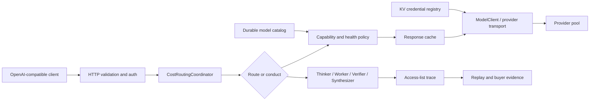

# Product and Technical Gap Baseline

**As of:** 2026-08-21 01:34, Asia/Seoul
**Source of truth:** `main` at `e226e1197bdfc890c9d8e5b9b648c78857d7e465`
**Product boundary:** one OpenAI-compatible gateway plus its operator evidence
control plane. Fugu, TRINITY, and Conductor are research inputs, not separate
deployables.
**Customer next action:** use this document to select the next mergeable PR and
to verify its exact-head evidence before approving or releasing it.

**Normative decision record:** [ADR 0016 — Product and technical gap
baseline](planning/adrs/0016-product-technical-gap-baseline.md). Privacy
requirements additionally follow [ADR 0010 — PII audit, not
masking](planning/adrs/0010-pii-audit-not-mask.md).

> This is a dated planning snapshot, not a live merge dashboard. PR heads,
> checks, reviews, and base relationships can change after publication. Always
> refetch the remote exact head and protected rules before acting on a row.

## 1. Product requirements (PRD)

Contextual Orchestrator must let an application keep using an OpenAI-compatible
API while the platform chooses between a single-worker route and a deeper,
verifiable workflow. A buyer should be able to answer four questions without
reading source code:

1. Which provider/model handled the request and why was it selected?
2. Which workflow roles saw which prior outputs?
3. What happened when a provider, tool, cache, or verifier failed?
4. Can the same evidence be replayed, audited, and operated as a standalone
   service or an imported module?

The existing product plan covers API compatibility, managed agent pools,
latency/quality policy, trace/access evidence, evaluation replay, i18n, and
buyer-readiness endpoints. The open queue shows that reliability, provider
bootstrap, secure credential use, purpose-limited PII access, and release-grade
operability are still being closed.

## 2. Technical requirements (TRD)

| Boundary | Required behavior | Acceptance evidence |
|---|---|---|
| API | Preserve `/v1/chat/completions` and compatible error/stream contracts. | Contract tests plus hosted required workflows. |
| Routing | Select by capability, provider health, cost, model mode, and explicit exclusions; do not route embedding-only models to chat synthesis. Embedding endpoints may delegate model selection to an enabled `embedding` capability agent. | Exact-head capability-isolation, discovery, failover, and [#789](https://github.com/ContextualWisdomLab/contextual-orchestrator/pull/789) embedding-contract tests. |
| Orchestration | Allocate shallow or deep work by task need; retain Thinker/Worker/Verifier/Synthesizer evidence, bounded recursion, and Conductor-style access lists. | Replayable workflow trace and equal-budget ablation evidence for [#568](https://github.com/ContextualWisdomLab/contextual-orchestrator/issues/568). |
| Provider plane | Discover model capabilities and price honestly, bootstrap credentials from KV, and use secure provider transport with fail-closed malformed responses. | Catalog/bootstrap, provider-contract, and security checks for [#764](https://github.com/ContextualWisdomLab/contextual-orchestrator/pull/764)/[#765](https://github.com/ContextualWisdomLab/contextual-orchestrator/pull/765)/[#768](https://github.com/ContextualWisdomLab/contextual-orchestrator/pull/768)/[#769](https://github.com/ContextualWisdomLab/contextual-orchestrator/pull/769)/[#770](https://github.com/ContextualWisdomLab/contextual-orchestrator/pull/770). |
| Failure plane | Classify tool failures, fail safely, preserve upstream truth, and retry only within a bounded policy. | [#771](https://github.com/ContextualWisdomLab/contextual-orchestrator/pull/771) focused/full tests and hosted security checks. |
| Cache plane | Optional injected Redis/Dragonfly-compatible response cache; deterministic keys, strict bypass, local fallback, fail-open backend behavior, and no cross-model reuse. | [#772](https://github.com/ContextualWisdomLab/contextual-orchestrator/pull/772) focused/full tests and RFC 9111 review. |
| Privacy | Do not blanket-mask operational PII. Enforce purpose-limited authorization, field-level encryption at rest, credential redaction, and auditable access. | [ADR 0010](planning/adrs/0010-pii-audit-not-mask.md) follow-up [#762](https://github.com/ContextualWisdomLab/contextual-orchestrator/pull/762) plus implementation tests. |
| Persistence | Keep database objects at least two words in `snake_case` and keep schemas in third normal form. | Schema convention review and migration tests. |
| Packaging | Keep one deployable product until a second consumer, independent cadence, or security-provenance boundary requires extraction; every extracted component must work standalone and as a submodule. | Packaging ADR and consumer integration proof. |
| Operability | Maintain one hourly owner for product development; do not add a duplicate scheduler. OpenCode/Noema/Strix must use the gateway path without `COPILOT_GITHUB_TOKEN`. | Central `.github` `organization-commercial-readiness-loop.yml` (`7 * * * *`) owns the hourly product loop; `pr-review-merge-scheduler.yml` owns the more frequent protected PR sweep. |
| Release | Release only from exact-head green evidence; update version and `CHANGELOG.md`. | Protected normal merge followed by release checks. |

## 3. Current architecture and UML-level flow

The public API stays small; the control plane owns provider selection,
capability isolation, workflow evidence, cache policy, and failure truth. Rust
is not warranted for the current stdlib Python gateway solely by preference:
the current product gap is correctness and operational evidence. Revisit a
Rust boundary when profiling demonstrates transport, parsing, or concurrency
cost that the existing process cannot meet, and preserve the OpenAI-compatible
module contract.

### Runtime role mapping

`thinker` is the canonical runtime and trace role for planning work. `planner`
is the planning responsibility, not a separate `WorkflowStep.role`: the
generated-plan path selects its planner model through the `thinker` role,
invokes that control-plane planning call, and then emits execution trace rows
with the declared `thinker`, `worker`, `verifier`, or `synthesizer` roles. A
planner call itself is not silently relabeled as a distinct `planner` trace
role. This keeps the documented role vocabulary aligned with
`TaskOrchestrator.ROLE_TAGS`, `WorkflowStep.role`, and the API trace contract.

## 4. Open PR inventory at the source-of-truth snapshot

Checks below are a snapshot, not approval. `queued` and `in_progress` are not
failures, but they also are not merge evidence. Protected main requires one
independent approving review, last-push approval, resolved threads, all
required workflows, and a normal merge.

| PR | Exact head at snapshot | State / base | Evidence boundary and next action |
|---:|---|---|---|
| [#792](https://github.com/ContextualWisdomLab/contextual-orchestrator/pull/792) | `236a28b3f73380aaa39aa7b19a2bc475c2cbdf6f` | ready, based on main | Documentation-only release gap closure: adds the canonical SemVer changelog and explicitly keeps `0.1.0` unreleased until protected main, required Checks, independent review, and release artifacts are verified. Normal merge still requires the protected gate. |
| [#790](https://github.com/ContextualWisdomLab/contextual-orchestrator/pull/790) | `0071751782ae535721e71785c3037989d2d27b77` | ready, based on main | Latest exact head keeps the gateway auth token outside the provider-key bootstrap gate. Exact-head review-gateway/model-discovery/API/security proof is `55 passed` with Ruff/diff clean; hosted Checks and independent approval remain required. |
| [#783](https://github.com/ContextualWisdomLab/contextual-orchestrator/pull/783) | `6210b00899bd6aae068570b0f030a224e9cc55a3` | ready, stacked on [#776](https://github.com/ContextualWisdomLab/contextual-orchestrator/pull/776) | Review the total monotonic body deadline and exact-head framing regression; integrate after [#776](https://github.com/ContextualWisdomLab/contextual-orchestrator/pull/776) with all protected evidence. |
| [#781](https://github.com/ContextualWisdomLab/contextual-orchestrator/pull/781) | `caf1eb34d92f8d1e3d99a98f4278378f6bc4e85f` | ready, stacked on [#780](https://github.com/ContextualWisdomLab/contextual-orchestrator/pull/780) | Review verified `trace` purpose scope, metadata-only pre-release audit, and generic fail-closed audit outage behavior at the current parent-integrated head before merging after [#780](https://github.com/ContextualWisdomLab/contextual-orchestrator/pull/780). |
| [#787](https://github.com/ContextualWisdomLab/contextual-orchestrator/pull/787) | `36e3be0bca5f64b7c5150351b2d505ea536a46a4` | ready, stacked on [#765](https://github.com/ContextualWisdomLab/contextual-orchestrator/pull/765) | Exact-head local proof is full suite `1474 passed in 626.39s`, focused tool-loop suite `51 passed`, and Ruff/diff clean; review the explicit client-owned loop opt-in and merge only after [#765](https://github.com/ContextualWisdomLab/contextual-orchestrator/pull/765) plus protected approval. |
| [#788](https://github.com/ContextualWisdomLab/contextual-orchestrator/pull/788) | `d670601e61ca181a7b7134c7d0219f310334ff05` | ready, based on main | Review opaque admin-session TTL/revocation, same-origin cookie state changes, Secure-by-default deployment, and fresh exact-head security Checks before normal merge. |
| [#789](https://github.com/ContextualWisdomLab/contextual-orchestrator/pull/789) | `3a80d91b8c879e57d30ab87af664546b8712fb15` | ready, based on main | Review optional embedding model selection, capability-constrained pool validation, OpenAPI parity, [ADR 0012](https://github.com/ContextualWisdomLab/contextual-orchestrator/blob/3a80d91b8c879e57d30ab87af664546b8712fb15/docs/planning/adrs/0012-auto-embedding-model-selection.md), and fresh exact-head protected Checks before normal merge. |
| [#782](https://github.com/ContextualWisdomLab/contextual-orchestrator/pull/782) | `1e7ddb96256a9379b3d8d4bb39c70a646f302bed` | ready, based on main | Review owner-bound workflow/access/evaluation reads, split-token admin evidence visibility, migration fail-closed behavior, and exact-head protected Checks before merge. |
| [#780](https://github.com/ContextualWisdomLab/contextual-orchestrator/pull/780) | `7c99b873c7583106dd1140439fd20cdbb885ef35` | ready, based on main | Review the minimal `/healthz` contract, authenticated `/readyz`, optional-dependency degradation, backend-identifier non-disclosure, and fresh exact-head hosted Checks before normal merge. |
| [#779](https://github.com/ContextualWisdomLab/contextual-orchestrator/pull/779) | `cf4a4501fa5057f89b21cad5033c5925755cd150` | ready, stacked on [#765](https://github.com/ContextualWisdomLab/contextual-orchestrator/pull/765) | Current successor for optional-temperature capability negotiation. Review exact same-provider retry semantics, then integrate only after [#765](https://github.com/ContextualWisdomLab/contextual-orchestrator/pull/765) reaches protected main; predecessor evidence is stale. |
| [#778](https://github.com/ContextualWisdomLab/contextual-orchestrator/pull/778) | `9aa99731f8ee242f10114b16f082608d9411191f` | ready, stacked on [#765](https://github.com/ContextualWisdomLab/contextual-orchestrator/pull/765) | Review source-image preservation, explicit `vision` eligibility/failover, Responses normalization, and the private LineageWeave OCR recovery boundary; focused exact-head suite is `94 passed`. |
| [#776](https://github.com/ContextualWisdomLab/contextual-orchestrator/pull/776) | `0ec115134d21d1fbee17cc5431e1c9433667ee5a` | ready, stacked on [#765](https://github.com/ContextualWisdomLab/contextual-orchestrator/pull/765) | Review fixed-length framing plus the total-deadline regression; [#783](https://github.com/ContextualWisdomLab/contextual-orchestrator/pull/783) supplies the root-cause implementation before retargeting onto protected main. |
| [#775](https://github.com/ContextualWisdomLab/contextual-orchestrator/pull/775) | `fb8fb621faa66859e36fa9496d3d6deefd09c18e` | draft, based on main | Verify the exact CPython 3.12 Atheris marker, direct test contract, hash lock, hosted Fuzz job, and independent approval before promotion. |
| [#784](https://github.com/ContextualWisdomLab/contextual-orchestrator/pull/784) | `f29ae25e0d298e020977482f6a9bcb7549f9e9a8` | ready, based on main | Review fail-closed release authorization, exact-head `gh api` collection, product-evidence separation, and fresh hosted Checks before protected merge; auto-merge was re-armed after the remote push. |
| [#785](https://github.com/ContextualWisdomLab/contextual-orchestrator/pull/785) | `ec609fa7b526a995346c34434e277eb12f5a0246` | ready, based on main | Issue [#568](https://github.com/ContextualWisdomLab/contextual-orchestrator/issues/568) exact-head proof is full suite `1461 passed in 580.97s`, focused judge/failover/passthrough/profile suite `69 passed`, and Ruff/diff clean; independent approval and protected Checks remain required. |
| [#773](https://github.com/ContextualWisdomLab/contextual-orchestrator/pull/773) | self-reference — refetch live PR head | ready, based on main | This document is the PR's own changing artifact, so embedding its content SHA would become stale on every refresh commit. Refetch the live PR #773 head before relying on this row; review the dated product/technical gap register and ADR 0016 against the other exact heads. |
| [#772](https://github.com/ContextualWisdomLab/contextual-orchestrator/pull/772) | `f72ddc886cc55a3243ebe79f6498c7f942409c83` | ready, based on main | Review cache-key isolation, strict bypass parsing, fail-open backend behavior, malformed cache entries, and routing/cost/stream interactions; exact-head cache/cost/ledger proof is `63 passed`, with full suite `1451 passed`. |
| [#771](https://github.com/ContextualWisdomLab/contextual-orchestrator/pull/771) | `e1d417070885d5c0d0f0e62bd7d2e07736e87f01` | ready, based on main | The tool-failure PR is limited to failure classification and safe fallback; exact-head fallback/security/HTTP contract suite is `134 passed` and Ruff/diff checks pass. Owner-bound evidence authorization is tracked separately in [#782](https://github.com/ContextualWisdomLab/contextual-orchestrator/pull/782). Hosted Checks are queued; obtain independent approval before protected merge. |
| [#770](https://github.com/ContextualWisdomLab/contextual-orchestrator/pull/770) | `386c9a03d1d7076106e4061776e81ffd6dac4d6f` | draft, based on stale main | Reconcile after [#768](https://github.com/ContextualWisdomLab/contextual-orchestrator/pull/768). Preserve complete-price evidence, provider-family diversity, corrupt-row handling, and consume the shared ordinary-chat classifier rather than a local detector. |
| [#769](https://github.com/ContextualWisdomLab/contextual-orchestrator/pull/769) | `9654c285c54443acf6358193925f4e0e8ae501ce` | ready, based on main | Core repository workflows succeeded on this head; obtain exact-head independent approval and remaining protected contexts. |
| [#768](https://github.com/ContextualWisdomLab/contextual-orchestrator/pull/768) | `88fee976ca4222309f625058a6f95f09e66744ec` | ready, based on main | Review the current capability boundary, including ShieldGemma, legacy Completions, direct-run regressions, and exact-head hosted checks. |
| [#765](https://github.com/ContextualWisdomLab/contextual-orchestrator/pull/765) | `d3f9a9b96523ed572b908c8abba1afa527eb49dc` | draft, based on main | Reconcile after [#768](https://github.com/ContextualWisdomLab/contextual-orchestrator/pull/768)/[#769](https://github.com/ContextualWisdomLab/contextual-orchestrator/pull/769); preserve DNS-pinned discovery, structured-output honesty, gateway-owned reasoning policy, and omitted sampling controls. |
| [#764](https://github.com/ContextualWisdomLab/contextual-orchestrator/pull/764) | `55814b9520133306777834ead0c7d380c3e1c820` | draft, based on main | Verify 3NF catalog persistence, credential promotion/rollback, last-known-good semantics, exact-set stale withdrawal, and shared capability-classifier adoption after rebase. |
| [#763](https://github.com/ContextualWisdomLab/contextual-orchestrator/pull/763) | `385a5b4e8d41dd6decab9f0845538e03fc71b51e` | draft, based on main | Reconcile with [#765](https://github.com/ContextualWisdomLab/contextual-orchestrator/pull/765)/[#768](https://github.com/ContextualWisdomLab/contextual-orchestrator/pull/768); preserve one-shot local Responses translation, local concurrency coordination, concrete-model stickiness, and adaptive provider failover. |
| [#762](https://github.com/ContextualWisdomLab/contextual-orchestrator/pull/762) | `be6b6c792165061e16f7d05a06251e5b8ee47519` | ready, based on main | The exact-head ADR closes the documented purpose, classification, AEAD/KMS, migration, and audit-gate review gaps; merge the design only after current-head independent approval, then implement its acceptance criteria separately. |

PR [#791](https://github.com/ContextualWisdomLab/contextual-orchestrator/pull/791) was merged into its stacked base branch on 2026-08-20; it is not a protected-main release. PR [#774](https://github.com/ContextualWisdomLab/contextual-orchestrator/pull/774) was closed unmerged as the stale-base predecessor of [#779](https://github.com/ContextualWisdomLab/contextual-orchestrator/pull/779). Its local
or predecessor-head evidence does not transfer. Issue [#745](https://github.com/ContextualWisdomLab/contextual-orchestrator/issues/745) is represented by
[#772](https://github.com/ContextualWisdomLab/contextual-orchestrator/pull/772) and issue [#567](https://github.com/ContextualWisdomLab/contextual-orchestrator/issues/567) by [#771](https://github.com/ContextualWisdomLab/contextual-orchestrator/pull/771). A draft or implementation PR is not treated as
completed until the protected-main contract is satisfied.

All links and full commit SHAs in this snapshot reflect the remote state
observed at 2026-08-21 01:34 Asia/Seoul; they are evidence pointers, not
standing approval.

## 5. Open issue and product-gap queue

| Issue | Customer-visible gap | Planned proof / next PR |
|---:|---|---|
| [#568](https://github.com/ContextualWisdomLab/contextual-orchestrator/issues/568) | Operators cannot compare provider-neutral reasoning profiles at equal budget. | PR [#785](https://github.com/ContextualWisdomLab/contextual-orchestrator/pull/785) adds versioned role profiles, exact snapshot hashing, provider-capability fail-closed request binding, and equal-budget theta-hat/RMSE ablation; production defaults remain locked until measured evidence is available. |
| [#123](https://github.com/ContextualWisdomLab/contextual-orchestrator/issues/123) | A sole collaborator can be unable to satisfy last-push approval. | Add governance evidence/runbook or a protected-rule-compatible process; never bypass approval. |
| [#119](https://github.com/ContextualWisdomLab/contextual-orchestrator/issues/119) | Ambiguous or unbounded inbound framing threatens request integrity. | PR [#776](https://github.com/ContextualWisdomLab/contextual-orchestrator/pull/776) adds fixed-length framing and PR [#783](https://github.com/ContextualWisdomLab/contextual-orchestrator/pull/783) enforces the total body deadline; merge the stack only after exact-head hosted evidence. |
| [#118](https://github.com/ContextualWisdomLab/contextual-orchestrator/issues/118) | Liveness and authenticated readiness are not yet fully separated. | PR [#780](https://github.com/ContextualWisdomLab/contextual-orchestrator/pull/780) implements the minimal `/healthz` and authenticated `/readyz` contract; merge only after exact-head Checks and independent approval. |
| [#117](https://github.com/ContextualWisdomLab/contextual-orchestrator/issues/117) | Trace access and inference access need separate authority. | PR [#781](https://github.com/ContextualWisdomLab/contextual-orchestrator/pull/781) adds a verified `trace` purpose scope, pre-release audit event, and audit-outage fail-closed tests; merge after [#780](https://github.com/ContextualWisdomLab/contextual-orchestrator/pull/780) and exact-head protected evidence. |
| [#116](https://github.com/ContextualWisdomLab/contextual-orchestrator/issues/116) | Browser admin sessions need separation from long-lived bearer credentials. | PR [#788](https://github.com/ContextualWisdomLab/contextual-orchestrator/pull/788) implements opaque bounded sessions, Secure-by-default cookies, same-origin state-change checks, logout/revocation, and regression evidence. |
| [#103](https://github.com/ContextualWisdomLab/contextual-orchestrator/issues/103) | Release readiness must fail closed on stale head, missing review, or missing Checks evidence. | PR [#784](https://github.com/ContextualWisdomLab/contextual-orchestrator/pull/784) separates product evidence from release authority and adds exact-head `gh api` collection; merge only after fresh protected evidence. |
| [#102](https://github.com/ContextualWisdomLab/contextual-orchestrator/issues/102) | Equivalent endpoints need race-to-first-valid completion without unsafe cancellation. | Add bounded concurrency and provider truth tests. |
| [#95](https://github.com/ContextualWisdomLab/contextual-orchestrator/issues/95) | Atheris locking must work on all supported CPython interpreters. | Land portable lock implementation and run the hosted fuzz job. |
| [#86](https://github.com/ContextualWisdomLab/contextual-orchestrator/issues/86) | NVIDIA NIM discovery needs live, evidence-grade capability/cost/quality measurement. | Use KV-registered NIM credentials in a controlled benchmark; publish provenance and limits. The issue remains open and no accepted active implementation PR exists. |

GitHub currently returns `404 Not Found` for issue [#777](https://github.com/ContextualWisdomLab/contextual-orchestrator/issues/777); its earlier metric-gap
row is therefore removed from the actionable queue rather than treated as a
live work item.

## 6. Prioritized gap register

| Priority | Gap | Current evidence | Definition of done |
|---:|---|---|---|
| P0 | Protected delivery cannot merge green PRs without independent approval. | Ruleset `18156473` requires one approval and last-push approval; several PRs are green but blocked. | A human/independent reviewer approves the exact current SHA, all threads resolve, hosted required workflows pass, and normal squash/merge succeeds. |
| P0 | Provider boundary is still being assembled across stacked PRs. | [#768](https://github.com/ContextualWisdomLab/contextual-orchestrator/pull/768), [#765](https://github.com/ContextualWisdomLab/contextual-orchestrator/pull/765), [#764](https://github.com/ContextualWisdomLab/contextual-orchestrator/pull/764), [#770](https://github.com/ContextualWisdomLab/contextual-orchestrator/pull/770), [#763](https://github.com/ContextualWisdomLab/contextual-orchestrator/pull/763), [#776](https://github.com/ContextualWisdomLab/contextual-orchestrator/pull/776), [#778](https://github.com/ContextualWisdomLab/contextual-orchestrator/pull/778), and [#779](https://github.com/ContextualWisdomLab/contextual-orchestrator/pull/779) are pending integration. | One current-main stack has capability isolation, secure JSON, bounded framing, multimodal evidence, KV bootstrap, honest catalog, optional-control negotiation, and failover with no duplicate logic. |
| P0 | Operational failure paths are not yet one buyer-verifiable contract. | [#771](https://github.com/ContextualWisdomLab/contextual-orchestrator/pull/771) and [#772](https://github.com/ContextualWisdomLab/contextual-orchestrator/pull/772) are open. | Exact-head full suite, focused edge tests, security scans, and a buyer-facing failure/rollback trace pass. |
| P1 | PII can remain usable without blanket masking, but authorization/encryption is unfinished. | [ADR 0010](planning/adrs/0010-pii-audit-not-mask.md) explicitly marks both follow-ups not started; [#762](https://github.com/ContextualWisdomLab/contextual-orchestrator/pull/762) is documentation. | Purpose-scoped caller/role authorization, field-level encryption at rest, credential-only redaction, and audit tests prove raw PII is only returned to an authorized purpose. |
| P1 | Deep-workflow compute policy lacks provider-neutral measured ablation. | PR [#785](https://github.com/ContextualWisdomLab/contextual-orchestrator/pull/785) supplies opt-in profiles, snapshot replay, and synthetic/estimated RMSE; the production gate remains closed pending buyer-held-out measurement. | Equal-budget shallow/deep/role-effort/access-list replay with reproducible quality, verifier, cost, and trace metrics. |
| P1 | Model discovery lacks live NVIDIA NIM evidence. | Issue [#86](https://github.com/ContextualWisdomLab/contextual-orchestrator/issues/86) remains open; local catalog is not production telemetry. | KV-backed NIM discovery benchmark records model capability, price provenance, failure class, and quality result without secret leakage. |
| P1 | Release gate and hourly loop need exact operational proof. | Central scheduler workflows own the loop; PR [#784](https://github.com/ContextualWisdomLab/contextual-orchestrator/pull/784) adds the exact-head authority evaluator/collector, but protected approval and release evidence remain open. | One scheduler owner, no duplicate workflow, exact-head release gate, version/changelog update, and normal protected release evidence. |
| P2 | Ecosystem boundaries need consumer proof. | `naruon`, `.github`, and sibling components are named consumers, but this repo remains one deployable product. | Add a minimal OpenAI-compatible connector contract test for a real consumer or defer extraction with a documented trigger; do not split speculatively. |
| P2 | Frontend component inventory is not applicable here. | This repository is a backend stdlib lab and has no frontend/Storybook tree. | Keep the existing Figma artifact record; introduce Storybook only when a frontend package is actually added. |

## 7. Delivery gates

For each PR, perform the following loop on the current head: inspect changed
files and review threads, reproduce the claimed behavior, fix root causes in
the shared path, run focused and full tests, run compile/diff/security checks,
refresh the hosted Checks, and merge only after the protected rule is satisfied.
Remote agent pushes are respected by refetching the head; stale approvals or
checks are not reused. Review queues and hosted wait time remain active-work
time: use it to implement the next independent gap, not to bypass the gate.

Release is not complete until the version, `CHANGELOG.md`, release candidate,
and exact-head evidence all agree. A green local run is not production or
buyer telemetry; label local evidence accordingly.

## 8. Standards and research basis (APA 7th)

Nielsen, S., Cetin, E., Schwendeman, P., Sun, Q., Xu, J., & Tang, Y. (2025).
*Learning to orchestrate agents in natural language with the Conductor*
(arXiv:2512.04388). https://doi.org/10.48550/arXiv.2512.04388

OpenAI. (n.d.-a). *Create chat completion*. OpenAI Platform.
https://platform.openai.com/docs/api-reference/chat/create

OpenAI. (n.d.-b). *Create a model response*. OpenAI Platform.
https://platform.openai.com/docs/api-reference/responses/create

OpenAPI Initiative. (2025, September 19). *OpenAPI specification version 3.2.0*.
https://spec.openapis.org/oas/v3.2.0.html

Sakana AI. (2026, June 22). *Sakana Fugu: One model to command them all*.
https://sakana.ai/fugu-release/

Xu, J., Sun, Q., Schwendeman, P., Nielsen, S., Cetin, E., & Tang, Y. (2025).
*TRINITY: An evolved LLM coordinator* (arXiv:2512.04695).
https://doi.org/10.48550/arXiv.2512.04695

Fielding, R., Nottingham, M., & Reschke, J. (2022). *HTTP caching* (RFC 9111).
RFC Editor. https://www.rfc-editor.org/rfc/rfc9111.html

National Institute of Standards and Technology. (2024). *Artificial
intelligence risk management framework: Generative artificial intelligence
profile* (NIST AI 600-1). https://doi.org/10.6028/NIST.AI.600-1

These sources support the current product shape, OpenAI-compatible wire
honesty, deep-versus-shallow orchestration allocation, cache safety, and
generative-AI risk evidence. PDFs are attached only when redistribution is
permitted; otherwise the canonical citation and link are retained.

## 9. Design and ecosystem record

- Existing editable Figma file: `Contextual Orchestrator Plugin-Driven Admin
  Design`, file ID `vsZMd8WAv42HDRgcZuNcWk`, recorded in
  [`docs/figma_artifacts.md`](figma_artifacts.md). No new Figma work is needed
  for this backend-only baseline.
- Existing FigJam architecture board is also recorded in that file.
- Storybook is not introduced because this repository has no frontend surface;
  repeated backend/API objects remain documented contracts and schemas.
- The current packaging decision is one standalone gateway that can be
  consumed as a module. A repository split requires a concrete independent
  consumer, release cadence, or security-provenance boundary.

**Customer next action:** approve the next exact-head PR only when its row above
has a concrete proof link, then use the next highest-priority unresolved gap to
create the following stacked change.
