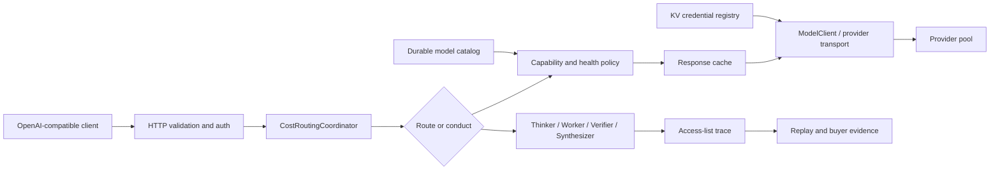

# Product and Technical Gap Baseline

**As of:** 2026-08-20, Asia/Seoul
**Source of truth:** `main` at `e226e1197bdfc890c9d8e5b9b648c78857d7e465`
**Product boundary:** one OpenAI-compatible gateway plus its operator evidence
control plane. Fugu, TRINITY, and Conductor are research inputs, not separate
deployables.
**Customer next action:** use this document to select the next mergeable PR and
to verify its exact-head evidence before approving or releasing it.

## 1. Product requirements (PRD)

Contextual Orchestrator must let an application keep using an OpenAI-compatible
API while the platform chooses between a single-worker route and a deeper,
verifiable workflow. A buyer should be able to answer four questions without
reading source code:

1. Which provider/model handled the request and why was it selected?
2. Which workflow roles saw which prior outputs?
3. What happened when a provider, tool, cache, or verifier failed?
4. Can the same evidence be replayed, audited, and operated as a standalone
   service or an imported module?

The existing product plan covers API compatibility, managed agent pools,
latency/quality policy, trace/access evidence, evaluation replay, i18n, and
buyer-readiness endpoints. The open queue shows that reliability, provider
bootstrap, secure credential use, purpose-limited PII access, and release-grade
operability are still being closed.

## 2. Technical requirements (TRD)

| Boundary | Required behavior | Acceptance evidence |
|---|---|---|
| API | Preserve `/v1/chat/completions` and compatible error/stream contracts. | Contract tests plus hosted required workflows. |
| Routing | Select by capability, provider health, cost, model mode, and explicit exclusions; do not route embedding-only models to chat synthesis. | Exact-head capability-isolation, discovery, and failover tests. |
| Orchestration | Allocate shallow or deep work by task need; retain Thinker/Worker/Verifier/Synthesizer evidence, bounded recursion, and Conductor-style access lists. | Replayable workflow trace and equal-budget ablation evidence for #568. |
| Provider plane | Discover model capabilities and price honestly, bootstrap credentials from KV, and use secure provider transport with fail-closed malformed responses. | Catalog/bootstrap, provider-contract, and security checks for #764/#765/#768/#769/#770. |
| Failure plane | Classify tool failures, fail safely, preserve upstream truth, and retry only within a bounded policy. | #771 focused/full tests and hosted security checks. |
| Cache plane | Optional injected Redis/Dragonfly-compatible semantic cache; deterministic keys, strict bypass, local fallback, fail-open backend behavior, and no cross-model reuse. | #772 focused/full tests and RFC 9111 review. |
| Privacy | Do not blanket-mask operational PII. Enforce purpose-limited authorization, field-level encryption at rest, credential redaction, and auditable access. | ADR 0010 follow-up #762 plus implementation tests. |
| Persistence | Keep database objects at least two words in `snake_case` and keep schemas in third normal form. | Schema convention review and migration tests. |
| Packaging | Keep one deployable product until a second consumer, independent cadence, or security-provenance boundary requires extraction; every extracted component must work standalone and as a submodule. | Packaging ADR and consumer integration proof. |
| Operability | Maintain one hourly owner for product development; do not add a duplicate scheduler. OpenCode/Noema/Strix must use the gateway path without `COPILOT_GITHUB_TOKEN`. | Central `.github` `organization-commercial-readiness-loop.yml` (`7 * * * *`) owns the hourly product loop; `pr-review-merge-scheduler.yml` owns the more frequent protected PR sweep. |
| Release | Release only from exact-head green evidence; update version and `CHANGELOG.md`. | Protected normal merge followed by release checks. |

## 3. Current architecture and UML-level flow

The public API stays small; the control plane owns provider selection,
capability isolation, workflow evidence, cache policy, and failure truth. Rust
is not warranted for the current stdlib Python gateway solely by preference:
the current product gap is correctness and operational evidence. Revisit a
Rust boundary when profiling demonstrates transport, parsing, or concurrency
cost that the existing process cannot meet, and preserve the OpenAI-compatible
module contract.

## 4. Open PR inventory at the source-of-truth snapshot

Checks below are a snapshot, not approval. `queued` and `in_progress` are not
failures, but they also are not merge evidence. Protected main requires one
independent approving review, last-push approval, resolved threads, all
required workflows, and a normal merge.

| PR | Exact head | State / review | Checks snapshot | Dependency and next action |
|---:|---|---|---|---|
| #776 | `3830f38` | stacked / review not recorded, clean | no protected required Checks until parent #765 is integrated | Review fixed-length framing, exact read, deadline, close-on-error, and RFC 9112 evidence; retarget/rebase onto protected main after #765. |
| #775 | `fb8fb62` | draft / `REVIEW_REQUIRED`, blocked | hosted Checks pending on the repaired head | Verify the exact CPython 3.12 Atheris marker keeps unsupported interpreters out while preserving the CPython 3.12 fuzz installation; obtain independent approval. |
| #774 | `8977384` | stacked on non-default base `feat/paper-grounded-auto-orchestration-20260820`, review not recorded, clean | no required Checks reported for its non-default base branch | Rebase onto the current #765/main line; preserve same-provider temperature negotiation and do not merge a stale 72-file comparison. |
| #773 | `41f4a0a` | ready / `REVIEW_REQUIRED`, blocked | required workflows pending | Review the current product/technical baseline and ADR 0016, then obtain independent approval. |
| #772 | `8452623` | ready / `REVIEW_REQUIRED`, blocked | required workflows pending | Review cache key, bypass, fail-open, and cost/routing interactions; wait for same-head Checks and independent approval. |
| #771 | `2351cab` | ready / `REVIEW_REQUIRED`, blocked | most security checks passed; full suite, Hypothesis, Atheris, queue scan, Strix queued/in progress | Recheck exact-head failure-chain behavior and hosted Checks; obtain independent approval. |
| #770 | `c01733b` | draft / `REVIEW_REQUIRED`, behind | most checks passed; coverage queued, Strix in progress | Rebase/integrate after catalog and transport dependencies; preserve honest fail-closed price evidence. |
| #769 | `9654c28` | ready / `REVIEW_REQUIRED`, blocked | required checks passed except coverage evidence queued | Resolve coverage evidence and obtain last-push independent approval; do not self-approve. |
| #768 | `f13ee66` | ready / `REVIEW_REQUIRED`, blocked | required workflows queued | Review the current remote head for embedding/chat capability separation; predecessor a4aef39 evidence is stale, so wait for full Checks and approval on f13ee66. |
| #765 | `d3f9a9b` | draft / `REVIEW_REQUIRED`, blocked | most checks passed; coverage queued | Review secure provider JSON and role reasoning contract after #768/#769 integration. |
| #764 | `f4f1b4a` | draft / `REVIEW_REQUIRED`, behind | required workflows queued | Stack after credential/catalog contract is settled; verify 3NF persistence and KV bootstrap. |
| #763 | `385a5b4` | draft / `REVIEW_REQUIRED`, blocked | most checks passed; coverage queued, Strix in progress | Integrate with current provider transport and catalog; retain failover evidence. |
| #762 | `be6b6c7` | ready / `REVIEW_REQUIRED`, blocked | required checks passed except coverage evidence queued | Implement purpose-limited authorization and field-level encryption follow-up; documentation alone is not completion. |

Issue #745 is represented by #772 and issue #567 by #771. The remaining open
issues are recorded below; they are not silently treated as completed because
an issue exists or a draft PR exists.

## 5. Open issue and product-gap queue

| Issue | Customer-visible gap | Planned proof / next PR |
|---:|---|---|
| #777 | Low-latency gateway routing metrics use coarse, inference-oriented histogram buckets and do not separate dispatch from upstream latency. | Add validated configurable bucket boundaries and distinct dispatch/upstream histograms; preserve metric names, labels, and bounded cardinality. |
| #568 | Operators cannot compare provider-neutral reasoning profiles at equal budget. | Add role-specific effort profiles, recursion/workflow/access-list controls, and an ablation report with reproducible fixtures. |
| #123 | A sole collaborator can be unable to satisfy last-push approval. | Add governance evidence/runbook or a protected-rule-compatible process; never bypass approval. |
| #119 | Ambiguous or unbounded inbound framing threatens request integrity. | PR #776 adds bounded framing tests and hosted security evidence after its #765 stack is reconciled. |
| #118 | Liveness and authenticated readiness are not yet fully separated. | Add unauthenticated liveness and purpose-limited readiness checks. |
| #117 | Trace access and inference access need separate authority. | Add scoped authorization tests and audit evidence. |
| #116 | Browser admin sessions need separation from long-lived bearer credentials. | Add session-bound admin controls and regression tests. |
| #103 | Release readiness must fail closed on stale head, missing review, or missing Checks evidence. | Implement exact-head release gate and changelog/version proof. |
| #102 | Equivalent endpoints need race-to-first-valid completion without unsafe cancellation. | Add bounded concurrency and provider truth tests. |
| #95 | Atheris locking must work on all supported CPython interpreters. | Land portable lock implementation and run the hosted fuzz job. |
| #86 | NVIDIA NIM discovery needs live, evidence-grade capability/cost/quality measurement. | Use KV-registered NIM credentials in a controlled benchmark; publish provenance and limits. |

## 6. Prioritized gap register

| Priority | Gap | Current evidence | Definition of done |
|---:|---|---|---|
| P0 | Protected delivery cannot merge green PRs without independent approval. | Ruleset `18156473` requires one approval and last-push approval; several PRs are green but blocked. | A human/independent reviewer approves the exact current SHA, all threads resolve, hosted required workflows pass, and normal squash/merge succeeds. |
| P0 | Provider boundary is still being assembled across stacked PRs. | #768, #765, #764, #770, and #763 are draft/behind or pending integration. | One current-main stack has capability isolation, secure JSON, KV bootstrap, honest catalog, and failover with no duplicate logic. |
| P0 | Operational failure paths are not yet one buyer-verifiable contract. | #771 and #772 are open; hosted checks are still queued. | Exact-head full suite, focused edge tests, security scans, and a buyer-facing failure/rollback trace pass. |
| P1 | PII can remain usable without blanket masking, but authorization/encryption is unfinished. | ADR 0010 explicitly marks both follow-ups not started; #762 is documentation. | Purpose-scoped caller/role authorization, field-level encryption at rest, credential-only redaction, and audit tests prove raw PII is only returned to authorized purpose. |
| P1 | Deep-workflow compute policy lacks provider-neutral measured ablation. | Product plan cites Fugu/TRINITY/Conductor; issue #568 remains open. | Equal-budget shallow/deep/role-effort/access-list replay with reproducible quality, verifier, cost, and trace metrics. |
| P1 | Model discovery lacks live NVIDIA NIM evidence. | Issue #86 remains open; local catalog is not production telemetry. | KV-backed NIM discovery benchmark records model capability, price provenance, failure class, and quality result without secret leakage. |
| P1 | Release gate and hourly loop need exact operational proof. | Rules require central scheduler workflows; issue #103 remains open. | One scheduler owner, no duplicate workflow, exact-head release gate, version/changelog update, and normal protected release evidence. |
| P2 | Ecosystem boundaries need consumer proof. | `naruon`, `.github`, and sibling components are named consumers, but this repo remains one deployable product. | Add a minimal OpenAI-compatible connector contract test for a real consumer or defer extraction with a documented trigger; do not split speculatively. |
| P2 | Frontend component inventory is not applicable here. | This repository is a backend stdlib lab and has no frontend/Storybook tree. | Keep the existing Figma artifact record; introduce Storybook only when a frontend package is actually added. |

## 7. Delivery gates

For each PR, perform the following loop on the current head: inspect changed
files and review threads, reproduce the claimed behavior, fix root causes in
the shared path, run focused and full tests, run compile/diff/security checks,
refresh the hosted Checks, and merge only after the protected rule is satisfied.
Remote agent pushes are respected by refetching the head; stale approvals or
checks are not reused. Review queues and hosted wait time remain active-work
time: use it to implement the next independent gap, not to bypass the gate.

Release is not complete until the version, `CHANGELOG.md`, release candidate,
and exact-head evidence all agree. A green local run is not production or
buyer telemetry; label local evidence accordingly.

## 8. Standards and research basis (APA 7th)

Nielsen, S., Cetin, E., Schwendeman, P., Sun, Q., Xu, J., & Tang, Y. (2025).
*Learning to orchestrate agents in natural language with the Conductor*
(arXiv:2512.04388). https://doi.org/10.48550/arXiv.2512.04388

OpenAI. (n.d.-a). *Create chat completion*. OpenAI Platform.
https://platform.openai.com/docs/api-reference/chat/create

OpenAI. (n.d.-b). *Create a model response*. OpenAI Platform.
https://platform.openai.com/docs/api-reference/responses/create

OpenAPI Initiative. (n.d.). *OpenAPI specification*. Retrieved August 20,
2026, from https://spec.openapis.org/oas/ (the official page currently lists
OpenAPI 3.2.0 as the newest listed minor line).

Sakana AI. (2026, June 22). *Sakana Fugu: One model to command them all*.
https://sakana.ai/fugu-release/

Xu, J., Sun, Q., Schwendeman, P., Nielsen, S., Cetin, E., & Tang, Y. (2025).
*TRINITY: An evolved LLM coordinator* (arXiv:2512.04695).
https://doi.org/10.48550/arXiv.2512.04695

Fielding, R., Nottingham, M., & Reschke, J. (2022). *HTTP caching* (RFC 9111).
RFC Editor. https://www.rfc-editor.org/rfc/rfc9111.html

National Institute of Standards and Technology. (2024). *Artificial
intelligence risk management framework: Generative artificial intelligence
profile* (NIST AI 600-1). https://doi.org/10.6028/NIST.AI.600-1

These sources support the current product shape, OpenAI-compatible wire
honesty, deep-versus-shallow orchestration allocation, cache safety, and
generative-AI risk evidence. PDFs are attached only when redistribution is
permitted; otherwise the canonical citation and link are retained.

## 9. Design and ecosystem record

- Existing editable Figma file: `Contextual Orchestrator Plugin-Driven Admin
  Design`, file ID `vsZMd8WAv42HDRgcZuNcWk`, recorded in
  [`docs/figma_artifacts.md`](figma_artifacts.md). No new Figma work is needed
  for this backend-only baseline.
- Existing FigJam architecture board is also recorded in that file.
- Storybook is not introduced because this repository has no frontend surface;
  repeated backend/API objects remain documented contracts and schemas.
- The current packaging decision is one standalone gateway that can be
  consumed as a module. A repository split requires a concrete independent
  consumer, release cadence, or security-provenance boundary.

**Customer next action:** approve the next exact-head PR only when its row above
has a concrete proof link, then use the next highest-priority unresolved gap to
create the following stacked change.
