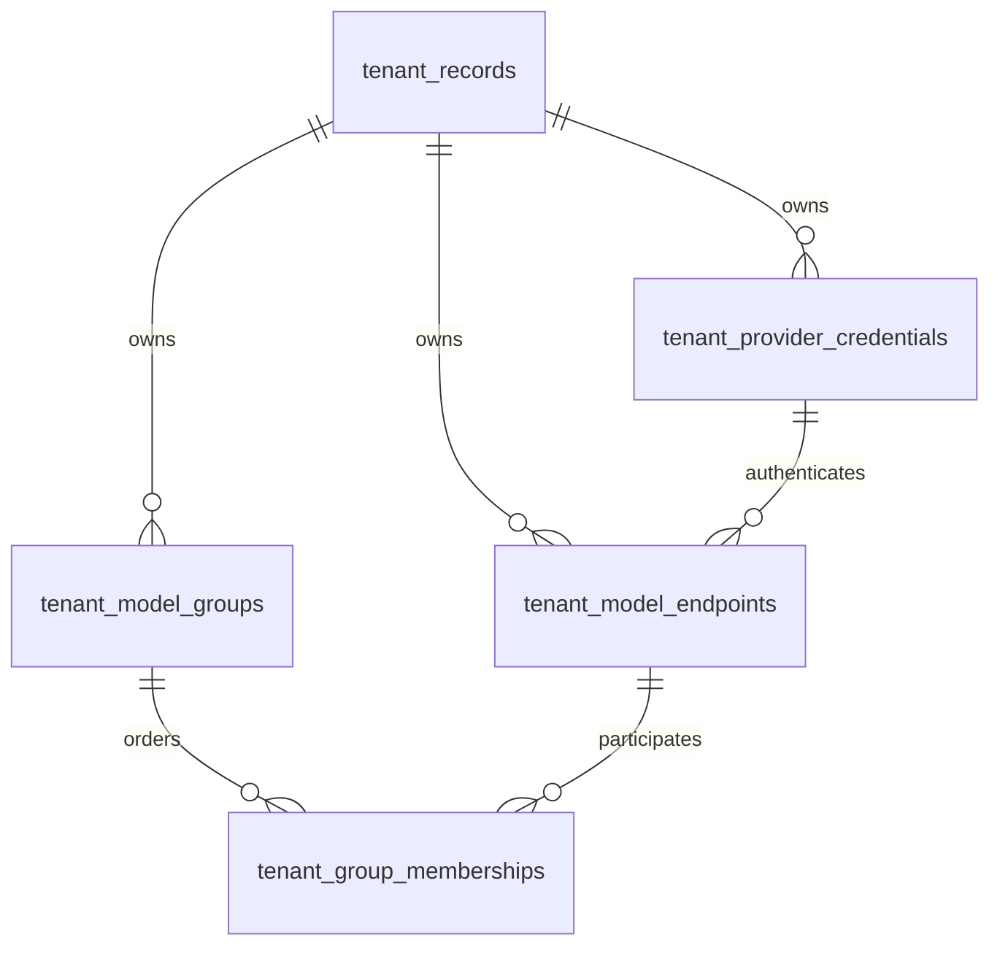
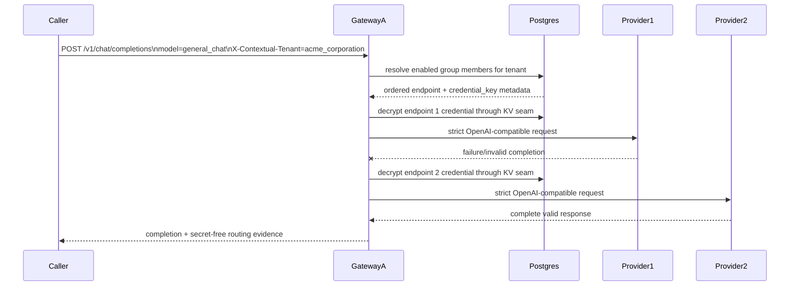

# Tenant Cloud Routing Design

**Date:** 2026-08-13  
**Status:** Accepted for the bounded stacked implementation  
**Base authority:** PR #96 exact head, not protected `main`

## Problem

The current gateway resolves one named provider credential from a process-global KV and keeps its agent pool in process memory. That is insufficient for a Cloud Native deployment where several Docker services or Kubernetes Pods must share one tenant's provider keys and model routing policy without treating one process as configuration authority.

## Approaches considered

### A. Keep process-local agent JSON and copy it into every Pod

Rejected. Rotation, endpoint disablement, and fallback order would drift between replicas, and a rollout would be required for every routing change.

### B. Add a new general-purpose secret-vault service

Rejected for this slice. It duplicates the existing pgcrypto credential boundary and would create another identity and availability dependency before a second proven implementation requires it.

### C. Reuse the encrypted KV for secret values and add normalized tenant routing metadata

Selected. Provider secrets remain in `provider_credentials`; tenant-qualified credential names prevent collisions. Separate normalized tables own tenant, credential metadata, groups, endpoints, and ordered membership. Every gateway replica resolves the group from PostgreSQL on each request and then uses the existing `ModelClient` provider trust boundary.

## Identity boundary

Keyverse/cwl-idp, or an equivalent verified identity proxy, remains the identity authority. The gateway does not create users, passwords, or identity tokens. The direct Cloud Gateway API requires an authenticated admin/inference bearer resolved from the shared KV. The browser UI stores no bearer in local or session storage and assumes same-origin identity-proxy injection in production.

## Data model

The secret is not duplicated in tenant metadata. `tenant_provider_credentials.credential_key` points to the pgcrypto-encrypted `provider_credentials.credential_name` row.

## Request flow

## Fallback semantics

This slice implements only `sequential_failover`.

- Membership order is explicit and unique within a group.
- Fallback never leaves the requested tenant or group.
- Disabled tenant, credential, group, endpoint, or membership is excluded.
- A candidate wins only after returning a non-empty complete string through `ModelClient`.
- Attempt evidence contains endpoint/provider/model identifiers and stable outcome codes, never exception text, prompts, responses, or credentials.
- Immediate race and delayed hedge remain owned by issue #102.

## Cloud Native deployment

- Gateway replicas are stateless with respect to tenant routing configuration.
- PostgreSQL is the shared control-plane authority.
- `/livez` performs no dependency access.
- `/readyz` performs only a bounded database ping and never calls an LLM.
- Provider keys enter through a one-shot bootstrap Job; gateway Pods do not receive provider API-key environment variables.
- Two Compose gateway services and a Kubernetes Deployment with two replicas exercise the shared-state contract.

## Verification

Offline tests are authoritative for merge gating. A separate manually dispatched workflow may consume `OPENROUTER_API_KEY`, `NVIDIA_NIM_API_KEY`, and `BYTEZ_API_KEY` to seed the registry, prove cross-process visibility, probe each official OpenAI-compatible provider surface, and demonstrate fallback after an intentionally failing first endpoint.

## References — APA 7th

Dean, J., & Barroso, L. A. (2013). The tail at scale. *Communications of the ACM, 56*(2), 74–80. https://doi.org/10.1145/2408776.2408794

Kubernetes Authors. (2026). *Liveness, readiness, and startup probes*. Kubernetes Documentation. https://kubernetes.io/docs/concepts/workloads/pods/probes/

PostgreSQL Global Development Group. (2026). *pgcrypto—Cryptographic functions*. PostgreSQL 18 Documentation. https://www.postgresql.org/docs/current/pgcrypto.html

OpenRouter. (2026). *API reference*. https://openrouter.ai/docs/api_reference/overview

NVIDIA. (2026). *NIM for large language models API reference*. https://docs.nvidia.com/nim/large-language-models/latest/api-reference.html

Bytez. (2026). *OpenAI-compatible chat completions*. https://docs.bytez.com/http-reference/oaiCompliant/chatCompletions
